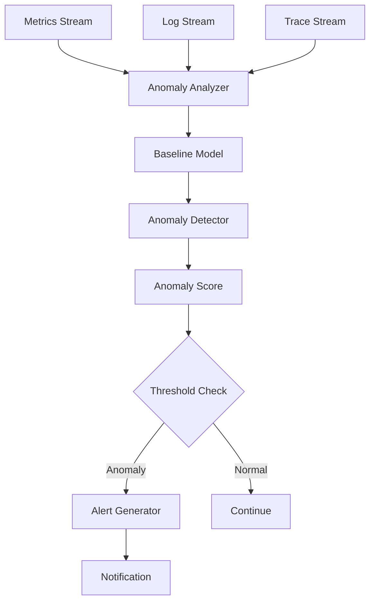

# Anomaly Detection Pattern

## Abstract

The Anomaly Detection pattern automatically identifies unusual system behavior by analyzing metrics, logs, and traces for deviations from normal patterns, enabling proactive issue detection and automated alerting.

## Problem Statement

System issues often manifest as anomalous behavior before complete failure. The problem is how to detect these anomalies automatically, distinguish between normal variation and true anomalies, minimize false positives, and provide actionable alerts for investigation.

## Context

This pattern arises when:
- Proactive issue detection is needed
- Manual monitoring is insufficient
- System behavior has detectable patterns
- Early warning of issues is valuable
- Automated alerting is required

## Forces

- **Sensitivity vs. False Positives:** More sensitive detection creates more alerts
- **Speed vs. Accuracy:** Fast detection may miss subtle anomalies
- **Baseline vs. Adaptation:** Static baselines miss behavior changes
- **Complexity vs. Simplicity:** Complex algorithms are harder to tune

## Solution

### Architecture Diagram



### Components

- **Data Collector:** Gathers metrics, logs, and traces
- **Baseline Model:** Maintains normal behavior patterns
- **Anomaly Detector:** Computes deviation scores
- **Alert Generator:** Creates actionable alerts

### Formal Properties

**Invariants:**
- Baseline is updated periodically
- Anomaly scores are normalized [0, 1]
- Alerts include context for investigation

**Guarantees:**
- Significant deviations are detected
- False positive rate is bounded
- Detection latency is bounded

**Bounds:**
- Baseline window: bounded by adaptation rate
- Detection time: bounded by analysis complexity
- Alert rate: bounded by threshold settings

## Implementation

```typescript
interface DataPoint {
  timestamp: number;
  value: number;
  labels?: Record<string, string>;
}

interface AnomalyConfig {
  windowSize: number;
  threshold: number;
  sensitivity: number;
  minDataPoints: number;
}

interface AnomalyResult {
  isAnomaly: boolean;
  score: number;
  expected: number;
  actual: number;
  deviation: number;
  timestamp: number;
}

class AnomalyDetector {
  private baseline: number[] = [];
  private config: AnomalyConfig;
  private mean = 0;
  private stddev = 0;

  constructor(config: AnomalyConfig) {
    this.config = config;
  }

  addDataPoint(value: number): AnomalyResult | null {
    // Update baseline
    this.baseline.push(value);
    if (this.baseline.length > this.config.windowSize) {
      this.baseline.shift();
    }

    // Need minimum data points
    if (this.baseline.length < this.config.minDataPoints) {
      return null;
    }

    // Calculate statistics
    this.updateStats();

    // Calculate anomaly score
    const score = this.calculateScore(value);

    return {
      isAnomaly: score > this.config.threshold,
      score,
      expected: this.mean,
      actual: value,
      deviation: Math.abs(value - this.mean),
      timestamp: Date.now()
    };
  }

  private updateStats(): void {
    const n = this.baseline.length;
    this.mean = this.baseline.reduce((a, b) => a + b, 0) / n;

    const squaredDiffs = this.baseline.map(v => Math.pow(v - this.mean, 2));
    this.stddev = Math.sqrt(squaredDiffs.reduce((a, b) => a + b, 0) / n);
  }

  private calculateScore(value: number): number {
    if (this.stddev === 0) return 0;

    // Z-score normalized to [0, 1]
    const zScore = Math.abs(value - this.mean) / this.stddev;
    const sensitivity = this.config.sensitivity;

    // Sigmoid function to normalize to [0, 1]
    return 1 / (1 + Math.exp(-sensitivity * (zScore - 2)));
  }

  // Multi-metric anomaly detection
  detectMultiMetric(
    metrics: Map<string, number[]>
  ): { metric: string; result: AnomalyResult }[] {
    const anomalies: { metric: string; result: AnomalyResult }[] = [];

    for (const [name, values] of metrics) {
      if (values.length === 0) continue;

      const latestValue = values[values.length - 1]!;
      const historicalValues = values.slice(0, -1);

      if (historicalValues.length < this.config.minDataPoints) continue;

      const mean = historicalValues.reduce((a, b) => a + b, 0) / historicalValues.length;
      const stddev = Math.sqrt(
        historicalValues.map(v => Math.pow(v - mean, 2)).reduce((a, b) => a + b, 0) / historicalValues.length
      );

      if (stddev === 0) continue;

      const zScore = Math.abs(latestValue - mean) / stddev;
      const score = 1 / (1 + Math.exp(-this.config.sensitivity * (zScore - 2)));

      if (score > this.config.threshold) {
        anomalies.push({
          metric: name,
          result: {
            isAnomaly: true,
            score,
            expected: mean,
            actual: latestValue,
            deviation: Math.abs(latestValue - mean),
            timestamp: Date.now()
          }
        });
      }
    }

    return anomalies;
  }
}
```

## Failure Modes

| Failure | Detection | Recovery |
|---------|-----------|----------|
| Baseline drift | Gradual behavior change | Reset baseline, use robust stats |
| Alert fatigue | Too many false positives | Increase threshold, tune sensitivity |
| Missed anomalies | False negatives | Lower threshold, add more signals |
| Data quality | Invalid data points | Filter outliers, validate input |

## When NOT to Use

- **Stable systems:** If behavior is completely predictable
- **No baseline:** If no historical data exists
- **High noise:** If signal-to-noise ratio is too low
- **No action:** If anomalies can't be acted upon

## Cross-References

### Related Patterns
- **Metrics Aggregation** (Part VII) — Metric collection
- **Health Check** (Part VII) — Component health
- **Distributed Tracing** (Part VII) — Trace analysis

### External Implementations
- **Prometheus** — AlertManager for anomaly alerts
- **Elasticsearch** — ML anomaly detection

## References

- **Statistical Process Control** — Quality control methods
- **Machine Learning Anomaly Detection** — ML-based approaches
- **Prometheus** — Alerting and anomaly detection
