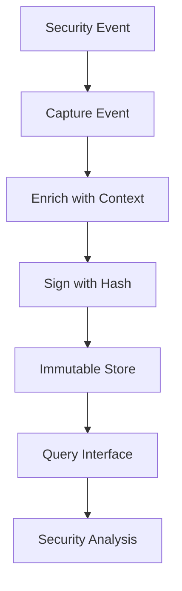

# Audit Logger Pattern

## Abstract

The Audit Logger pattern provides immutable, structured logging of security-relevant events for compliance and forensics. By capturing actor, action, resource, and outcome with cryptographic integrity, this pattern enables post-hoc investigation and demonstrates regulatory compliance.

## Problem Statement

Agent systems process sensitive data and perform security-relevant actions that require audit logging. The problem is how to create tamper-evident logs that capture all relevant events, support efficient querying, and meet compliance requirements while not impacting system performance.

## Context

This pattern arises when:
- Regulatory compliance requires audit trails (HIPAA, SOX, PCI-DSS)
- Security investigations need forensic data
- Access control decisions need to be reviewed
- Incident response requires timeline reconstruction
- User accountability is required

## Forces

- **Completeness vs. Performance:** Full audit is comprehensive but slow
- **Immutability vs. Storage:** Cryptographic integrity increases storage
- **Real-time vs. Batch:** Immediate logging is current; batched is efficient
- **Detail vs. Privacy:** Detailed logs help forensics; privacy may require redaction

## Solution

### Architecture Diagram



### Components

- **Event Capturer:** Intercepts security-relevant events
- **Context Enricher:** Adds actor, resource, timestamp metadata
- **Integrity Signer:** Creates cryptographic proof of log entry
- **Immutable Store:** Append-only storage backend
- **Query Interface:** Supports filtering and analysis

### Formal Properties

**Invariants:**
- Logs are append-only and immutable
- Each entry contains cryptographic hash of previous entry
- All security events are captured in order

**Guarantees:**
- Tampering is detectable via hash chain
- Events are never lost or reordered
- Query results are consistent

**Bounds:**
- Write latency: bounded by storage backend
- Storage growth: bounded by retention policy
- Query performance: depends on index strategy

## Implementation

```typescript
interface AuditEvent {
  id: string;
  timestamp: string;
  actor: {
    userId?: string;
    sessionId?: string;
    ipAddress?: string;
    userAgent?: string;
  };
  action: string;
  resource: {
    type: string;
    id: string;
    attributes?: Record<string, unknown>;
  };
  outcome: 'success' | 'failure' | 'partial';
  reason?: string;
  metadata?: Record<string, unknown>;
  previousHash: string;
  hash: string;
}

class AuditLogger {
  private chain: AuditChain;
  private queue: AsyncQueue<AuditEvent>;
  private redactFields = ['password', 'token', 'secret', 'apiKey'];

  constructor(
    private store: AuditStore,
    private hasher: HashFunction,
    private batchSize: number = 100,
    private flushIntervalMs: number = 1000
  ) {
    this.chain = this.initChain();
    this.queue = new AsyncQueue(this.batchSize, this.flushIntervalMs);
    this.queue.onFlush = this.writeBatch.bind(this);
  }

  async log(event: Omit<AuditEvent, 'id' | 'timestamp' | 'previousHash' | 'hash'>): Promise<void> {
    const enriched = this.enrichEvent(event);
    const entry = await this.createEntry(enriched);
    this.queue.enqueue(entry);
  }

  private async createEntry(event: EnrichedEvent): Promise<AuditEvent> {
    const previousEntry = await this.chain.getLastEntry();
    const id = generateUUID('audit-');
    const timestamp = new Date().toISOString();

    const entry: AuditEvent = {
      id,
      timestamp,
      ...event,
      previousHash: previousEntry?.hash || 'GENESIS',
      hash: '', // Will be computed
    };

    entry.hash = await this.hasher.compute(this.computeHashInput(entry));

    return entry;
  }

  private computeHashInput(entry: AuditEvent): string {
    return JSON.stringify({
      id: entry.id,
      timestamp: entry.timestamp,
      actor: entry.actor,
      action: entry.action,
      resource: entry.resource,
      outcome: entry.outcome,
      previousHash: entry.previousHash,
    });
  }

  private async writeBatch(entries: AuditEvent[]): Promise<void> {
    await this.store.append(entries);
    for (const entry of entries) {
      this.chain.append(entry);
    }
  }

  async query(filter: AuditFilter): Promise<AuditEvent[]> {
    return this.store.query(filter);
  }

  async verifyIntegrity(fromId?: string): Promise<IntegrityResult> {
    const entries = await this.store.getChain(fromId);
    let previousHash = 'GENESIS';

    for (const entry of entries) {
      if (entry.previousHash !== previousHash) {
        return { valid: false, brokenAt: entry.id };
      }

      const expectedHash = await this.hasher.compute(
        this.computeHashInput(entry)
      );

      if (entry.hash !== expectedHash) {
        return { valid: false, brokenAt: entry.id };
      }

      previousHash = entry.hash;
    }

    return { valid: true };
  }

  private redact(event: Omit<AuditEvent, 'id' | 'timestamp' | 'previousHash' | 'hash'>): EnrichedEvent {
    const redacted = { ...event };
    for (const field of this.redactFields) {
      if (redacted.metadata?.[field]) {
        redacted.metadata[field] = '[REDACTED]';
      }
    }
    return redacted;
  }
}
```

## Failure Modes

| Failure | Detection | Recovery |
|---------|-----------|----------|
| Store unavailable | Write failure | Buffer locally, alert on backlog |
| Hash chain broken | Integrity check failure | Alert immediately |
| Event dropped | Queue overflow | Alert, consider alternative storage |
| Query timeout | Query latency | Paginate results |

## When NOT to Use

- **Development environments:** If audit is not required
- **Low-security applications:** If compliance doesn't mandate it
- **High-volume, low-value events:** If logging overhead is unacceptable
- **Privacy-critical data:** If logging certain events violates privacy |

## Cross-References

### Related Patterns
- **Audit Trail** (Part V) — May share infrastructure
- **Structured Logging** (Part VII) — Logging infrastructure
- **PII Redactor** (Part V) — Redacts sensitive data before logging

### External Implementations
- **agent-mesh** — `src/audit/audit-logger.ts` with CloudAudit

## References

- **HIPAA Audit Controls** — Security logging requirements
- **PCI-DSS Requirement 10** — Logging requirements
- **OWASP Logging** — Security event logging best practices