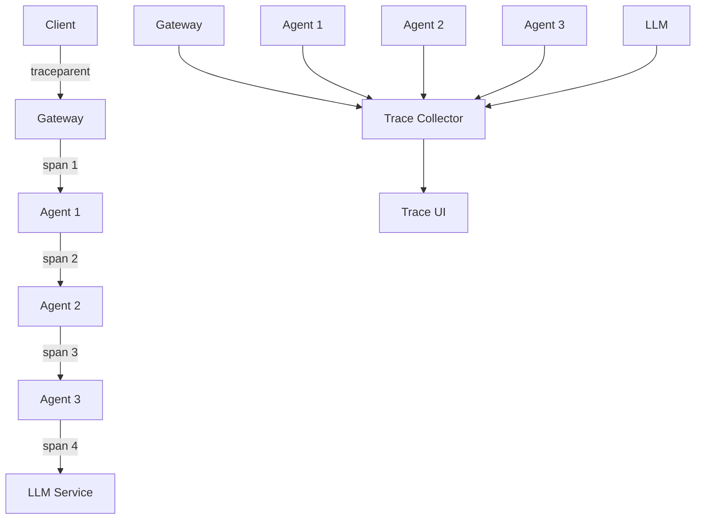

# Distributed Tracing Pattern

## Abstract

The Distributed Tracing pattern enables end-to-end request correlation across multiple agents and services by propagating trace context, recording spans, and providing visibility into request flows through complex agentic systems.

## Problem Statement

In multi-agent systems, requests flow through multiple components, making it difficult to understand the complete journey of a request. The problem is how to correlate events across service boundaries, track request latency, identify bottlenecks, and debug issues in distributed agent workflows.

## Context

This pattern arises when:
- Requests span multiple agents or services
- Debugging production issues is difficult
- Performance bottlenecks need identification
- Request flows are complex
- Observability across boundaries is needed

## Forces

- **Detail vs. Overhead:** More detailed traces add performance overhead
- **Sampling vs. Completeness:** Full tracing is expensive
- **Propagation vs. Compatibility:** Context must work across technologies
- **Storage vs. Retention:** Traces require significant storage

## Solution

### Architecture Diagram



### Components

- **Trace Context:** Propagates trace identifiers
- **Span Recorder:** Records timing and metadata
- **Context Propagator:** Passes context across boundaries
- **Trace Collector:** Aggregates spans into traces

### Formal Properties

**Invariants:**
- Every span has a unique span ID
- Every span references its parent span
- Trace ID is consistent across all spans in a trace

**Guarantees:**
- Traces are complete (all spans collected)
- Span order is preserved
- Context is propagated correctly

**Bounds:**
- Trace size: bounded by span count
- Span duration: bounded by operation time
- Context size: bounded by propagation format

## Implementation

```typescript
interface TraceContext {
  traceId: string;
  spanId: string;
  parentSpanId?: string;
  sampled: boolean;
}

interface Span {
  traceId: string;
  spanId: string;
  parentSpanId?: string;
  name: string;
  startTime: number;
  endTime?: number;
  attributes: Record<string, string>;
  status: 'ok' | 'error';
  error?: string;
}

interface TracerConfig {
  serviceName: string;
  sampleRate: number;
  exporter: (spans: Span[]) => Promise<void>;
}

class DistributedTracer {
  private activeSpans = new Map<string, Span>();

  constructor(private config: TracerConfig) {}

  startSpan(name: string, parentContext?: TraceContext): { span: Span; context: TraceContext } {
    const traceId = parentContext?.traceId || crypto.randomUUID();
    const spanId = crypto.randomUUID();
    
    const span: Span = {
      traceId,
      spanId,
      parentSpanId: parentContext?.spanId,
      name,
      startTime: Date.now(),
      attributes: { service: this.config.serviceName },
      status: 'ok'
    };

    this.activeSpans.set(spanId, span);

    const context: TraceContext = {
      traceId,
      spanId,
      parentSpanId: parentContext?.spanId,
      sampled: Math.random() < this.config.sampleRate
    };

    return { span, context };
  }

  endSpan(spanId: string, error?: Error): void {
    const span = this.activeSpans.get(spanId);
    if (!span) return;

    span.endTime = Date.now();
    span.status = error ? 'error' : 'ok';
    if (error) {
      span.error = error.message;
    }

    this.activeSpans.delete(spanId);

    // Export span (in production, batch and send asynchronously)
    this.config.exporter([span]).catch(console.error);
  }

  async withSpan<T>(
    name: string,
    fn: (context: TraceContext) => Promise<T>,
    parentContext?: TraceContext
  ): Promise<T> {
    const { span, context } = this.startSpan(name, parentContext);

    try {
      const result = await fn(context);
      return result;
    } catch (error) {
      this.endSpan(span.spanId, error as Error);
      throw error;
    } finally {
      if (!span.endTime) {
        this.endSpan(span.spanId);
      }
    }
  }

  propagateContext(context: TraceContext): Record<string, string> {
    // W3C Trace Context format
    return {
      traceparent: `00-${context.traceId}-${context.spanId}-0${context.sampled ? '1' : '0'}`
    };
  }

  extractContext(headers: Record<string, string>): TraceContext | undefined {
    const traceparent = headers['traceparent'];
    if (!traceparent) return undefined;

    const parts = traceparent.split('-');
    if (parts.length !== 4) return undefined;

    return {
      traceId: parts[1],
      spanId: parts[2],
      sampled: parts[3] === '01'
    };
  }
}
```

## Failure Modes

| Failure | Detection | Recovery |
|---------|-----------|----------|
| Context loss | Trace breaks | Log warning, create new trace |
| Export failure | Spans not sent | Buffer locally, retry |
| High overhead | Performance impact | Increase sampling, reduce attributes |
| Storage full | Trace storage exhausted | Drop old traces, alert |

## When NOT to Use

- **Simple systems:** If requests don't cross boundaries
- **Performance critical:** If tracing overhead is unacceptable
- **No debugging needs:** If production debugging is not needed
- **Cost sensitive:** If trace storage is too expensive

## Cross-References

### Related Patterns
- **Structured Logging** (Part VII) — Log correlation
- **Metrics Aggregation** (Part VII) — Performance metrics
- **Health Check** (Part VII) — Component monitoring

### External Implementations
- **agent-mesh** — `src/observability/otel.ts` for OpenTelemetry
- **OpenTelemetry** — Industry standard for tracing

## References

- **OpenTelemetry** — Observability framework
- **W3C Trace Context** — Trace propagation standard
- **Jaeger** — Distributed tracing system
