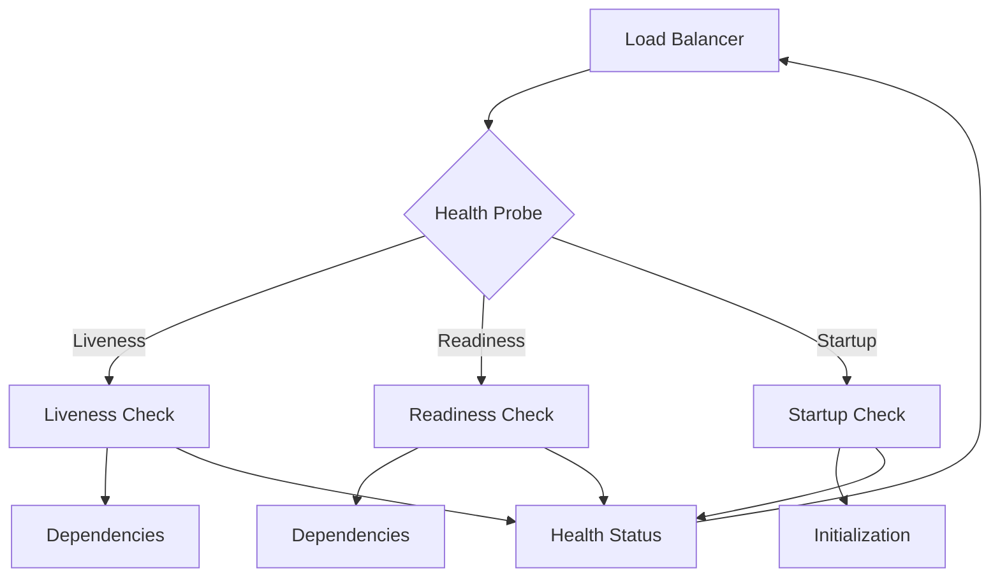

# Health Check Pattern

## Abstract

The Health Check pattern provides liveness and readiness probing for components by exposing endpoints that report component health status, enabling load balancers and orchestration systems to make routing decisions.

## Problem Statement

In distributed systems, components can fail in various ways. The problem is how to detect component failures quickly, distinguish between different failure modes (startup, running, degraded), and provide actionable health information to orchestration systems.

## Context

This pattern arises when:
- Components need health monitoring
- Load balancers need routing decisions
- Kubernetes or similar orchestrators are used
- Graceful degradation is needed
- Quick failure detection is required

## Forces

- **Depth vs. Speed:** Deep checks are thorough but slow
- **Frequency vs. Load:** Frequent checks add load
- **Independence vs. Context:** Checks should be isolated
- **Accuracy vs. Simplicity:** Complex checks may have false positives

## Solution

### Architecture Diagram



### Components

- **Liveness Probe:** Checks if component is running
- **Readiness Probe:** Checks if component can accept traffic
- **Startup Probe:** Checks if component has started
- **Health Aggregator:** Combines check results

### Formal Properties

**Invariants:**
- Health checks complete within timeout
- Checks are idempotent and side-effect free
- Status reflects actual component state

**Guarantees:**
- Unhealthy components are removed from rotation
- Readiness reflects dependency health
- Startup completion is detected

**Bounds:**
- Check timeout: bounded by configuration
- Check interval: bounded by minimum interval
- Check depth: bounded by timeout

## Implementation

```typescript
type HealthStatus = 'healthy' | 'unhealthy' | 'starting';

interface HealthCheck {
  name: string;
  timeout: number;
  check: () => Promise<boolean>;
}

interface HealthResult {
  name: string;
  status: HealthStatus;
  latency: number;
  error?: string;
}

interface HealthReport {
  status: HealthStatus;
  checks: HealthResult[];
  timestamp: string;
}

class HealthChecker {
  private livenessChecks: HealthCheck[] = [];
  private readinessChecks: HealthCheck[] = [];
  private startupChecks: HealthCheck[] = [];
  private started = false;

  addLiveness(name: string, timeout: number, check: () => Promise<boolean>): void {
    this.livenessChecks.push({ name, timeout, check });
  }

  addReadiness(name: string, timeout: number, check: () => Promise<boolean>): void {
    this.readinessChecks.push({ name, timeout, check });
  }

  addStartup(name: string, timeout: number, check: () => Promise<boolean>): void {
    this.startupChecks.push({ name, timeout, check });
  }

  async checkLiveness(): Promise<HealthReport> {
    const results = await Promise.all(
      this.livenessChecks.map(c => this.runCheck(c))
    );

    return {
      status: results.every(r => r.status === 'healthy') ? 'healthy' : 'unhealthy',
      checks: results,
      timestamp: new Date().toISOString()
    };
  }

  async checkReadiness(): Promise<HealthReport> {
    if (!this.started) {
      return {
        status: 'starting',
        checks: [],
        timestamp: new Date().toISOString()
      };
    }

    const results = await Promise.all(
      this.readinessChecks.map(c => this.runCheck(c))
    );

    return {
      status: results.every(r => r.status === 'healthy') ? 'healthy' : 'unhealthy',
      checks: results,
      timestamp: new Date().toISOString()
    };
  }

  async checkStartup(): Promise<HealthReport> {
    if (this.started) {
      return {
        status: 'healthy',
        checks: [],
        timestamp: new Date().toISOString()
      };
    }

    const results = await Promise.all(
      this.startupChecks.map(c => this.runCheck(c))
    );

    const allHealthy = results.every(r => r.status === 'healthy');
    if (allHealthy) {
      this.started = true;
    }

    return {
      status: allHealthy ? 'healthy' : 'starting',
      checks: results,
      timestamp: new Date().toISOString()
    };
  }

  private async runCheck(check: HealthCheck): Promise<HealthResult> {
    const start = Date.now();
    try {
      const success = await Promise.race([
        check.check(),
        new Promise<boolean>((_, reject) =>
          setTimeout(() => reject(new Error('Timeout')), check.timeout)
        )
      ]);

      return {
        name: check.name,
        status: success ? 'healthy' : 'unhealthy',
        latency: Date.now() - start
      };
    } catch (error) {
      return {
        name: check.name,
        status: 'unhealthy',
        latency: Date.now() - start,
        error: (error as Error).message
      };
    }
  }
}
```

## Failure Modes

| Failure | Detection | Recovery |
|---------|-----------|----------|
| Check timeout | Probe exceeds timeout | Increase timeout, optimize check |
| False positive | Healthy marked unhealthy | Add retry, check logic |
| False negative | Unhealthy marked healthy | Deepen check, add assertions |
| Check storm | Too many concurrent checks | Stagger checks, add jitter |

## When NOT to Use

- **Simple applications:** If no orchestration is used
- **Monolithic systems:** If no load balancing exists
- **Development:** If health checks add complexity
- **Stateless services:** If service has no dependencies

## Cross-References

### Related Patterns
- **Circuit Breaker** (Part II) — Component health
- **Metrics Aggregation** (Part VII) — Health metrics
- **Distributed Tracing** (Part VII) — Request health

### External Implementations
- **Kubernetes** — Liveness, readiness, startup probes
- **AWS ELB** — Health check configuration

## References

- **Kubernetes** — Health check probes
- **Google SRE** — Monitoring distributed systems
- **AWS** — ELB health checks
