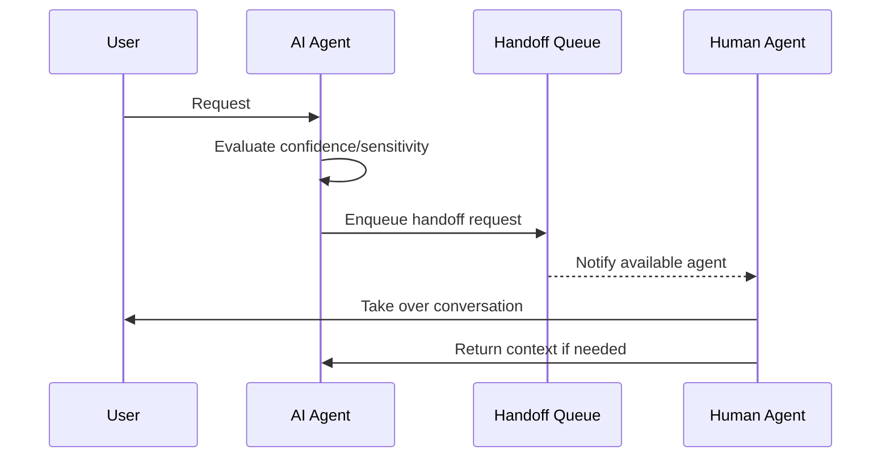

# Human Handoff Pattern

## Abstract

The Human Handoff pattern transfers control from AI agents to human operators when confidence is low, escalation is required, or specialized human judgment is needed. By implementing a graceful transfer mechanism with context preservation, this pattern ensures users receive appropriate assistance while maintaining conversation continuity.

## Problem Statement

AI agents have limitations in understanding nuance, handling complex cases, or dealing with emotional situations. The problem is how to seamlessly transfer control to human operators when needed, preserve all context for the human agent, and ensure the user experience remains smooth during and after the handoff.

## Context

This pattern arises when:
- Classification confidence is below threshold
- User explicitly requests human assistance
- Agent encounters restricted content
- Sensitive topics require human judgment
- Emotional or frustrated users need empathetic handling

## Forces

- **Speed vs. Completeness:** Fast handoff preserves urgency; complete handoff takes longer
- **Context Preservation vs. Privacy:** Full context helps human; some data may need redaction
- **Automatic vs. Manual Trigger:** Auto-detection is fast; manual trigger is more accurate
- **Handoff vs. Consultation:** Handoff transfers completely; consultation retains agent

## Solution

### Architecture Diagram



### Components

- **Handoff Trigger:** Evaluates when handoff is needed
- **Context Preserver:** Collects and formats context for human
- **Queue Manager:** Manages handoff queue and routing
- **State Transferrer:** Transfers conversation state seamlessly
- **Return Handler:** Manages return to AI or completion by human

### Formal Properties

**Invariants:**
- Handoff always includes sufficient context
- User is notified of handoff initiation
- Human agent always receives complete request

**Guarantees:**
- Handoff completes within SLA bounds
- Context is not lost during transfer
- User experience remains smooth

**Bounds:**
- Handoff latency: bounded by queue and human availability
- Context size: bounded for transmission efficiency
- Queue depth: bounded by staffing

## Implementation

```typescript
interface HandoffRequest {
  sessionId: string;
  userId: string;
  reason: HandoffReason;
  urgency: 'low' | 'medium' | 'high' | 'urgent';
  context: HandoffContext;
  conversationHistory: Turn[];
  agentNotes?: string;
}

interface HandoffContext {
  summary: string;
  keyEntities: string[];
  userIntent: string;
  emotionalState?: 'neutral' | 'frustrated' | 'angry' | 'satisfied';
  previousAttempts?: string[];
}

class HumanHandoffManager {
  constructor(
    private queue: HandoffQueue,
    private contextPreserver: ContextPreserver,
    private notificationService: NotificationService
  ) {}

  async initiateHandoff(request: HandoffRequest): Promise<HandoffTicket> {
    // Preserve context
    const preservedContext = await this.contextPreserver.preserve(request);

    // Create ticket
    const ticket: HandoffTicket = {
      id: generateUUID(),
      ...request,
      context: preservedContext,
      status: 'pending',
      createdAt: new Date().toISOString(),
    };

    // Add to queue with priority
    await this.queue.enqueue(ticket, request.urgency);

    // Notify available human agents
    await this.notificationService.notify(
      `New handoff: ${request.reason} (${request.urgency})`,
      ticket
    );

    return ticket;
  }

  async completeHandoff(
    ticketId: string,
    resolution: HumanResolution,
    returnToAgent: boolean
  ): Promise<void> {
    const ticket = await this.queue.dequeue(ticketId);

    if (returnToAgent) {
      // Return context to agent for continuation
      await this.queue.returnToAgent(ticket.sessionId, {
        resolution: resolution.summary,
        humanNotes: resolution.notes,
      });
    } else {
      // Mark session as closed
      await this.sessionService.close(ticket.sessionId, 'human_resolved');
    }

    await this.notificationService.notify('Handoff completed', ticket);
  }
}
```

## Failure Modes

| Failure | Detection | Recovery |
|---------|-----------|----------|
| No human available | Queue timeout | Agent continues with limited scope |
| Context lost | Missing fields | Reconstruct from conversation history |
| User abandons during handoff | Session timeout | Close ticket, log for follow-up |
| Human agent overload | Queue depth exceeded | Escalate to supervisor |

## When NOT to Use

- **High confidence interactions:** If agent handles most cases well
- **Simple queries:** If requests are simple and agent is accurate
- **No human staffing:** If no human agents are available
- **Real-time requirements:** If latency is critical and handoff adds unacceptable delay

## Cross-References

### Related Patterns
- **Confidence Gate** (Part IV) — Can trigger handoff on low confidence
- **Supervisor** (Part I) — May route to human handoff
- **Session Bypass** (Part III) — Maintains session during handoff

### External Implementations
- **agent-mesh** — `src/handoff/human-handoff.ts` with Zendesk integration

## References

- **Customer Service Handoff** — HCI best practices
- **Escalation Patterns** — Enterprise support patterns
- **Copilot Studio Handoff** — Microsoft documentation