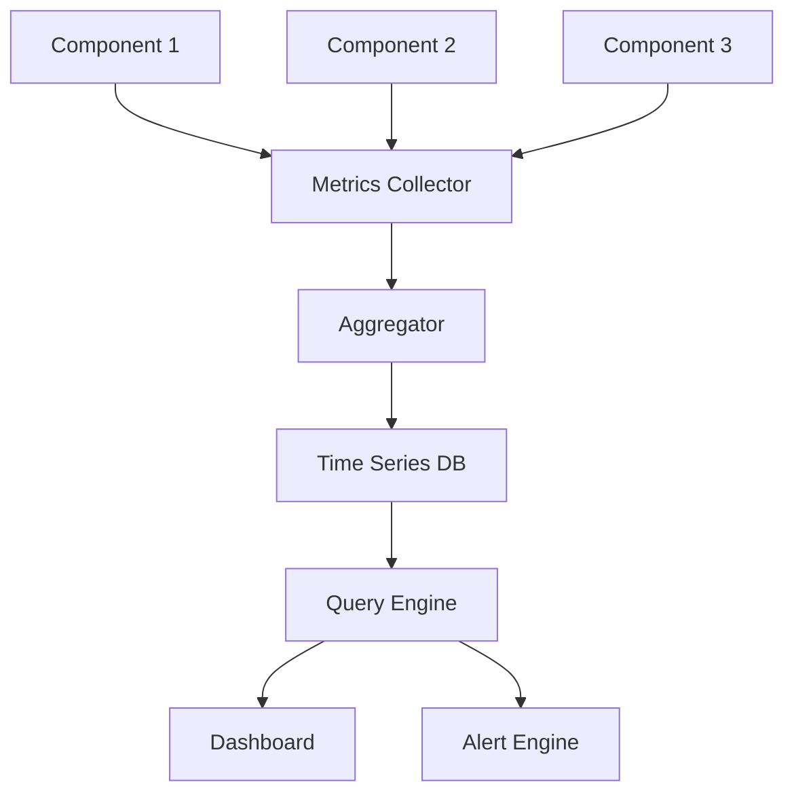

# Metrics Aggregation Pattern

## Abstract

The Metrics Aggregation pattern collects and summarizes system behavior statistics by gathering metrics from multiple sources, computing aggregates, and exposing them for monitoring and alerting.

## Problem Statement

Understanding system behavior requires collecting and analyzing metrics from multiple components. The problem is how to efficiently gather metrics, compute meaningful aggregates, maintain metric consistency, and expose them for monitoring without overwhelming storage or processing resources.

## Context

This pattern arises when:
- System behavior needs monitoring
- Performance trends must be tracked
- Alerting requires metric thresholds
- Capacity planning needs historical data
- SLA compliance must be measured

## Forces

- **Granularity vs. Storage:** Fine-grained metrics use more storage
- **Frequency vs. Overhead:** Frequent collection adds overhead
- **Accuracy vs. Performance:** Precise metrics may impact performance
- **Retention vs. Cost:** Long retention increases storage costs

## Solution

### Architecture Diagram



### Components

- **Metrics Collector:** Gathers raw metrics from components
- **Aggregator:** Computes statistics (avg, p50, p95, p99)
- **Time Series DB:** Stores metrics with time indexing
- **Query Engine:** Provides metric queries and alerts

### Formal Properties

**Invariants:**
- Metrics are timestamped at collection
- Aggregates are computed over fixed windows
- Metric names follow consistent naming convention

**Guarantees:**
- Metrics are available within bounded delay
- Aggregates are accurate within tolerance
- Historical data is retained per policy

**Bounds:**
- Collection interval: bounded by minimum interval
- Aggregation window: bounded by window size
- Retention: bounded by storage policy

## Implementation

```typescript
type MetricType = 'counter' | 'gauge' | 'histogram';

interface MetricPoint {
  name: string;
  value: number;
  timestamp: number;
  labels: Record<string, string>;
}

interface AggregatedMetric {
  name: string;
  window: number;
  count: number;
  sum: number;
  min: number;
  max: number;
  avg: number;
  p50: number;
  p95: number;
  p99: number;
}

interface MetricsAggregatorConfig {
  windowSizeMs: number;
  retentionWindows: number;
}

class MetricsAggregator {
  private metrics = new Map<string, number[]>();
  private windows = new Map<string, AggregatedMetric[]>();
  private config: MetricsAggregatorConfig;

  constructor(config: MetricsAggregatorConfig) {
    this.config = config;
  }

  record(name: string, value: number, labels?: Record<string, string>): void {
    const key = this.makeKey(name, labels);
    if (!this.metrics.has(key)) {
      this.metrics.set(key, []);
    }
    this.metrics.get(key)!.push(value);
  }

  increment(name: string, labels?: Record<string, string>): void {
    this.record(name, 1, labels);
  }

  gauge(name: string, value: number, labels?: Record<string, string>): void {
    const key = this.makeKey(name, labels);
    // Gauges only keep the latest value
    this.metrics.set(key, [value]);
  }

  getAggregated(name: string, labels?: Record<string, string>): AggregatedMetric | null {
    const key = this.makeKey(name, labels);
    const values = this.metrics.get(key);
    if (!values || values.length === 0) return null;

    const sorted = [...values].sort((a, b) => a - b);
    const sum = values.reduce((a, b) => a + b, 0);

    return {
      name,
      window: this.config.windowSizeMs,
      count: values.length,
      sum,
      min: sorted[0],
      max: sorted[sorted.length - 1],
      avg: sum / values.length,
      p50: this.percentile(sorted, 50),
      p95: this.percentile(sorted, 95),
      p99: this.percentile(sorted, 99)
    };
  }

  flush(): void {
    // Store current window's aggregates
    for (const [key, values] of this.metrics) {
      if (values.length === 0) continue;

      const [name, labels] = this.parseKey(key);
      const aggregated = this.getAggregated(name, labels);
      if (!aggregated) continue;

      if (!this.windows.has(key)) {
        this.windows.set(key, []);
      }

      const windowData = this.windows.get(key)!;
      windowData.push(aggregated);

      // Enforce retention
      if (windowData.length > this.config.retentionWindows) {
        windowData.shift();
      }
    }

    // Clear current metrics
    this.metrics.clear();
  }

  private makeKey(name: string, labels?: Record<string, string>): string {
    if (!labels) return name;
    const labelStr = Object.entries(labels)
      .sort(([a], [b]) => a.localeCompare(b))
      .map(([k, v]) => `${k}=${v}`)
      .join(',');
    return `${name}{${labelStr}}`;
  }

  private parseKey(key: string): [string, Record<string, string>?] {
    const braceIndex = key.indexOf('{');
    if (braceIndex === -1) return [key];

    const name = key.substring(0, braceIndex);
    const labelStr = key.substring(braceIndex + 1, key.lastIndexOf('}'));
    const labels: Record<string, string> = {};

    labelStr.split(',').forEach(pair => {
      const [k, v] = pair.split('=');
      labels[k] = v;
    });

    return [name, labels];
  }

  private percentile(sorted: number[], p: number): number {
    const index = Math.ceil((p / 100) * sorted.length) - 1;
    return sorted[Math.max(0, index)];
  }
}
```

## Failure Modes

| Failure | Detection | Recovery |
|---------|-----------|----------|
| Metric overflow | Values exceed limits | Use larger types, reset |
| Collection gap | Missing data points | Interpolate, mark as gap |
| Storage full | Retention exceeded | Drop oldest, alert |
| Aggregation error | Invalid calculations | Log error, skip metric |

## When NOT to Use

- **Simple systems:** If basic logging suffices
- **No monitoring:** If no alerting or dashboards needed
- **Cost sensitive:** If metric storage is too expensive
- **Low cardinality:** If few metrics are needed

## Cross-References

### Related Patterns
- **Structured Logging** (Part VII) — Log-based metrics
- **Health Check** (Part VII) — Health metrics
- **Anomaly Detection** (Part VII) — Metric-based anomalies

### External Implementations
- **Prometheus** — Metrics collection and aggregation
- **StatsD** — Simple metrics aggregation

## References

- **Prometheus** — Monitoring and alerting toolkit
- **Google SRE** — Monitoring distributed systems
- **Four Golden Signals** — Latency, traffic, errors, saturation
