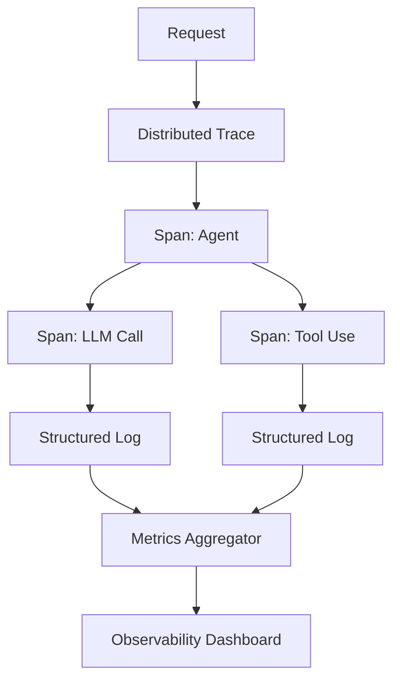

# Observability Pattern

## Abstract

The Observability pattern provides comprehensive monitoring of agent systems through structured logging, distributed tracing, and metrics aggregation. By implementing the three pillars of observability with unified correlation, this pattern enables debugging of complex agent flows, performance optimization, and proactive alerting.

## Problem Statement

Agent systems with multiple components, complex flows, and LLM interactions are difficult to debug and monitor. The problem is how to implement observability that captures the full picture of system behavior, enables correlation across components, and supports both reactive debugging and proactive optimization.

## Context

This pattern arises when:
- Debugging complex agent flows is needed
- Performance optimization is required
- Proactive alerting is desired
- System behavior needs to be understood
- User experience needs to be monitored

## Forces

- **Granularity vs. Overhead:** Detailed observability provides insights but adds overhead
- **Correlation vs. Complexity:** Unified correlation IDs simplify tracing but require coordination
- **Storage vs. Retention:** Long retention supports historical analysis but increases costs
- **Sampling vs. Completeness:** Sampling reduces cost but may miss rare events

## Solution

### Architecture Diagram



### Components

- **Tracer:** Creates distributed traces with spans
- **Structured Logger:** Captures contextual logs
- **Metrics Collector:** Aggregates quantitative measurements
- **Correlation Manager:** Links traces, logs, and metrics
- **Alert Manager:** Triggers on anomalous conditions

### Formal Properties

**Invariants:**
- All requests have unique trace IDs
- Logs contain trace and span IDs
- Metrics are collected consistently

**Guarantees:**
- Trace context propagates through all components
- Logs are searchable by trace ID
- Metrics accurately reflect system state

**Bounds:**
- Trace duration: bounded by timeout settings
- Log volume: bounded by sampling
- Metric cardinality: bounded by label limits

## Implementation

```typescript
interface ObservabilityConfig {
  serviceName: string;
  tracing: {
    enabled: boolean;
    sampleRate: number;
    exporter: TracingExporter;
  };
  logging: {
    level: LogLevel;
    format: 'json' | 'pretty';
    redactFields: string[];
  };
  metrics: {
    enabled: boolean;
    exportInterval: number;
    exporter: MetricsExporter;
  };
}

class Observability {
  private tracer: Tracer;
  private logger: StructuredLogger;
  private metrics: MetricsCollector;

  constructor(private config: ObservabilityConfig) {
    this.tracer = new Tracer(config.tracing);
    this.logger = new StructuredLogger(config.logging);
    this.metrics = new MetricsCollector(config.metrics);
  }

  async trace<T>(
    name: string,
    context: Record<string, unknown>,
    fn: (span: Span) => Promise<T>
  ): Promise<T> {
    return this.tracer.trace(name, context, async (span) => {
      const startTime = Date.now();

      try {
        this.logger.info(`Starting ${name}`, { spanId: span.id, ...context });

        const result = await fn(span);

        const duration = Date.now() - startTime;
        this.metrics.recordDuration(name, duration);
        this.logger.info(`Completed ${name}`, { spanId: span.id, duration });

        return result;
      } catch (error) {
        const duration = Date.now() - startTime;
        this.metrics.incrementCounter(`${name}.errors`);
        this.logger.error(`Failed ${name}`, {
          spanId: span.id,
          duration,
          error: error instanceof Error ? error.message : String(error),
        });
        throw error;
      }
    });
  }

  getMetricsCollector(): MetricsCollector {
    return this.metrics;
  }

  getTracer(): Tracer {
    return this.tracer;
  }

  createMiddleware() {
    return async (req: Request, res: Response, next: NextFunction) => {
      const traceId = req.headers['x-trace-id'] as string || generateUUID();
      const span = this.tracer.startSpan(`${req.method} ${req.path}`, {
        traceId,
        requestPath: req.path,
        requestMethod: req.method,
      });

      req.traceId = traceId;
      req.span = span;

      res.on('finish', () => {
        span.end();
        this.metrics.incrementCounter('http.requests', {
          method: req.method,
          path: req.path,
          statusCode: res.statusCode,
        });
      });

      next();
    };
  }
}
```

## Failure Modes

| Failure | Detection | Recovery |
|---------|-----------|----------|
| Exporter unavailable | Export error | Buffer locally, alert on backlog |
| Trace context lost | Missing trace ID | Generate new trace ID |
| Metric cardinality explosion | Label explosion | Reject metrics with excessive labels |
| Log storage full | Storage quota | Delete old logs per retention policy |

## When NOT to Use

- **Development only:** If production observability is not needed
- **Simple systems:** If a single service with no dependencies
- **Cost-sensitive systems:** If observability overhead is unacceptable
- **Privacy-sensitive systems:** If observability exposes sensitive data |

## Cross-References

### Related Patterns
- **Distributed Tracing** (Part VII) — Trace implementation
- **Structured Logging** (Part VII) — Log implementation
- **Metrics Aggregation** (Part VII) — Metrics implementation
- **Anomaly Detection** (Part VII) — Uses observability data

### External Implementations
- **agent-mesh** — `src/observability/` with OpenTelemetry

## References

- **OpenTelemetry** — Vendor-neutral observability
- **Three Pillars of Observability** — Logging, metrics, tracing
- **RED Method** — Rate, errors, duration metrics