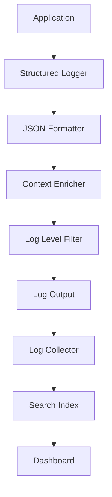

# Structured Logging Pattern

## Abstract

The Structured Logging pattern enables machine-parseable logs by emitting events in a consistent JSON format with standardized fields, facilitating automated log analysis, alerting, and debugging in production systems.

## Problem Statement

Unstructured text logs are difficult to search, analyze, and alert on. The problem is how to emit logs in a consistent structured format, include relevant context, maintain appropriate log levels, and enable efficient querying and analysis.

## Context

This pattern arises when:
- Logs need to be searchable and filterable
- Automated log analysis is required
- Multiple services produce logs
- Debugging requires context correlation
- Compliance requires structured audit logs

## Forces

- **Detail vs. Volume:** More detail increases storage costs
- **Performance vs. Richness:** Structured logging adds overhead
- **Standardization vs. Flexibility:** Common schema vs. service-specific needs
- **Privacy vs. Debugging:** Sensitive data must be protected

## Solution

### Architecture Diagram



### Components

- **Structured Logger:** Emits JSON-formatted log events
- **Context Enricher:** Adds correlation IDs and metadata
- **Log Level Filter:** Controls verbosity
- **Log Collector:** Aggregates logs from multiple sources

### Formal Properties

**Invariants:**
- Every log entry is valid JSON
- Required fields are always present
- Timestamps are in UTC with timezone info

**Guarantees:**
- Logs are machine-parseable
- Correlation IDs link related events
- Log levels are respected

**Bounds:**
- Log entry size: bounded by maximum field count
- Log retention: bounded by storage and compliance
- Log volume: bounded by rate limiting

## Implementation

```typescript
type LogLevel = 'debug' | 'info' | 'warn' | 'error';

interface LogEntry {
  timestamp: string;
  level: LogLevel;
  service: string;
  message: string;
  correlationId?: string;
  traceId?: string;
  spanId?: string;
  [key: string]: unknown;
}

interface LoggerConfig {
  service: string;
  level: LogLevel;
  formatter?: (entry: LogEntry) => string;
}

class StructuredLogger {
  private context: Partial<LogEntry> = {};

  constructor(private config: LoggerConfig) {}

  setContext(context: Partial<LogEntry>): void {
    this.context = { ...this.context, ...context };
  }

  debug(message: string, data?: Record<string, unknown>): void {
    this.log('debug', message, data);
  }

  info(message: string, data?: Record<string, unknown>): void {
    this.log('info', message, data);
  }

  warn(message: string, data?: Record<string, unknown>): void {
    this.log('warn', message, data);
  }

  error(message: string, error?: Error, data?: Record<string, unknown>): void {
    this.log('error', message, {
      ...data,
      error: error?.message,
      stack: error?.stack
    });
  }

  private log(level: LogLevel, message: string, data?: Record<string, unknown>): void {
    const levelOrder: LogLevel[] = ['debug', 'info', 'warn', 'error'];
    const currentLevel = levelOrder.indexOf(this.config.level);
    const messageLevel = levelOrder.indexOf(level);

    if (messageLevel < currentLevel) return;

    const entry: LogEntry = {
      timestamp: new Date().toISOString(),
      level,
      service: this.config.service,
      message,
      ...this.context,
      ...data
    };

    const output = this.config.formatter?.(entry) || JSON.stringify(entry);
    this.write(output);
  }

  private write(output: string): void {
    switch (this.config.level) {
      case 'debug':
      case 'info':
        console.log(output);
        break;
      case 'warn':
        console.warn(output);
        break;
      case 'error':
        console.error(output);
        break;
    }
  }
}

// Usage example
const logger = new StructuredLogger({
  service: 'agent-gateway',
  level: 'info'
});

// Set correlation context
logger.setContext({
  correlationId: 'req-123',
  traceId: 'trace-456',
  userId: 'user-789'
});

logger.info('Request processed', {
  duration: 150,
  tokens: 250,
  model: 'gpt-4'
});
```

## Failure Modes

| Failure | Detection | Recovery |
|---------|-----------|----------|
| Log volume spike | Sudden increase in log count | Rate limit, sample |
| Sensitive data leak | PII in logs | Scan logs, add redaction |
| Log loss | Collector failure | Buffer locally, retry |
| Performance impact | Logging slows app | Async logging, reduce detail |

## When NOT to Use

- **Simple applications:** If logs are rarely analyzed
- **Development:** If structured format adds friction
- **No log infrastructure:** If no log aggregation exists
- **Performance critical:** If logging overhead is unacceptable

## Cross-References

### Related Patterns
- **Distributed Tracing** (Part VII) — Trace correlation
- **Audit Trail** (Part V) — Compliance logging
- **Metrics Aggregation** (Part VII) — Statistical analysis

### External Implementations
- **agent-mesh** — `src/observability/logger.ts` for Winston-based logging
- **pino** — High-performance JSON logger
- **Winston** — Popular Node.js logger

## References

- **12-Factor App** — Logs as event streams
- **Google SRE** — Structured logging practices
- **pino** — High-performance logging library
