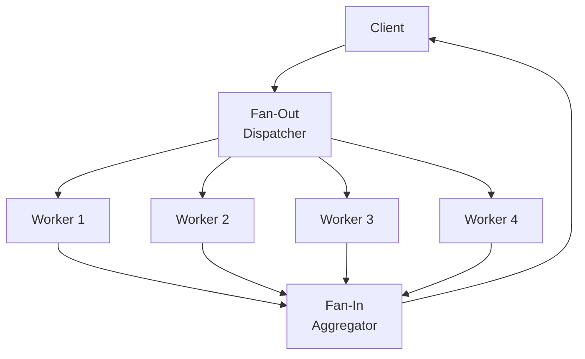

# Fan-Out/Fan-In Pattern

## Abstract

The Fan-Out/Fan-In pattern parallelizes independent tasks across multiple workers and aggregates results, enabling efficient processing of embarrassingly parallel workloads with automatic result collection.

## Problem Statement

When a task can be decomposed into multiple independent subtasks, executing them sequentially wastes available parallelism. The problem is how to efficiently distribute work across multiple workers, handle partial failures, and aggregate results while maintaining correctness and performance.

## Context

This pattern arises when:
- Tasks can be decomposed into independent subtasks
- Parallel execution significantly reduces latency
- Results need to be collected and aggregated
- Workers may fail independently
- Load balancing across workers is needed

## Forces

- **Parallelism vs. Coordination:** More parallelism increases coordination overhead
- **Granularity vs. Overhead:** Fine-grained tasks increase parallelism but also overhead
- **Fault Tolerance vs. Complexity:** Handling partial failures adds complexity
- **Aggregation Strategy vs. Result Type:** Different aggregations suit different result types

## Solution

### Architecture Diagram



### Components

- **Dispatcher:** Decomposes task and distributes subtasks to workers
- **Workers:** Execute subtasks in parallel
- **Aggregator:** Collects and combines worker results
- **Result Collector:** Manages partial results and detects completion

### Formal Properties

**Invariants:**
- Each subtask is assigned to exactly one worker
- Aggregator waits for all successful results or timeout
- Subtask execution is idempotent (for retry safety)

**Guarantees:**
- All subtasks are attempted at least once
- Results are aggregated in deterministic order
- Partial failure handling with configurable thresholds

**Bounds:**
- Worker count: bounded by available resources
- Fan-out factor: bounded by coordination overhead
- Aggregation timeout: bounded by slowest worker × retry count

## Implementation

```typescript
interface Subtask<T> {
  id: string;
  payload: T;
}

interface WorkerResult<T> {
  subtaskId: string;
  success: boolean;
  result?: T;
  error?: string;
}

class FanOutFanIn<T, R> {
  constructor(
    private workers: Worker<T, R>[],
    private aggregator: Aggregator<R>
  ) {}

  async execute(task: T[]): Promise<R> {
    const subtasks = this.decompose(task);
    const results = await Promise.allSettled(
      subtasks.map(st => this.executeSubtask(st))
    );

    const successful = results
      .filter((r): r is PromiseFulfilledResult<WorkerResult<R>> => r.status === 'fulfilled')
      .map(r => r.value);

    if (successful.length < subtasks.length * 0.8) {
      throw new Error('Too many subtask failures');
    }

    return this.aggregator.aggregate(successful.map(r => r.result!));
  }

  private async executeSubtask(subtask: Subtask<T>): Promise<WorkerResult<R>> {
    const worker = this.selectWorker();
    return await worker.execute(subtask);
  }

  private selectWorker(): Worker<T, R> {
    // Simple round-robin or least-loaded selection
    return this.workers[Math.floor(Math.random() * this.workers.length)]!;
  }
}
```

## Failure Modes

| Failure | Detection | Recovery |
|---------|-----------|----------|
| Worker failure | Timeout or explicit error | Retry with different worker |
| Partial results | Some workers succeed, some fail | Aggregate available results or fail |
| Aggregator failure | Exception during aggregation | Retry aggregation or use fallback |
| Straggler | One worker much slower | Timeout and use partial results |

## When NOT to Use

- **Sequential dependencies:** If subtasks depend on each other, use pipeline
- **Small tasks:** If task overhead exceeds parallelism benefit, execute sequentially
- **Limited workers:** If only one worker available, no parallelism possible
- **Complex aggregation:** If aggregation is NP-hard, consider approximation

## Cross-References

### Related Patterns
- **Orchestrator-Worker** (Part I) — Sequential coordination
- **Pipeline** (Part I) — Sequential processing
- **Batch Coalescing** (Part VI) — Complementary batching

### External Implementations
- **Apache Spark** — Distributed data processing
- **AWS Lambda** — Parallel function execution

## References

- **MapReduce** (Dean & Ghemawat, 2004) — Large-scale data processing
- **Parallel Programming Patterns** — Fan-out/fan-in pattern
- **Apache Beam** — Unified batch and streaming model
