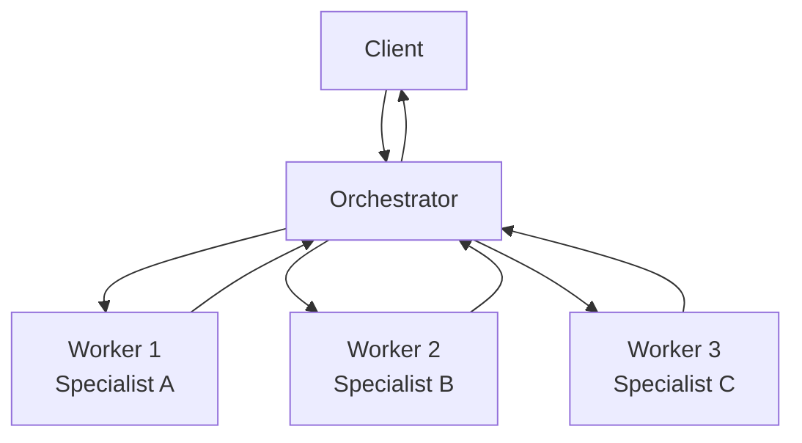

# Orchestrator-Worker Pattern

## Abstract

The Orchestrator-Worker pattern coordinates task distribution among specialized agents through a central orchestrator that decomposes complex tasks and dispatches subtasks to worker agents based on their capabilities.

## Problem Statement

In multi-agent systems, complex tasks often require coordination among multiple specialized agents. The problem is how to decompose a complex task into subtasks, assign each subtask to the appropriate specialized agent, collect and aggregate results, and handle failures gracefully without creating tight coupling between agents.

## Context

This pattern arises when:
- Tasks require multiple specialized capabilities
- Agents have distinct areas of expertise
- Task decomposition is non-trivial
- Results need to be aggregated or composed
- Failure handling must be coordinated

## Forces

- **Centralization vs. Distribution:** Central orchestration simplifies coordination but creates a single point of failure
- **Specialization vs. Flexibility:** Highly specialized agents are efficient but less adaptable
- **Synchronous vs. Asynchronous:** Synchronous coordination is simpler but less scalable
- **Coupling vs. Autonomy:** Tight coupling enables coordination but reduces agent independence

## Solution

### Architecture Diagram



### Components

- **Orchestrator:** Central coordinator that decomposes tasks and manages workflow
- **Workers:** Specialized agents that execute specific subtasks
- **Task Queue:** Optional buffer for asynchronous task distribution
- **Result Aggregator:** Component that combines worker results

### Formal Properties

**Invariants:**
- Each subtask is assigned to exactly one worker
- Orchestrator maintains task state throughout execution
- All workers respond within timeout bounds

**Guarantees:**
- Task completion or explicit failure notification
- Subtask isolation (one worker's failure doesn't affect others)
- Result consistency (aggregated result matches task specification)

**Bounds:**
- Maximum concurrent workers: bounded by orchestrator capacity
- Task timeout: bounded by sum of worker timeouts + orchestration overhead
- Memory: O(n) where n = number of concurrent tasks

## Implementation

```typescript
interface Task {
  id: string;
  type: string;
  payload: unknown;
  dependencies?: string[];
}

interface WorkerResult {
  taskId: string;
  success: boolean;
  data: unknown;
  error?: string;
}

class Orchestrator {
  private workers = new Map<string, Worker>();
  private activeTasks = new Map<string, TaskState>();

  async executeTask(task: Task): Promise<WorkerResult> {
    const subtasks = this.decomposeTask(task);
    const results = await Promise.allSettled(
      subtasks.map(st => this.executeSubtask(st))
    );
    return this.aggregateResults(results);
  }

  private decomposeTask(task: Task): Task[] {
    // Task decomposition logic
    return [];
  }

  private async executeSubtask(subtask: Task): Promise<WorkerResult> {
    const worker = this.selectWorker(subtask);
    return await worker.execute(subtask);
  }

  private selectWorker(task: Task): Worker {
    // Worker selection based on task type and capabilities
    return this.workers.get(task.type)!;
  }

  private aggregateResults(results: PromiseSettledResult<WorkerResult>[]): WorkerResult {
    // Result aggregation logic
    return {
      taskId: crypto.randomUUID(),
      success: true,
      data: results
    };
  }
}
```

## Failure Modes

| Failure | Detection | Recovery |
|---------|-----------|----------|
| Worker timeout | No response within timeout | Retry with different worker or fallback |
| Worker failure | Explicit error response | Retry or escalate to human |
| Orchestrator failure | No coordination | Restart orchestrator with state recovery |
| Partial results | Some workers succeed, some fail | Degrade gracefully or compensate |

## When NOT to Use

- **Simple tasks:** If tasks don't require multiple specialists, use a single agent
- **Tight latency requirements:** Orchestration overhead may be unacceptable
- **Highly dynamic workflows:** If task decomposition is unpredictable, consider reactive patterns
- **Stateless operations:** If no coordination is needed, use direct routing

## Cross-References

### Related Patterns
- **Supervisor** (Part I) — Adds hierarchical oversight
- **Pipeline** (Part I) — Sequential alternative for linear workflows
- **Fan-Out/Fan-In** (Part I) — Parallel execution variant
- **Router** (Part I) — Simpler routing without orchestration

### External Implementations
- **agent-mesh** — `src/orchestrator/` for complete implementation

## References

- **Enterprise Integration Patterns** (Hohpe & Woolf, 2003) — Message broker patterns
- **AWS Step Functions** — Managed orchestration service
- **Temporal.io** — Durable execution framework
