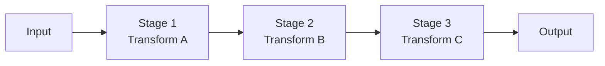

# Pipeline Pattern

## Abstract

The Pipeline pattern chains sequential transformations where each stage processes input and passes output to the next stage, creating a linear processing flow with clear separation of concerns.

## Problem Statement

In data processing systems, complex transformations are often composed of simpler sequential steps. The problem is how to structure these transformations to maximize reusability, testability, and maintainability while ensuring data flows correctly through each stage.

## Context

This pattern arises when:
- Data requires multiple sequential transformations
- Each transformation is independent and stateless
- Processing order is fixed and deterministic
- Stages may be reused in different pipelines
- Throughput optimization is needed

## Forces

- **Throughput vs. Latency:** Pipelining improves throughput but adds latency per item
- **Coupling vs. Flexibility:** Tight coupling simplifies data flow but reduces flexibility
- **Buffering vs. Backpressure:** Buffers smooth flow but can hide bottlenecks
- **Stateless vs. Stateful:** Stateless stages are simpler but may duplicate work

## Solution

### Architecture Diagram



### Components

- **Pipeline:** Orchestrates the flow of data through stages
- **Stages:** Individual transformation units with defined input/output
- **Buffers:** Optional queues between stages for flow control
- **Pipeline Factory:** Creates pipeline instances with configured stages

### Formal Properties

**Invariants:**
- Each stage has exactly one input and one output
- Data flows in one direction (no feedback loops)
- Stage execution is idempotent

**Guarantees:**
- Output is deterministic for given input
- Pipeline fails fast on stage error
- Backpressure is propagated upstream

**Bounds:**
- Pipeline depth: bounded by latency requirements
- Stage timeout: bounded by SLA divided by stage count
- Buffer size: bounded by memory constraints

## Implementation

```typescript
interface PipelineStage<T, U> {
  name: string;
  process(input: T): Promise<U>;
}

class Pipeline<T> {
  private stages: PipelineStage<unknown, unknown>[] = [];

  addStage<U, V>(stage: PipelineStage<U, V>): Pipeline<V> {
    this.stages.push(stage as PipelineStage<unknown, unknown>);
    return this as unknown as Pipeline<V>;
  }

  async execute(input: T): Promise<unknown> {
    let current = input as unknown;
    for (const stage of this.stages) {
      current = await stage.process(current);
    }
    return current;
  }
}

// Usage
const pipeline = new Pipeline<string>()
  .addStage({ name: 'parse', process: (s: string) => JSON.parse(s) })
  .addStage({ name: 'validate', process: (obj: unknown) => validate(obj) })
  .addStage({ name: 'transform', process: (valid: Validated) => transform(valid) });
```

## Failure Modes

| Failure | Detection | Recovery |
|---------|-----------|----------|
| Stage timeout | No output within timeout | Retry stage or fail pipeline |
| Stage error | Exception thrown | Log error, fail pipeline, notify |
| Data corruption | Invalid data format | Validate at each stage boundary |
| Bottleneck | Stage queue grows | Scale stage or optimize processing |

## When NOT to Use

- **Non-linear workflows:** If processing branches or loops, use orchestration
- **Stateful processing:** If stages need shared state, use shared memory patterns
- **Dynamic ordering:** If stage order varies, use router pattern
- **Real-time requirements:** Pipeline latency may violate timing constraints

## Cross-References

### Related Patterns
- **Orchestrator-Worker** (Part I) — More flexible coordination
- **Fan-Out/Fan-In** (Part I) — Parallel variant
- **Router** (Part I) — Content-based routing alternative

### External Implementations
- **agent-mesh** — Pipeline stages in agent processing

## References

- **Unix Philosophy** — Pipes and filters architecture
- **Enterprise Integration Patterns** (Hohpe & Woolf) — Message pipeline
- **Apache Airflow** — DAG-based pipeline orchestration
