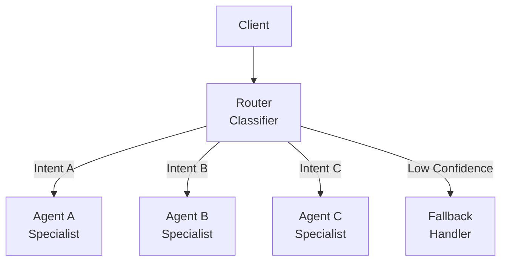

# Router Pattern

## Abstract

The Router pattern directs requests to appropriate agents based on content analysis, enabling specialized handling by routing each request to the agent best suited to process it.

## Problem Statement

In multi-agent systems, different agents specialize in different domains. The problem is how to analyze incoming requests, determine the appropriate agent, and route the request efficiently while handling ambiguous cases and maintaining routing accuracy.

## Context

This pattern arises when:
- Multiple specialized agents exist
- Request type is not known a priori
- Routing accuracy affects system performance
- Ambiguous requests need special handling
- Routing decisions should be fast

## Forces

- **Accuracy vs. Speed:** More accurate classification takes more time
- **Specificity vs. Coverage:** Specialized agents are accurate but cover less
- **Static vs. Dynamic:** Static routing is fast but inflexible
- **Confidence vs. Escalation:** Low-confidence routing may need human review

## Solution

### Architecture Diagram



### Components

- **Router/Classifier:** Analyzes input and determines intent
- **Routing Table:** Maps intents to agent handlers
- **Confidence Scorer:** Evaluates routing decision confidence
- **Fallback Handler:** Handles ambiguous or unknown intents

### Formal Properties

**Invariants:**
- Each request is routed to exactly one agent or fallback
- Routing decision is deterministic for same input
- Confidence score is between 0.0 and 1.0

**Guarantees:**
- Routing completes within bounded latency
- Unknown intents are handled by fallback
- Routing table is eventually consistent

**Bounds:**
- Classification latency: bounded by model inference time
- Routing table size: bounded by memory
- Confidence threshold: tunable parameter

## Implementation

```typescript
interface RoutingDecision {
  intent: string;
  confidence: number;
  agent: string;
}

interface RouteConfig {
  intent: string;
  agent: string;
  minConfidence: number;
}

class Router {
  private routes: RouteConfig[] = [];
  private classifier: IntentClassifier;
  private fallbackHandler: FallbackHandler;

  async route(request: Request): Promise<Response> {
    const decision = await this.classify(request);
    
    if (decision.confidence < this.getThreshold(decision.intent)) {
      return await this.fallbackHandler.handle(request);
    }

    const agent = this.getAgent(decision.agent);
    return await agent.process(request);
  }

  private async classify(request: Request): Promise<RoutingDecision> {
    const intent = await this.classifier.classify(request.content);
    const confidence = await this.classifier.getConfidence(intent);
    const route = this.routes.find(r => r.intent === intent);
    
    return {
      intent,
      confidence,
      agent: route?.agent || 'default'
    };
  }
}
```

## Failure Modes

| Failure | Detection | Recovery |
|---------|-----------|----------|
| Misclassification | Wrong agent selected | Retrain classifier, add feedback loop |
| Low confidence | Confidence below threshold | Route to fallback or human |
| Agent unavailable | Target agent down | Retry with fallback agent |
| Classifier drift | Accuracy degrades over time | Periodic retraining, monitoring |

## When NOT to Use

- **Single agent:** If only one agent exists, routing is unnecessary
- **Known intent:** If intent is explicit in request, use direct dispatch
- **High accuracy required:** If misrouting is costly, use human review
- **Dynamic agents:** If agents change frequently, routing table maintenance is burdensome

## Cross-References

### Related Patterns
- **Confidence Gate** (Part IV) — Threshold-based routing decisions
- **Orchestrator-Worker** (Part I) — More complex coordination
- **Fallback Chain** (Part II) — Handles routing failures

### External Implementations
- **agent-mesh** — `src/classifier/` and `src/router/` for complete implementation
- **classifier-evals** — Evaluation harness for router accuracy

## References

- **Intent Classification** — NLP pattern for request understanding
- **Content-Based Routing** — Enterprise integration pattern
- **AWS Lex** — Intent-based conversational routing
