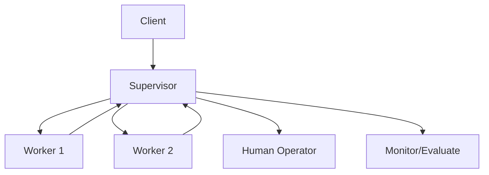

# Supervisor Pattern

## Abstract

The Supervisor pattern provides hierarchical oversight with escalation paths, where a supervisor agent monitors worker agents, evaluates their performance, and intervenes when necessary through escalation or reassignment.

## Problem Statement

In multi-agent systems, worker agents may encounter situations beyond their capabilities, make errors, or require human intervention. The problem is how to provide oversight, detect when intervention is needed, and escalate appropriately while maintaining system autonomy for routine operations.

## Context

This pattern arises when:
- Workers have limited capabilities or authority
- Errors require human judgment
- Performance monitoring is critical
- Escalation paths must be defined
- Quality assurance is required

## Forces

- **Autonomy vs. Control:** More supervisor control reduces worker autonomy
- **Escalation Speed vs. Accuracy:** Fast escalation may be premature; slow escalation risks errors
- **Human-in-the-loop vs. Automation:** More human involvement increases quality but reduces speed
- **Monitoring Overhead vs. Visibility:** Detailed monitoring provides visibility but adds overhead

## Solution

### Architecture Diagram



### Components

- **Supervisor:** Oversees worker agents and makes escalation decisions
- **Workers:** Execute tasks under supervisor oversight
- **Escalation Handler:** Routes exceptional cases to human operators
- **Performance Monitor:** Tracks worker metrics and quality

### Formal Properties

**Invariants:**
- Every worker reports to exactly one supervisor
- Escalation decisions are logged
- Supervisor maintains worker capability registry

**Guarantees:**
- Escalation within bounded time for critical issues
- Worker performance tracking with statistical confidence
- Graceful degradation when supervisor is unavailable

**Bounds:**
- Supervisor span of control: bounded by cognitive load (typically 5-10 workers)
- Escalation latency: bounded by SLA requirements
- Monitoring data retention: bounded by storage capacity

## Implementation

```typescript
interface WorkerStatus {
  workerId: string;
  status: 'idle' | 'busy' | 'error' | 'escalated';
  performance: PerformanceMetrics;
}

interface EscalationRequest {
  workerId: string;
  reason: string;
  severity: 'low' | 'medium' | 'high' | 'critical';
  context: unknown;
}

class Supervisor {
  private workers = new Map<string, WorkerStatus>();
  private escalationHandlers = new Map<string, EscalationHandler>();

  async assignTask(task: Task): Promise<void> {
    const worker = this.selectWorker(task);
    await worker.execute(task);
    this.monitorPerformance(worker);
  }

  private selectWorker(task: Task): Worker {
    // Selection based on capability, load, and performance
    return this.findBestWorker(task);
  }

  private monitorPerformance(worker: Worker): void {
    const metrics = this.collectMetrics(worker);
    if (this.shouldEscalate(metrics)) {
      this.escalate(worker, metrics);
    }
  }

  private shouldEscalate(metrics: PerformanceMetrics): boolean {
    // Escalation logic based on error rate, confidence, etc.
    return metrics.errorRate > 0.1 || metrics.confidence < 0.7;
  }
}
```

## Failure Modes

| Failure | Detection | Recovery |
|---------|-----------|----------|
| Supervisor overload | Queue buildup, slow decisions | Load balance or add supervisors |
| False positive escalation | Escalation rate too high | Adjust thresholds, retrain models |
| Worker dependency | Workers rely too much on supervisor | Increase worker autonomy gradually |
| Escalation bottleneck | Human operators overwhelmed | Add operators or improve automation |

## When NOT to Use

- **Highly reliable workers:** If workers rarely need intervention, overhead is unjustified
- **Real-time systems:** Supervision latency may violate timing constraints
- **Simple tasks:** If tasks are straightforward, direct execution is more efficient
- **Fully autonomous systems:** If no human intervention is possible, use self-healing patterns

## Cross-References

### Related Patterns
- **Orchestrator-Worker** (Part I) — Coordination without oversight
- **Confidence Gate** (Part IV) — Threshold-based escalation
- **Human Handoff** (Part VI) — Escalation to human operators

### External Implementations
- **agent-mesh** — `src/supervisor/` for hierarchical oversight

## References

- **Management Cybernetics** (Beer, 1972) — Viable System Model
- **Human-in-the-loop Systems** — ACM Computing Surveys
- **Kubernetes** — Controller pattern for resource management
