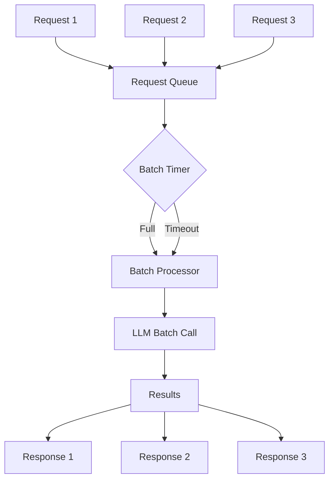

# Batch Coalescing Pattern

## Abstract

The Batch Coalescing pattern improves throughput by collecting multiple requests and processing them together, reducing per-request overhead and enabling more efficient resource utilization.

## Problem Statement

Individual LLM API calls have fixed overhead (network latency, API processing). The problem is how to batch multiple requests together to amortize this overhead, improve throughput, and reduce costs while managing the added latency from waiting for batches to fill.

## Context

This pattern arises when:
- Many small requests arrive frequently
- Per-request overhead is significant
- Throughput is more important than latency
- Requests can be delayed briefly
- Batch processing is supported

## Forces

- **Batch Size vs. Latency:** Larger batches increase throughput but add latency
- **Wait Time vs. Efficiency:** Longer waits fill batches but delay responses
- **Homogeneity vs. Flexibility:** Similar requests batch better
- **Complexity vs. Gain:** Batching adds complexity

## Solution

### Architecture Diagram



### Components

- **Request Queue:** Collects incoming requests
- **Batch Timer:** Triggers batch processing
- **Batch Processor:** Groups and processes requests
- **Result Distributor:** Routes results to requesters

### Formal Properties

**Invariants:**
- Requests are processed in FIFO order within batches
- Batch size never exceeds maximum
- All requests in a batch are processed together

**Guarantees:**
- Requests are processed within max wait time
- Batch processing is atomic
- Results are delivered to correct requesters

**Bounds:**
- Batch size: bounded by max_batch_size
- Wait time: bounded by max_wait_time
- Batch processing time: bounded by sum of individual times

## Implementation

```typescript
interface BatchRequest<T, R> {
  id: string;
  input: T;
  resolve: (result: R) => void;
  reject: (error: Error) => void;
  timestamp: number;
}

interface BatchConfig<T, R> {
  maxBatchSize: number;
  maxWaitTimeMs: number;
  processor: (inputs: T[]) => Promise<R[]>;
}

class BatchCoalescer<T, R> {
  private queue: BatchRequest<T, R>[] = [];
  private processing = false;
  private timer: NodeJS.Timeout | null = null;

  constructor(private config: BatchConfig<T, R>) {}

  async process(input: T): Promise<R> {
    return new Promise((resolve, reject) => {
      const request: BatchRequest<T, R> = {
        id: crypto.randomUUID(),
        input,
        resolve,
        reject,
        timestamp: Date.now()
      };

      this.queue.push(request);

      // Start timer if this is the first request
      if (this.queue.length === 1) {
        this.startTimer();
      }

      // Process immediately if batch is full
      if (this.queue.length >= this.config.maxBatchSize) {
        this.processBatch();
      }
    });
  }

  private startTimer(): void {
    this.timer = setTimeout(() => {
      this.processBatch();
    }, this.config.maxWaitTimeMs);
  }

  private async processBatch(): Promise<void> {
    if (this.processing || this.queue.length === 0) return;

    this.processing = true;
    if (this.timer) {
      clearTimeout(this.timer);
      this.timer = null;
    }

    const batch = this.queue.splice(0, this.config.maxBatchSize);
    const inputs = batch.map(r => r.input);

    try {
      const results = await this.config.processor(inputs);
      
      for (let i = 0; i < batch.length; i++) {
        batch[i]!.resolve(results[i]!);
      }
    } catch (error) {
      for (const request of batch) {
        request.reject(error as Error);
      }
    } finally {
      this.processing = false;
      
      // Process remaining requests
      if (this.queue.length > 0) {
        this.processBatch();
      }
    }
  }

  getQueueSize(): number {
    return this.queue.length;
  }
}
```

## Failure Modes

| Failure | Detection | Recovery |
|---------|-----------|----------|
| Batch timeout | Requests waiting too long | Reduce max_wait_time |
| Partial failure | Some batch items fail | Retry failed items individually |
| Queue overflow | Queue grows unbounded | Increase batch size, add backpressure |
| Processor failure | Batch processing fails | Retry with smaller batches |

## When NOT to Use

- **Real-time required:** If low latency is critical
- **Unique requests:** If requests can't be batched
- **Low volume:** If requests are infrequent
- **Stateful processing:** If requests depend on order

## Cross-References

### Related Patterns
- **Fan-Out/Fan-In** (Part I) — Parallel processing
- **Graceful Degradation** (Part VI) — Handle batch failures
- **Token Budget Enforcer** (Part VI) — Cost optimization

### External Implementations
- **OpenAI Batch API** — Batch processing for completions
- **AWS Batch** — Batch computing service

## References

- **Batch Processing** — Data-intensive applications
- **OpenAI Batch API** — Efficient batch processing
- **MapReduce** — Large-scale batch processing
