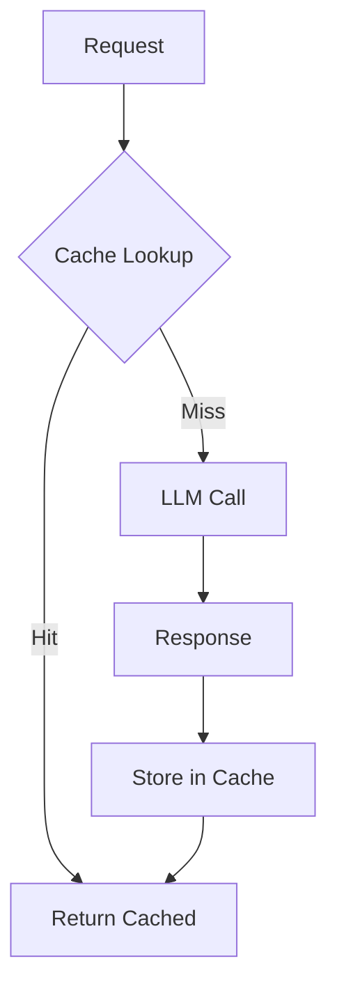

# Cache-Aside Pattern

## Abstract

The Cache-Aside pattern avoids redundant LLM computation by caching responses and checking the cache before making API calls, significantly reducing latency and costs for repeated or similar requests.

## Problem Statement

LLM API calls are expensive and slow. The problem is how to cache responses effectively, handle cache invalidation, manage cache misses, and ensure cache consistency while maximizing hit rates and minimizing stale data.

## Context

This pattern arises when:
- Similar requests are made repeatedly
- LLM responses are deterministic for same inputs
- Latency reduction is critical
- Cost reduction is important
- Response consistency is acceptable

## Forces

- **Hit Rate vs. Freshness:** Larger caches may serve stale data
- **Key Granularity vs. Hit Rate:** Fine-grained keys reduce hits
- **TTL vs. Staleness:** Longer TTL increases hits but may serve outdated data
- **Cache Size vs. Memory:** Larger caches use more memory

## Solution

### Architecture Diagram



### Components

- **Cache Store:** Stores request-response pairs
- **Key Generator:** Creates cache keys from requests
- **Invalidator:** Manages cache expiration
- **Stats Tracker:** Monitors hit/miss rates

### Formal Properties

**Invariants:**
- Cache key uniquely identifies request
- Cached responses are immutable
- Expired entries are removed

**Guarantees:**
- Cache hit returns immediately
- Cache miss fetches fresh response
- Cache is eventually consistent

**Bounds:**
- Cache size: bounded by memory/storage
- TTL: bounded by freshness requirements
- Key collision: bounded by hash quality

## Implementation

```typescript
interface CacheEntry<T> {
  response: T;
  createdAt: number;
  ttlMs: number;
  key: string;
}

interface CacheAsideConfig {
  maxEntries: number;
  defaultTTLMs: number;
  keyGenerator: (request: unknown) => string;
}

class CacheAside<T> {
  private cache = new Map<string, CacheEntry<T>>();
  private hits = 0;
  private misses = 0;

  constructor(private config: CacheAsideConfig) {}

  async get(request: unknown, fetcher: () => Promise<T>): Promise<T> {
    const key = this.config.keyGenerator(request);
    
    // Check cache
    const cached = this.getFromCache(key);
    if (cached) {
      this.hits++;
      return cached;
    }

    // Cache miss - fetch fresh
    this.misses++;
    const response = await fetcher();
    
    // Store in cache
    this.setInCache(key, response);
    return response;
  }

  private getFromCache(key: string): T | null {
    const entry = this.cache.get(key);
    if (!entry) return null;

    // Check TTL
    if (Date.now() - entry.createdAt > entry.ttlMs) {
      this.cache.delete(key);
      return null;
    }

    return entry.response;
  }

  private setInCache(key: string, response: T): void {
    // Evict if at capacity
    if (this.cache.size >= this.config.maxEntries) {
      const oldestKey = this.cache.keys().next().value;
      if (oldestKey) this.cache.delete(oldestKey);
    }

    this.cache.set(key, {
      key,
      response,
      createdAt: Date.now(),
      ttlMs: this.config.defaultTTLMs
    });
  }

  invalidate(key?: string): void {
    if (key) {
      this.cache.delete(key);
    } else {
      this.cache.clear();
    }
  }

  getStats(): { hitRate: number; size: number } {
    const total = this.hits + this.misses;
    return {
      hitRate: total > 0 ? this.hits / total : 0,
      size: this.cache.size
    };
  }
}
```

## Failure Modes

| Failure | Detection | Recovery |
|---------|-----------|----------|
| Cache miss storm | Sudden drop in hit rate | Warm cache, increase TTL |
| Stale cache | Outdated responses served | Reduce TTL, add invalidation |
| Cache full | Eviction rate high | Increase size, reduce TTL |
| Key collision | Wrong response returned | Improve key generation |

## When NOT to Use

- **Unique requests:** If every request is different
- **Non-deterministic:** If responses vary for same input
- **Real-time required:** If freshest data is always needed
- **Memory constrained:** If cache memory is unavailable

## Cross-References

### Related Patterns
- **Idempotency Cache** (Part III) — Request deduplication
- **Token Budget Enforcer** (Part VI) — Cost control
- **Graceful Degradation** (Part VI) — Handle cache failures

### External Implementations
- **llm-router** — Response caching for LLM calls
- **Redis** — Distributed caching

## References

- **Cache-Aside Pattern** — Microsoft Azure patterns
- **Redis** — Caching best practices
- **HTTP Caching** — RFC 7234 caching standards
