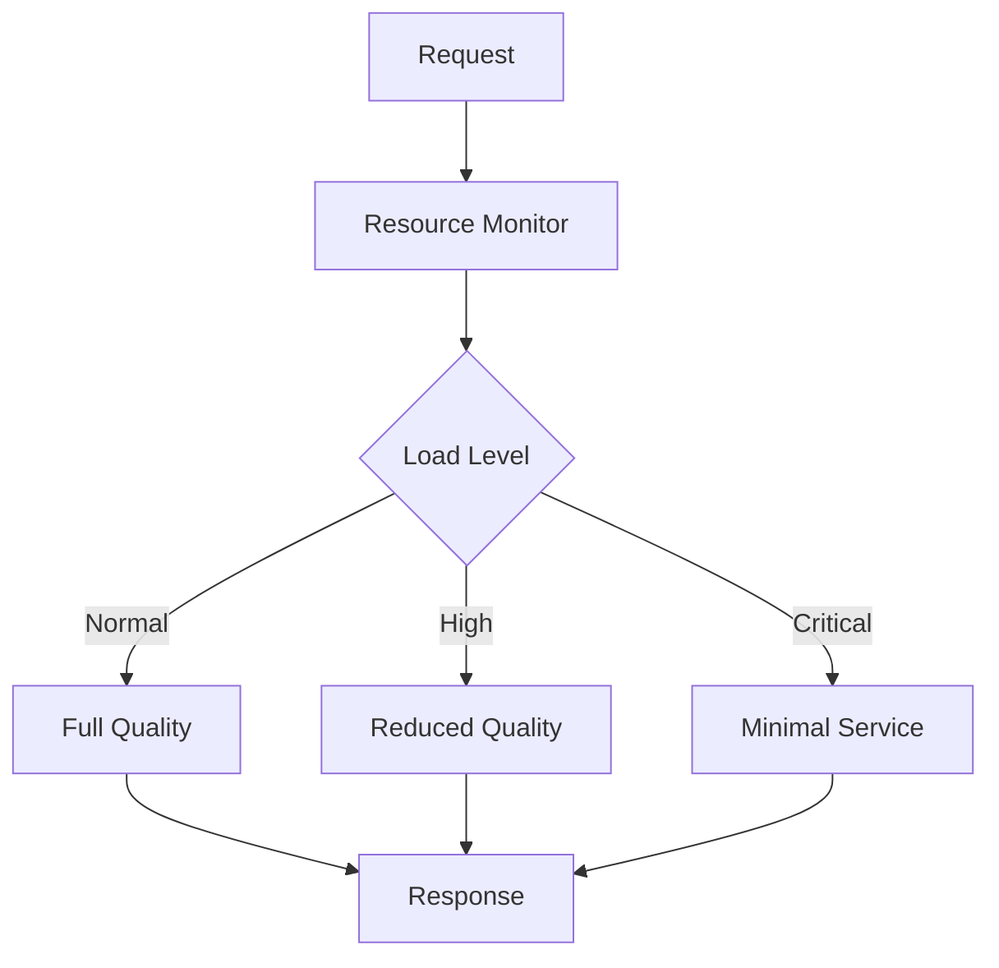

# Graceful Degradation Pattern

## Abstract

The Graceful Degradation pattern maintains service availability under load by reducing quality or functionality when resources are constrained, ensuring the system remains usable even in degraded mode.

## Problem Statement

Under high load or resource constraints, systems may fail completely. The problem is how to detect resource pressure, reduce quality or functionality in a controlled manner, and maintain core service availability while gracefully reducing non-essential features.

## Context

This pattern arises when:
- Resource constraints threaten availability
- Load spikes exceed capacity
- Cost limits are reached
- Partial service is better than no service
- Quality can be adjusted dynamically

## Forces

- **Quality vs. Availability:** Lower quality maintains availability
- **Core vs. Features:** Essential features must be preserved
- **Detection vs. Reaction:** Early detection allows smoother degradation
- **Recovery vs. Hysteresis:** Avoid oscillation between modes

## Solution

### Architecture Diagram



### Components

- **Resource Monitor:** Tracks system load and resources
- **Degradation Manager:** Controls quality levels
- **Quality Adjuster:** Modifies response quality
- **Recovery Handler:** Restores full quality

### Formal Properties

**Invariants:**
- Core functionality is always available
- Degradation level is deterministic
- Recovery is gradual to avoid oscillation

**Guarantees:**
- Service remains available under any load
- Quality degrades predictably
- Recovery occurs when resources improve

**Bounds:**
- Degradation levels: bounded by defined stages
- Recovery time: bounded by hysteresis settings
- Minimum quality: bounded by core functionality

## Implementation

```typescript
type DegradationLevel = 'full' | 'reduced' | 'minimal';

interface DegradationConfig {
  thresholds: {
    high: number; // CPU/memory threshold for reduced quality
    critical: number; // Threshold for minimal service
  };
  hysteresis: number; // Prevent oscillation
  checkIntervalMs: number;
}

interface ResourceMetrics {
  cpuUsage: number;
  memoryUsage: number;
  queueLength: number;
  errorRate: number;
}

class GracefulDegradation {
  private currentLevel: DegradationLevel = 'full';
  private metrics: ResourceMetrics = {
    cpuUsage: 0,
    memoryUsage: 0,
    queueLength: 0,
    errorRate: 0
  };
  private checkInterval: NodeJS.Timeout | null = null;

  constructor(
    private config: DegradationConfig,
    private metricsProvider: () => Promise<ResourceMetrics>
  ) {
    this.startMonitoring();
  }

  async execute<T>(
    operation: () => Promise<T>,
    fallbacks: {
      full: () => Promise<T>;
      reduced: () => Promise<T>;
      minimal: () => Promise<T>;
    }
  ): Promise<T> {
    const level = this.currentLevel;
    
    try {
      switch (level) {
        case 'full':
          return await fallbacks.full();
        case 'reduced':
          return await fallbacks.reduced();
        case 'minimal':
          return await fallbacks.minimal();
      }
    } catch (error) {
      // If current level fails, try lower level
      if (level === 'full') {
        return await fallbacks.reduced();
      } else if (level === 'reduced') {
        return await fallbacks.minimal();
      }
      throw error;
    }
  }

  private async startMonitoring(): Promise<void> {
    this.checkInterval = setInterval(async () => {
      this.metrics = await this.metricsProvider();
      this.updateLevel();
    }, this.config.checkIntervalMs);
  }

  private updateLevel(): void {
    const load = this.calculateLoad();
    const hysteresis = this.config.hysteresis;

    switch (this.currentLevel) {
      case 'full':
        if (load > this.config.thresholds.high) {
          this.currentLevel = 'reduced';
        }
        break;
      case 'reduced':
        if (load > this.config.thresholds.critical) {
          this.currentLevel = 'minimal';
        } else if (load < this.config.thresholds.high - hysteresis) {
          this.currentLevel = 'full';
        }
        break;
      case 'minimal':
        if (load < this.config.thresholds.critical - hysteresis) {
          this.currentLevel = 'reduced';
        }
        break;
    }
  }

  private calculateLoad(): number {
    // Weighted combination of metrics
    return (
      this.metrics.cpuUsage * 0.3 +
      this.metrics.memoryUsage * 0.3 +
      this.metrics.errorRate * 0.4
    );
  }

  getLevel(): DegradationLevel {
    return this.currentLevel;
  }

  destroy(): void {
    if (this.checkInterval) {
      clearInterval(this.checkInterval);
    }
  }
}
```

## Failure Modes

| Failure | Detection | Recovery |
|---------|-----------|----------|
| Oscillation | Frequent level changes | Increase hysteresis |
| Stuck degraded | Not recovering | Check metrics, force recovery |
| Wrong threshold | Premature degradation | Adjust thresholds |
| Metric error | Invalid metrics | Use defaults, alert |

## When NOT to Use

- **Consistent quality:** If quality must never vary
- **Low load:** If system never approaches capacity
- **Simple systems:** If degradation adds too much complexity
- **Binary systems:** If partial service is not useful

## Cross-References

### Related Patterns
- **Circuit Breaker** (Part II) — Fail fast on errors
- **Token Budget Enforcer** (Part VI) — Cost-based degradation
- **Fallback Chain** (Part II) — Alternative implementations

### External Implementations
- **llm-router** — Model fallback on cost/quality
- **Kubernetes HPA** — Auto-scaling with degradation

## References

- **Graceful Degradation** — AWS Well-Architected
- **Resilience Engineering** — SRE practices
- **Adaptive Systems** — Self-tuning architectures
