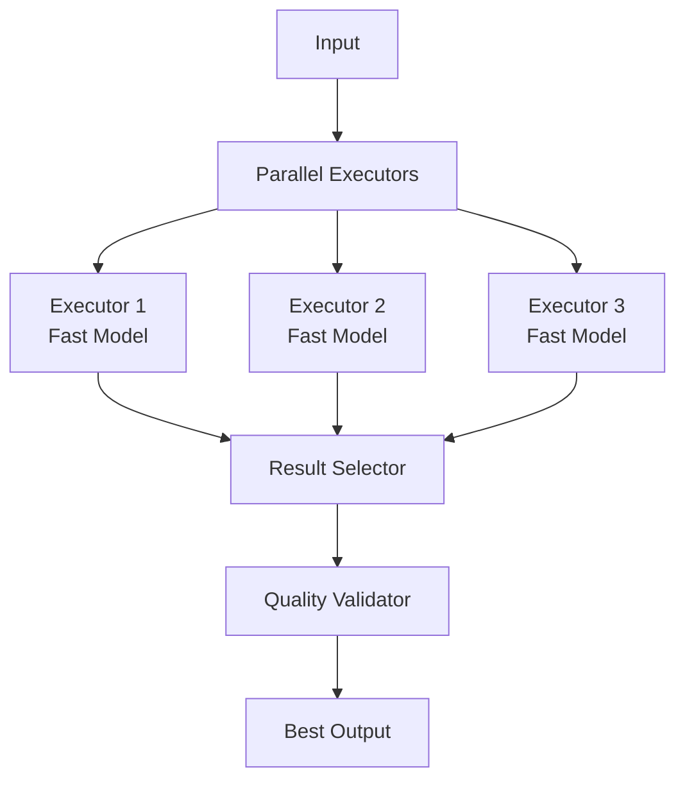

# Speculative Execution Pattern

## Abstract

The Speculative Execution pattern reduces latency by generating multiple candidate responses in parallel and selecting the best one, trading increased computation for faster perceived response time.

## Problem Statement

LLM inference latency can be high, especially for complex queries. The problem is how to reduce perceived latency by speculatively generating multiple candidates in parallel, selecting the best result, and avoiding the full sequential cost while maintaining output quality.

## Context

This pattern arises when:
- LLM latency impacts user experience
- Parallel computation is available
- Multiple valid responses exist
- Quality can be evaluated automatically
- Cost of extra computation is acceptable

## Forces

- **Latency vs. Cost:** Parallel execution increases cost
- **Quality vs. Speed:** More candidates may improve quality
- **Selection vs. Overhead:** Selection logic adds complexity
- **Speculation vs. Waste:** Some candidates are discarded

## Solution

### Architecture Diagram



### Components

- **Parallel Executors:** Generate candidates concurrently
- **Result Selector:** Chooses best candidate
- **Quality Validator:** Evaluates candidate quality
- **Cancellation Handler:** Stops unnecessary work

### Formal Properties

**Invariants:**
- All executors start simultaneously
- Selection is deterministic for same candidates
- Best candidate is always selected

**Guarantees:**
- Response time is bounded by fastest executor
- Quality is validated before return
- Resources are released after selection

**Bounds:**
- Parallel executions: bounded by available resources
- Selection time: bounded by validation complexity
- Total cost: bounded by number of executors

## Implementation

```typescript
interface Executor<T, R> {
  id: string;
  priority: number;
  execute: (input: T) => Promise<R>;
}

interface SelectionStrategy<R> {
  select: (results: Map<string, R>) => Promise<string>;
  validate: (result: R) => Promise<boolean>;
}

class SpeculativeExecutor<T, R> {
  constructor(
    private executors: Executor<T, R>[],
    private selector: SelectionStrategy<R>
  ) {}

  async execute(input: T): Promise<R> {
    const controllers = new Map<string, AbortController>();
    const results = new Map<string, R>();
    const errors = new Map<string, Error>();

    // Start all executors in parallel
    const promises = this.executors.map(async (executor) => {
      const controller = new AbortController();
      controllers.set(executor.id, controller);

      try {
        const result = await Promise.race([
          executor.execute(input),
          this.createTimeoutPromise(5000, controller.signal)
        ]);
        results.set(executor.id, result);
      } catch (error) {
        errors.set(executor.id, error as Error);
      }
    });

    // Wait for at least one result
    await Promise.any(promises);

    // Cancel remaining executors
    for (const [id, controller] of controllers) {
      if (!results.has(id)) {
        controller.abort();
      }
    }

    // Select best result
    if (results.size === 0) {
      throw new Error('All executors failed');
    }

    const bestId = await this.selector.select(results);
    const bestResult = results.get(bestId)!;

    // Validate result
    const valid = await this.selector.validate(bestResult);
    if (!valid) {
      throw new Error('Best result failed validation');
    }

    return bestResult;
  }

  private createTimeoutPromise<T>(ms: number, signal: AbortSignal): Promise<T> {
    return new Promise((_, reject) => {
      const timer = setTimeout(() => reject(new Error('Timeout')), ms);
      signal.addEventListener('abort', () => clearTimeout(timer), { once: true });
    });
  }
}
```

## Failure Modes

| Failure | Detection | Recovery |
|---------|-----------|----------|
| All executors fail | No results returned | Return error, fallback |
| Selection error | Invalid selection | Use default, retry |
| Resource exhaustion | Too many parallel calls | Limit concurrency |
| Validation failure | Best result invalid | Try next best |

## When NOT to Use

- **Single correct answer:** If only one valid response exists
- **Cost sensitive:** If extra computation is too expensive
- **Sequential required:** If results must be sequential
- **Simple queries:** If query is simple enough for single execution

## Cross-References

### Related Patterns
- **Fan-Out/Fan-In** (Part I) — Parallel execution
- **Graceful Degradation** (Part VI) — Fallback on failure
- **Cache-Aside** (Part VI) — Avoid computation

### External Implementations
- **Speculative decoding** — LLM inference optimization

## References

- **Speculative Execution** — Distributed systems optimization
- **MapReduce** — Parallel processing patterns
- **LLM Speculative Decoding** — Draft-and-verify inference
