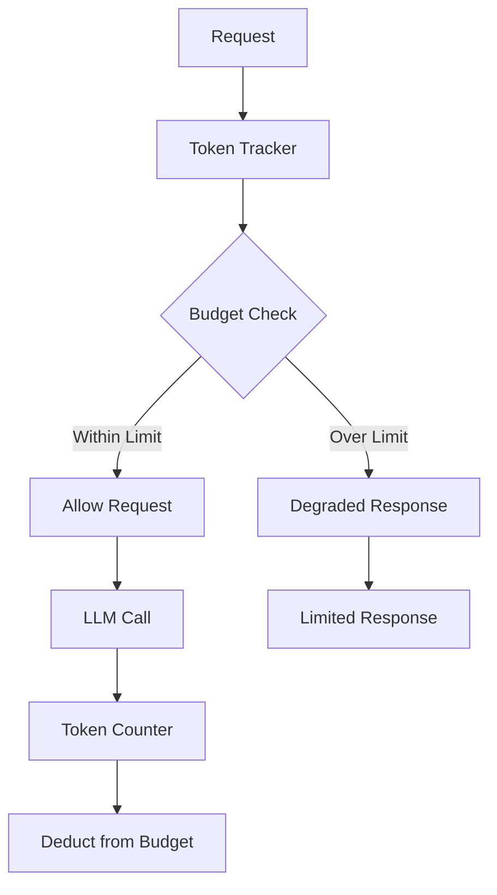

# Token Budget Enforcer Pattern

## Abstract

The Token Budget Enforcer pattern controls LLM API costs by allocating and enforcing token budgets across requests, users, or time periods, preventing cost overruns while maintaining service quality.

## Problem Statement

LLM API costs can spiral out of control without proper budgeting. The problem is how to track token usage, enforce budget limits, allocate tokens fairly across users or requests, and handle budget exhaustion gracefully while maintaining service quality.

## Context

This pattern arises when:
- LLM API costs must be controlled
- Budget limits are set for cost management
- Token usage varies across requests
- Fair allocation among users is needed
- Cost predictability is required

## Forces

- **Budget vs. Quality:** Strict budgets may reduce output quality
- **Allocation vs. Flexibility:** Fixed allocation may not match demand
- **Enforcement vs. Experience:** Hard limits may frustrate users
- **Tracking vs. Performance:** Precise tracking adds overhead

## Solution

### Architecture Diagram



### Components

- **Token Tracker:** Monitors token usage
- **Budget Manager:** Manages budget allocations
- **Token Counter:** Counts tokens in requests/responses
- **Enforcer:** Applies budget limits

### Formal Properties

**Invariants:**
- Token count is always non-negative
- Budget deductions are atomic
- Usage is tracked before and after each call

**Guarantees:**
- Budget is never exceeded
- Usage is accurately tracked
- Budget exhaustion is handled gracefully

**Bounds:**
- Budget period: configurable (hourly, daily, monthly)
- Token limit: bounded by budget allocation
- Tracking accuracy: within ±1% of actual usage

## Implementation

```typescript
interface BudgetConfig {
  maxTokens: number;
  periodMs: number; // e.g., 24 * 60 * 60 * 1000 for daily
  warningThreshold: number; // e.g., 0.8 for 80%
}

interface TokenUsage {
  periodStart: number;
  tokensUsed: number;
  requestsCount: number;
}

class TokenBudgetEnforcer {
  private usage: TokenUsage = {
    periodStart: Date.now(),
    tokensUsed: 0,
    requestsCount: 0
  };

  constructor(private config: BudgetConfig) {}

  async checkBudget(estimatedTokens: number): Promise<{ allowed: boolean; remaining: number }> {
    this.resetIfNewPeriod();
    
    const remaining = this.config.maxTokens - this.usage.tokensUsed;
    const allowed = this.usage.tokensUsed + estimatedTokens <= this.config.maxTokens;
    
    return { allowed, remaining };
  }

  async execute<T>(
    operation: () => Promise<{ result: T; tokens: number }>,
    estimatedTokens: number
  ): Promise<T> {
    const { allowed, remaining } = await this.checkBudget(estimatedTokens);
    
    if (!allowed) {
      throw new Error(`Token budget exceeded. Remaining: ${remaining}`);
    }

    const { result, tokens } = await operation();
    
    this.usage.tokensUsed += tokens;
    this.usage.requestsCount++;
    
    return result;
  }

  getUsage(): TokenUsage {
    this.resetIfNewPeriod();
    return { ...this.usage };
  }

  private resetIfNewPeriod(): void {
    const now = Date.now();
    if (now - this.usage.periodStart >= this.config.periodMs) {
      this.usage = {
        periodStart: now,
        tokensUsed: 0,
        requestsCount: 0
      };
    }
  }
}
```

## Failure Modes

| Failure | Detection | Recovery |
|---------|-----------|----------|
| Budget exhaustion | Usage reaches limit | Degrade gracefully, notify user |
| Token count error | Mismatch in counting | Recalculate, adjust |
| Period reset failure | Usage carries over | Force reset, log error |
| Estimation error | Actual >> estimated | Update estimation model |

## When NOT to Use

- **Unlimited budget:** If cost is not a concern
- **Fixed cost:** If using flat-rate pricing
- **Internal tools:** If API costs are negligible
- **Unpredictable usage:** If usage patterns vary wildly

## Cross-References

### Related Patterns
- **Graceful Degradation** (Part VI) — Handle budget exhaustion
- **Cache-Aside** (Part VI) — Reduce token usage
- **Structured Output Validator** (Part IV) — Reduce output tokens

### External Implementations
- **llm-router** — `src/telemetry/budget-manager.ts`

## References

- **LLM Cost Optimization** — Token efficiency strategies
- **AWS Budgets** — Cloud cost management
- **OpenAI Pricing** — Token-based pricing models
