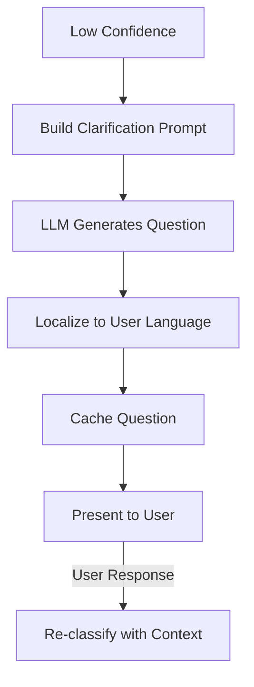

# Clarification Pattern

## Abstract

The Clarification pattern generates targeted questions to resolve ambiguity when classification confidence is low. By using LLMs to generate context-aware clarification questions in the user's language, this pattern improves routing accuracy while maintaining a natural conversational experience.

## Problem Statement

When intent classification produces low-confidence results, routing to a specialized agent may result in poor user experience. The problem is how to generate natural, targeted clarification questions that help users confirm their intent without frustrating them with generic or confusing questions.

## Context

This pattern arises when:
- Classification confidence is below threshold
- Agent supports clarification workflow
- User's intent is ambiguous
- Multiple agents could handle the request
- Natural conversation flow is important

## Forces

- **Specificity vs. Generality:** Specific questions are more helpful but may miss the mark
- **Brevity vs. Clarity:** Short questions are faster but may be unclear
- **Automation vs. Templates:** Generated questions are flexible; templates are predictable
- **Language Support:** Generated questions support many languages; templates require translation

## Solution

### Architecture Diagram



### Components

- **Clarification Prompt Builder:** Constructs prompt for LLM
- **Question Generator:** Uses LLM to generate clarification question
- **Localization Manager:** Ensures question is in user's language
- **Question Cache:** Caches generated questions to avoid regeneration

### Formal Properties

**Invariants:**
- Clarification questions are always in user's detected language
- Cached questions are reused for same classification result
- Maximum clarification rounds is bounded

**Guarantees:**
- Generated questions are context-aware and specific
- Fallback questions exist if LLM fails
- Questions are cached for bounded time

**Bounds:**
- Question length: bounded for readability
- Cache TTL: bounded (typically 5 minutes)
- Clarification rounds: bounded (typically 2-3)

## Implementation

```typescript
interface ClarificationRequest {
  agent: AgentConfig;
  classification: ClassificationResult;
  userLanguage: string;
}

class ClarificationGenerator {
  private cache = new LRUMap<string, { question: string; expires: number }>(1000);
  private fallbackQuestions: Map<string, string>;

  constructor(
    private llm: LLMClient,
    private cacheTTL: number = 5 * 60 * 1000
  ) {
    this.fallbackQuestions = this.loadFallbackQuestions();
  }

  async generate(
    agent: AgentConfig,
    classification: ClassificationResult,
    language: string
  ): Promise<string> {
    const cacheKey = `${agent.id}:${classification.intent}:${language}`;

    const cached = this.cache.get(cacheKey);
    if (cached && Date.now() < cached.expires) {
      return cached.question;
    }

    try {
      const prompt = this.buildPrompt(agent, classification, language);
      const question = await this.llm.generate(prompt, {
        temperature: 0.3,
        maxTokens: 100,
      });

      this.cache.set(cacheKey, {
        question,
        expires: Date.now() + this.cacheTTL,
      });

      return question;
    } catch (error) {
      return this.getFallbackQuestion(agent, language);
    }
  }

  private buildPrompt(
    agent: AgentConfig,
    classification: ClassificationResult,
    language: string
  ): string {
    return `Generate a clarification question in ${language} for a user whose request might be about "${agent.description}".`;
  }
}
```

## Failure Modes

| Failure | Detection | Recovery |
|---------|-----------|----------|
| LLM unavailable | API timeout | Use fallback question |
| Invalid language | Unsupported language code | Default to English |
| Generated question too long | Length validation | Truncate or use fallback |
| Cache miss storm | Many misses for same question | Pre-generate common questions |

## When NOT to Use

- **High confidence classification:** If classification is always confident, clarification is unnecessary
- **Simple domains:** For simple domains, static clarification questions may suffice
- **Real-time requirements:** If latency is critical, skip clarification
- **Single agent systems:** If only one agent exists, clarification is unnecessary

## Cross-References

### Related Patterns
- **Confidence Gate** (Part IV) — Triggers clarification when confidence is low
- **Router** (Part I) — Clarification helps router make better decisions
- **Session Bypass** (Part III) — Clarification responses maintain session

### External Implementations
- **agent-mesh** — `src/confidence/clarification.cache.ts` with LRU cache

## References

- **agent-mesh ARCHITECTURE.md** — Clarification implementation
- **Dialogue Systems** — Clarification strategies in conversational AI
- **LLM Prompt Engineering** — Best practices for question generation