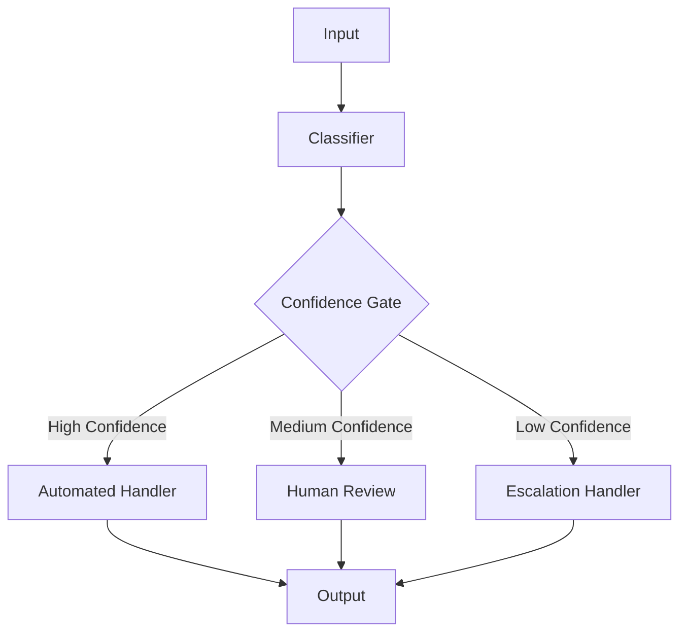

# Confidence Gate Pattern

## Abstract

The Confidence Gate pattern routes requests based on classification confidence thresholds, sending high-confidence requests to automated handlers and low-confidence requests to more capable (but expensive) handlers or human operators.

## Problem Statement

Automated classification systems sometimes produce low-confidence results that may lead to incorrect routing. The problem is how to handle uncertain classifications appropriately by escalating them to more capable handlers while processing confident classifications efficiently through automated paths.

## Context

This pattern arises when:
- Classification confidence varies across requests
- Misclassification has significant costs
- More capable handlers are available but expensive
- Human review is an option for edge cases
- Confidence scores are well-calibrated

## Forces

- **Automation vs. Accuracy:** Higher automation reduces cost but may reduce accuracy
- **Threshold vs. Volume:** Higher thresholds increase escalation volume
- **Speed vs. Quality:** Automated paths are faster but less accurate
- **Cost vs. Risk:** Expensive handlers reduce misclassification risk

## Solution

### Architecture Diagram



### Components

- **Classifier:** Generates intent prediction with confidence score
- **Confidence Gate:** Evaluates confidence against thresholds
- **Automated Handler:** Processes high-confidence requests
- **Escalation Handler:** Handles low-confidence requests

### Formal Properties

**Invariants:**
- Confidence score is between 0.0 and 1.0
- Thresholds are ordered: auto > review > escalate
- Every request is handled by exactly one path

**Guarantees:**
- High-confidence requests are processed automatically
- Low-confidence requests receive additional scrutiny
- Escalation volume is bounded by threshold settings

**Bounds:**
- Threshold values: configurable per intent type
- Escalation rate: bounded by confidence distribution
- Processing latency: bounded by handler SLA

## Implementation

```typescript
interface ConfidenceGateConfig {
  autoThreshold: number; // e.g., 0.8
  reviewThreshold: number; // e.g., 0.5
}

interface ClassificationResult {
  intent: string;
  confidence: number;
  alternatives?: Array<{ intent: string; confidence: number }>;
}

class ConfidenceGate {
  constructor(private config: ConfidenceGateConfig) {}

  async process(
    input: unknown,
    classifier: Classifier,
    handlers: Handlers
  ): Promise<Response> {
    const classification = await classifier.classify(input);
    return this.route(classification, handlers, input);
  }

  private route(
    classification: ClassificationResult,
    handlers: Handlers,
    input: unknown
  ): Promise<Response> {
    const { confidence } = classification;

    if (confidence >= this.config.autoThreshold) {
      return handlers.auto.process(input, classification);
    }

    if (confidence >= this.config.reviewThreshold) {
      return handlers.review.process(input, classification);
    }

    return handlers.escalate.process(input, classification);
  }
}

interface Handlers {
  auto: { process: (input: unknown, classification: ClassificationResult) => Promise<Response> };
  review: { process: (input: unknown, classification: ClassificationResult) => Promise<Response> };
  escalate: { process: (input: unknown, classification: ClassificationResult) => Promise<Response> };
}
```

## Failure Modes

| Failure | Detection | Recovery |
|---------|-----------|----------|
| Threshold misconfiguration | Too many/few escalations | Monitor escalation rate, adjust |
| Confidence drift | Classifier confidence becomes unreliable | Recalibrate classifier |
| Handler overload | Escalation queue grows | Scale handlers, adjust thresholds |
| False confidence | High confidence but wrong classification | Add validation layer |

## When NOT to Use

- **Binary classification:** If only two outcomes, simple threshold suffices
- **Perfect classifier:** If classifier is always correct, gate is unnecessary
- **No escalation path:** If no alternative handlers exist
- **Uniform confidence:** If confidence is always high or always low

## Cross-References

### Related Patterns
- **Router** (Part I) — Base routing without confidence
- **LLM-as-Judge** (Part IV) — Quality evaluation
- **Human Handoff** (Part VI) — Escalation to humans
- **Supervisor** (Part I) — Oversight and escalation

### External Implementations
- **agent-mesh** — `src/confidence/confidence.gate.ts`

## References

- **Confidence Calibration** — Machine learning reliability
- **Active Learning** — Selective sampling for labeling
- **Human-in-the-loop ML** — Escalation strategies
