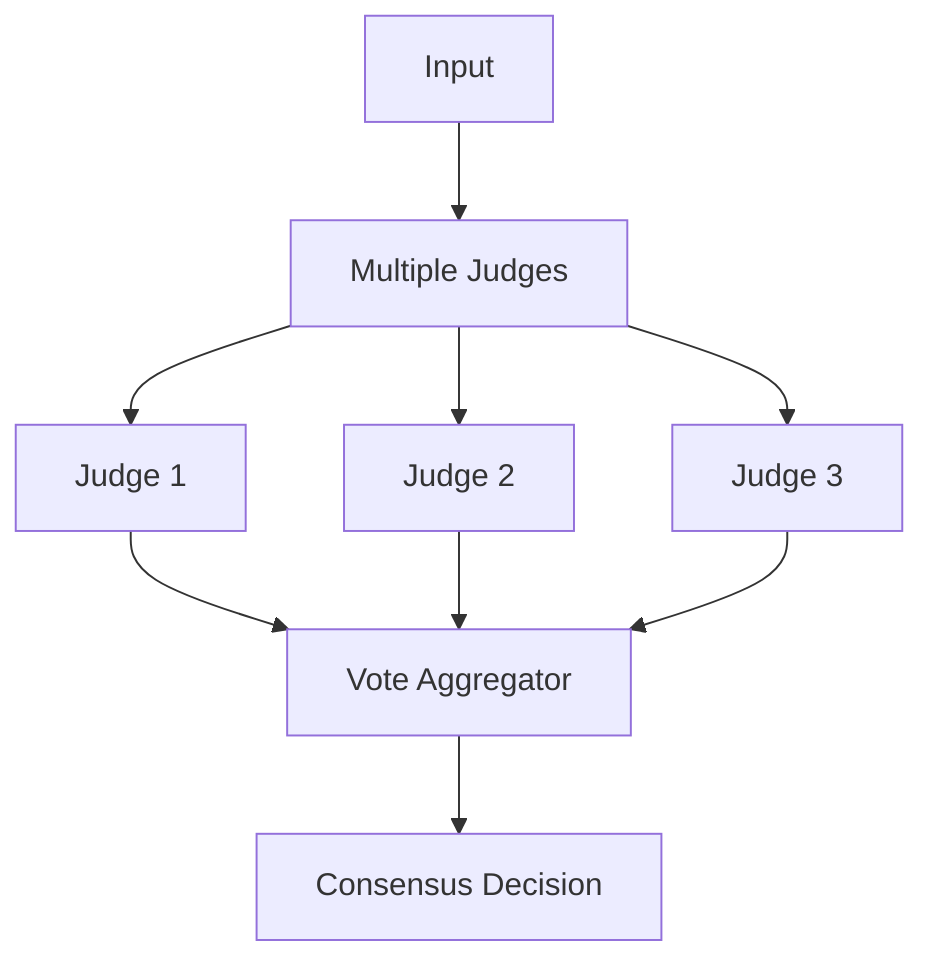

# Consensus Voting Pattern

## Abstract

The Consensus Voting pattern improves decision quality by collecting judgments from multiple independent judges and selecting the majority or weighted consensus, reducing the impact of individual judge errors or biases.

## Problem Statement

Individual judges (whether LLMs or humans) can make errors or exhibit biases that lead to incorrect decisions. The problem is how to combine multiple independent judgments to improve accuracy, handle disagreements, and provide confidence in the final decision while managing the increased cost of multiple evaluations.

## Context

This pattern arises when:
- Individual judgments are error-prone
- Multiple independent judges are available
- Decision accuracy is critical
- Judges have diverse perspectives or expertise
- Cost of multiple evaluations is acceptable

## Forces

- **Accuracy vs. Cost:** More judges increase accuracy but also cost
- **Independence vs. Diversity:** Judges must be independent but diverse
- **Majority vs. Weighted:** Simple majority vs. expertise-weighted voting
- **Speed vs. Quality:** Waiting for all votes delays decisions

## Solution

### Architecture Diagram



### Components

- **Judge Pool:** Collection of independent evaluators
- **Vote Collector:** Gathers judgments from all judges
- **Vote Aggregator:** Combines votes using voting strategy
- **Tiebreaker:** Handles tied votes

### Formal Properties

**Invariants:**
- Each judge provides exactly one vote
- Votes are independent (no collusion)
- Aggregation is deterministic for same votes

**Guarantees:**
- Decision reflects majority opinion
- Ties are resolved deterministically
- Confidence increases with agreement level

**Bounds:**
- Judge count: odd number to avoid ties (typically 3-7)
- Voting time: bounded by slowest judge
- Cost: linear in number of judges

## Implementation

```typescript
interface Judge<T, R> {
  id: string;
  weight?: number;
  evaluate: (input: T) => Promise<R>;
}

interface VotingConfig {
  strategy: 'majority' | 'weighted' | 'unanimous';
  tiebreaker?: (votes: Vote[]) => Promise<string>;
}

interface Vote {
  judgeId: string;
  decision: string;
  confidence?: number;
}

class ConsensusVoting<T, R extends string> {
  constructor(
    private judges: Judge<T, R>[],
    private config: VotingConfig
  ) {}

  async evaluate(input: T): Promise<{ decision: R; confidence: number }> {
    // Collect votes from all judges
    const votes = await Promise.all(
      this.judges.map(j => this.collectVote(j, input))
    );

    // Aggregate votes
    const result = this.aggregate(votes);
    return result;
  }

  private async collectVote(judge: Judge<T, R>, input: T): Promise<Vote> {
    const decision = await judge.evaluate(input);
    return {
      judgeId: judge.id,
      decision: decision as unknown as string,
      confidence: 1.0 // Could be provided by judge
    };
  }

  private aggregate(votes: Vote[]): { decision: R; confidence: number } {
    // Count votes by decision
    const counts = new Map<string, number>();
    let totalWeight = 0;

    for (const vote of votes) {
      const weight = this.getWeight(vote.judgeId);
      counts.set(vote.decision, (counts.get(vote.decision) || 0) + weight);
      totalWeight += weight;
    }

    // Find majority
    let maxCount = 0;
    let majorityDecision = '';
    for (const [decision, count] of counts) {
      if (count > maxCount) {
        maxCount = count;
        majorityDecision = decision;
      }
    }

    const confidence = maxCount / totalWeight;
    return {
      decision: majorityDecision as R,
      confidence
    };
  }

  private getWeight(judgeId: string): number {
    const judge = this.judges.find(j => j.id === judgeId);
    return judge?.weight || 1;
  }
}
```

## Failure Modes

| Failure | Detection | Recovery |
|---------|-----------|----------|
| Judge collusion | Votes too correlated | Add diverse judges, detect correlation |
| Systematic bias | All judges make same error | Add diverse judge types |
| Tie votes | No clear majority | Use tiebreaker, add odd judge |
| Slow judge | One judge delays all | Timeout, use available votes |

## When NOT to Use

- **High agreement:** If judges always agree, single judge suffices
- **Cost sensitive:** If evaluation cost is critical
- **Real-time required:** If voting latency is unacceptable
- **No independent judges:** If judges are correlated

## Cross-References

### Related Patterns
- **LLM-as-Judge** (Part IV) — Individual judgment
- **Confidence Gate** (Part IV) — Quality-based routing
- **Fan-Out/Fan-In** (Part I) — Parallel evaluation

### External Implementations
- **Classifier-evals** — Multi-model evaluation

## References

- **Condorcet's Jury Theorem** — Mathematical basis for voting
- **Ensemble Methods** — Machine learning voting
- **Delphi Method** — Structured expert judgment
