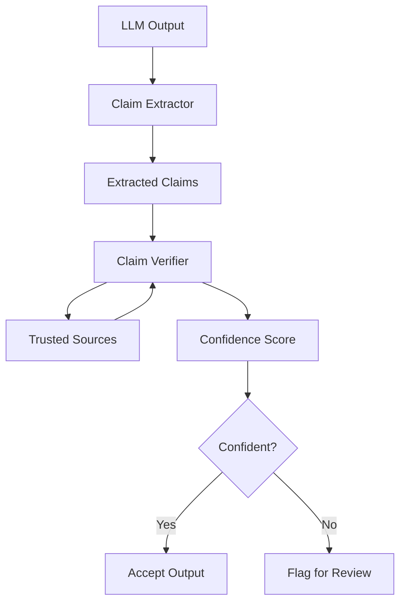

# Hallucination Detector Pattern

## Abstract

The Hallucination Detector pattern verifies factual accuracy by cross-referencing LLM outputs against trusted sources, identifying unsupported claims, and flagging potential hallucinations for review or correction.

## Problem Statement

LLMs can generate plausible-sounding but factually incorrect information (hallucinations). The problem is how to detect these hallucinations automatically, verify claims against reliable sources, quantify confidence in factual accuracy, and handle detected hallucinations appropriately.

## Context

This pattern arises when:
- Factual accuracy is critical
- LLM outputs may contain unsupported claims
- Trusted reference sources are available
- Hallucination risk varies by topic
- Automated fact-checking is needed

## Forces

- **Coverage vs. Speed:** Comprehensive checking takes more time
- **Source Reliability vs. Availability:** Most reliable sources may not be accessible
- **Precision vs. Recall:** Strict checking may flag correct information
- **Automation vs. Human Review:** Full automation may miss nuances

## Solution

### Architecture Diagram



### Components

- **Claim Extractor:** Identifies factual claims in output
- **Source Connector:** Queries trusted reference sources
- **Claim Verifier:** Cross-references claims with sources
- **Confidence Scorer:** Calculates hallucination probability

### Formal Properties

**Invariants:**
- Each claim is verified against at least one source
- Confidence score is between 0.0 and 1.0
- Source reliability is tracked and weighted

**Guarantees:**
- Verified claims have source attribution
- Unverified claims are flagged
- Confidence reflects source agreement

**Bounds:**
- Verification time: bounded by source query latency
- Source queries: bounded by rate limits
- Claim count: bounded by output length

## Implementation

```typescript
interface Claim {
  text: string;
  type: 'fact' | 'opinion' | 'inference';
  confidence?: number;
}

interface VerificationResult {
  claim: Claim;
  verified: boolean;
  sources: string[];
  confidence: number;
}

interface HallucinationConfig {
  sources: SourceConnector[];
  minConfidence: number;
  claimThreshold: number;
}

interface SourceConnector {
  name: string;
  reliability: number; // 0.0 to 1.0
  query: (claim: string) => Promise<VerificationSource[]>;
}

class HallucinationDetector {
  constructor(private config: HallucinationConfig) {}

  async detect(text: string): Promise<{
    hallucinated: boolean;
    results: VerificationResult[];
    overallConfidence: number;
  }> {
    // Extract claims from text
    const claims = await this.extractClaims(text);
    
    // Verify each claim
    const results = await Promise.all(
      claims.map(c => this.verifyClaim(c))
    );
    
    // Calculate overall confidence
    const overallConfidence = this.calculateConfidence(results);
    
    return {
      hallucinated: overallConfidence < this.config.minConfidence,
      results,
      overallConfidence
    };
  }

  private async extractClaims(text: string): Promise<Claim[]> {
    // Use NLP or LLM to extract factual claims
    // This is a simplified implementation
    const sentences = text.split(/[.!?]+/).filter(s => s.trim());
    return sentences.map(sentence => ({
      text: sentence.trim(),
      type: 'fact'
    }));
  }

  private async verifyClaim(claim: Claim): Promise<VerificationResult> {
    const verifications = await Promise.all(
      this.config.sources.map(source =>
        source.query(claim.text).then(results => ({
          source: source.name,
          reliability: source.reliability,
          found: results.length > 0,
          results
        }))
      )
    );

    const foundCount = verifications.filter(v => v.found).length;
    const weightedConfidence = verifications.reduce((sum, v) => {
      return sum + (v.found ? v.reliability : 0);
    }, 0);

    return {
      claim,
      verified: foundCount > 0,
      sources: verifications.filter(v => v.found).map(v => v.source),
      confidence: weightedConfidence / verifications.length
    };
  }

  private calculateConfidence(results: VerificationResult[]): number {
    if (results.length === 0) return 0;
    return results.reduce((sum, r) => sum + r.confidence, 0) / results.length;
  }
}
```

## Failure Modes

| Failure | Detection | Recovery |
|---------|-----------|----------|
| Source unavailable | Query timeout or error | Use backup sources, flag as unverified |
| False positive | Correct claim flagged | Improve source coverage, adjust thresholds |
| False negative | Hallucination not detected | Add more sources, improve extraction |
| Source bias | Sources have systematic errors | Use diverse sources, weight by reliability |

## When NOT to Use

- **Creative content:** If output is creative, fact-checking is inappropriate
- **No trusted sources:** If no reliable sources exist for the domain
- **Opinion content:** If output is opinion, not fact
- **Real-time required:** If verification latency is unacceptable

## Cross-References

### Related Patterns
- **Structured Output Validator** (Part IV) — Schema validation
- **LLM-as-Judge** (Part IV) — Quality evaluation
- **Consensus Voting** (Part IV) — Multiple opinions
- **Human Handoff** (Part VI) — Escalate for human review

### External Implementations
- **Search APIs** — Google Search, Bing for fact verification
- **Knowledge Graphs** — Wikidata, DBpedia for structured facts

## References

- **Hallucination Detection** — LLM reliability research
- **Fact Verification** — NLP fact-checking systems
- **RAG** — Retrieval-augmented generation for grounding
