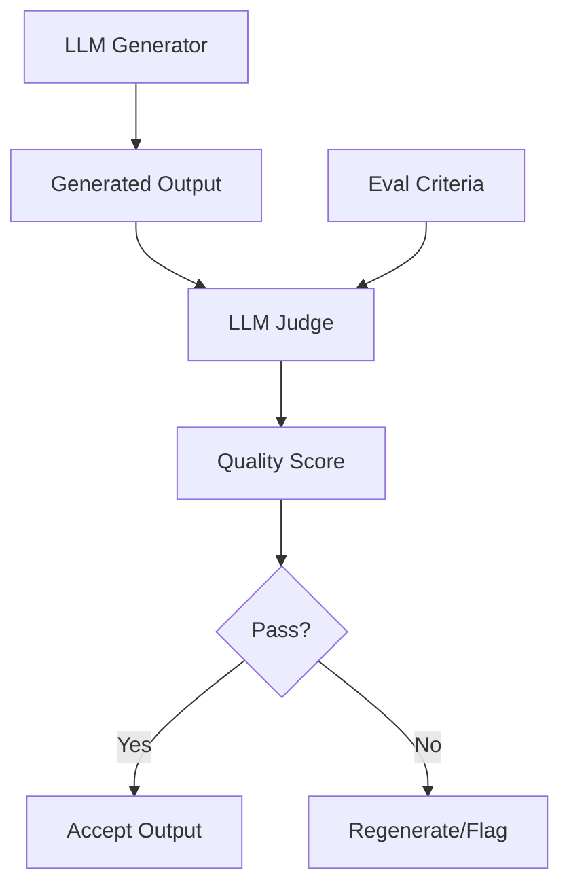

# LLM-as-Judge Pattern

## Abstract

The LLM-as-Judge pattern uses a language model to automatically evaluate the quality, correctness, or appropriateness of another LLM's output, enabling scalable quality assurance without human reviewers.

## Problem Statement

LLM outputs need quality evaluation, but human review doesn't scale. The problem is how to use LLMs themselves to evaluate other LLM outputs reliably, handling the nuances of correctness, relevance, and appropriateness while managing evaluation costs and potential biases.

## Context

This pattern arises when:
- LLM output quality needs verification
- Human review is too expensive or slow
- Evaluation criteria can be expressed in natural language
- Multiple quality dimensions need assessment
- Automated quality monitoring is required

## Forces

- **Accuracy vs. Cost:** Better judge models are more expensive
- **Detail vs. Speed:** Detailed evaluation takes more time
- **Bias vs. Objectivity:** Judge models have their own biases
- **Calibration vs. Complexity:** Score calibration adds complexity

## Solution

### Architecture Diagram



### Components

- **Generator:** Produces the output to be evaluated
- **Judge LLM:** Evaluates output quality
- **Evaluation Prompt:** Structured prompt for consistent judging
- **Score Aggregator:** Combines multiple evaluation dimensions

### Formal Properties

**Invariants:**
- Judge evaluation is deterministic for same input
- Score is normalized to [0, 1] range
- Evaluation criteria are explicit and documented

**Guarantees:**
- Every output receives a quality score
- Scores are comparable across evaluations
- Evaluation completes within bounded time

**Bounds:**
- Evaluation latency: bounded by judge model inference time
- Evaluation cost: bounded by token limits
- Score range: [0, 1] with defined interpretation

## Implementation

```typescript
interface EvaluationCriteria {
  name: string;
  description: string;
  weight: number;
}

interface JudgeConfig {
  model: string;
  criteria: EvaluationCriteria[];
  passThreshold: number;
}

interface EvaluationResult {
  scores: Record<string, number>;
  overallScore: number;
  passed: boolean;
  feedback?: string;
}

class LLMJudge {
  constructor(private config: JudgeConfig) {}

  async evaluate(
    input: string,
    output: string,
    context?: string
  ): Promise<EvaluationResult> {
    const prompt = this.buildEvalPrompt(input, output, context);
    const response = await this.callJudge(prompt);
    return this.parseResponse(response);
  }

  private buildEvalPrompt(
    input: string,
    output: string,
    context?: string
  ): string {
    const criteriaSection = this.config.criteria
      .map(c => `- ${c.name}: ${c.description}`)
      .join('\n');

    return `Evaluate the following response based on these criteria:

Criteria:
${criteriaSection}

Input: ${input}
Response: ${output}
${context ? `Context: ${context}` : ''}

Rate each criterion from 0-1 and provide brief feedback.`;
  }

  private async callJudge(prompt: string): Promise<string> {
    // Call LLM judge model
    return await callLLM(this.config.model, prompt);
  }

  private parseResponse(response: string): EvaluationResult {
    // Parse scores from judge response
    const scores: Record<string, number> = {};
    let totalWeight = 0;
    let weightedSum = 0;

    for (const criterion of this.config.criteria) {
      const score = this.extractScore(response, criterion.name);
      scores[criterion.name] = score;
      weightedSum += score * criterion.weight;
      totalWeight += criterion.weight;
    }

    const overallScore = weightedSum / totalWeight;
    return {
      scores,
      overallScore,
      passed: overallScore >= this.config.passThreshold
    };
  }

  private extractScore(response: string, criterion: string): number {
    // Extract score from response (simplified)
    const match = response.match(new RegExp(`${criterion}:\\s*([0-9.]+)`));
    return match ? parseFloat(match[1]) : 0.5;
  }
}
```

## Failure Modes

| Failure | Detection | Recovery |
|---------|-----------|----------|
| Judge bias | Systematic scoring patterns | Calibrate with human labels |
| Score inflation | Scores cluster at high end | Adjust prompt, use comparative eval |
| Hallucinated scores | Invalid score format | Validate and retry |
| Prompt injection | Malicious input affects judge | Sanitize inputs to judge |

## When NOT to Use

- **Objective criteria:** If evaluation is objective, use rule-based checks
- **Low stakes:** If errors are acceptable, skip evaluation
- **No judge model:** If no suitable judge model available
- **Real-time required:** If evaluation latency is unacceptable

## Cross-References

### Related Patterns
- **Consensus Voting** (Part IV) — Multiple judges
- **Confidence Gate** (Part IV) — Quality-based routing
- **Structured Output Validator** (Part IV) — Schema validation
- **Human Handoff** (Part VI) — Escalate for human review

### External Implementations
- **classifier-evals** — `src/judge/` for evaluation harness

## References

- **LLM-as-a-Judge** (Zheng et al., 2023) — Research paper
- **Constitutional AI** — Self-critique and revision
- **RLAIF** — Reinforcement learning from AI feedback
