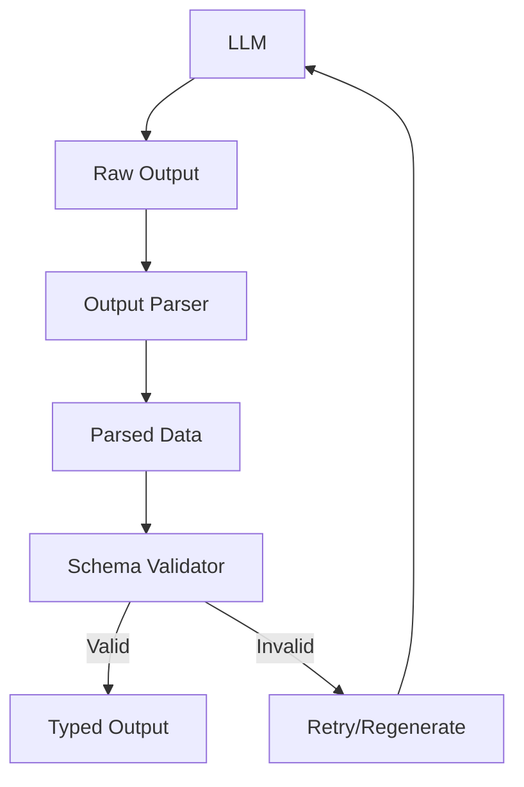

# Structured Output Validator Pattern

## Abstract

The Structured Output Validator pattern enforces output schemas by validating LLM responses against defined data structures, ensuring type correctness, required fields, and value constraints before downstream processing.

## Problem Statement

LLMs generate free-form text that may not conform to expected data structures. The problem is how to ensure LLM outputs match required schemas, handle validation failures gracefully, and provide actionable feedback for regeneration while maintaining type safety throughout the system.

## Context

This pattern arises when:
- LLM outputs must conform to specific schemas
- Downstream systems require typed data
- Validation failures need handling
- Schema evolution must be managed
- Type safety is critical for reliability

## Forces

- **Strictness vs. Flexibility:** Strict validation may reject valid outputs
- **Schema Complexity vs. LLM Capability:** Complex schemas are harder for LLMs
- **Validation Speed vs. Thoroughness:** Deep validation takes more time
- **Error Recovery vs. Failure:** Retry may fix issues or waste resources

## Solution

### Architecture Diagram



### Components

- **Output Parser:** Converts raw text to structured data
- **Schema Validator:** Validates against JSON schema or Zod schema
- **Error Handler:** Manages validation failures
- **Retry Manager:** Coordinates regeneration attempts

### Formal Properties

**Invariants:**
- Output always conforms to schema after validation
- Validation is deterministic for same input
- Schema is versioned and backward compatible

**Guarantees:**
- Valid outputs pass through immediately
- Invalid outputs trigger retry or error
- Validation errors are actionable

**Bounds:**
- Validation time: bounded by schema complexity
- Retry attempts: bounded by max_retries
- Schema size: bounded by LLM context window

## Implementation

```typescript
import { z, ZodSchema, ZodError } from 'zod';

interface ValidatorConfig {
  maxRetries: number;
  schema: ZodSchema;
  repairPrompt?: string;
}

interface ValidationResult<T> {
  success: boolean;
  data?: T;
  errors?: ValidationError[];
}

interface ValidationError {
  field: string;
  message: string;
  suggestion?: string;
}

class StructuredOutputValidator<T> {
  constructor(private config: ValidatorConfig) {}

  async validate(
    rawOutput: string,
    regenerate?: () => Promise<string>
  ): Promise<ValidationResult<T>> {
    try {
      // Parse JSON from raw output
      const parsed = JSON.parse(rawOutput);
      
      // Validate against schema
      const data = this.config.schema.parse(parsed) as T;
      return { success: true, data };
    } catch (error) {
      if (error instanceof ZodError) {
        const validationErrors = this.formatErrors(error);
        
        if (regenerate && this.shouldRetry(validationErrors)) {
          const newOutput = await regenerate();
          return this.validate(newOutput, regenerate);
        }
        
        return {
          success: false,
          errors: validationErrors
        };
      }
      
      // JSON parse error
      if (regenerate) {
        const newOutput = await regenerate();
        return this.validate(newOutput, regenerate);
      }
      
      return {
        success: false,
        errors: [{ field: 'output', message: 'Invalid JSON' }]
      };
    }
  }

  private formatErrors(error: ZodError): ValidationError[] {
    return error.errors.map(e => ({
      field: e.path.join('.'),
      message: e.message,
      suggestion: this.getSuggestion(e)
    }));
  }

  private getSuggestion(error: import('zod').ZodIssue): string {
    // Provide helpful suggestions based on error type
    if (error.code === 'invalid_type') {
      return `Expected ${error.expected}, received ${error.received}`;
    }
    if (error.code === 'invalid_union') {
      return 'Value must match one of the allowed types';
    }
    return error.message;
  }

  private shouldRetry(errors: ValidationError[]): boolean {
    // Don't retry for certain error types
    const nonRetryable = ['unrecognized_keys', 'too_big'];
    return !errors.some(e => nonRetryable.includes(e.field));
  }
}

// Usage example
const userSchema = z.object({
  name: z.string().min(1),
  email: z.string().email(),
  age: z.number().int().positive().max(120)
});

const validator = new StructuredOutputValidator<typeof userSchema>({
  maxRetries: 3,
  schema: userSchema
});

const result = await validator.validate(llmOutput, regenerate);
```

## Failure Modes

| Failure | Detection | Recovery |
|---------|-----------|----------|
| Schema too complex | LLM consistently fails | Simplify schema, use examples |
| Infinite retry loop | Max retries exceeded | Fail with detailed error |
| Schema drift | Schema changes break validation | Version schemas, migrate |
| Parse failure | Invalid JSON structure | Use structured output modes |

## When NOT to Use

- **Free-form text:** If output is natural language, validation is unnecessary
- **Simple outputs:** If output is simple, basic type checking suffices
- **No schema:** If no clear schema exists, use flexible parsing
- **Real-time required:** If validation latency is unacceptable

## Cross-References

### Related Patterns
- **Hallucination Detector** (Part IV) — Fact verification
- **Retry with Backoff** (Part II) — Retry failed validation
- **LLM-as-Judge** (Part IV) — Quality evaluation
- **Fallback Chain** (Part II) — Handle validation failures

### External Implementations
- **mcp-contract-kit** — `src/validators/protocol/` for schema validation
- **Zod** — TypeScript-first schema validation

## References

- **JSON Schema** — Schema validation standard
- **Zod** — TypeScript schema validation library
- **OpenAI Structured Outputs** — Guaranteed valid JSON mode
