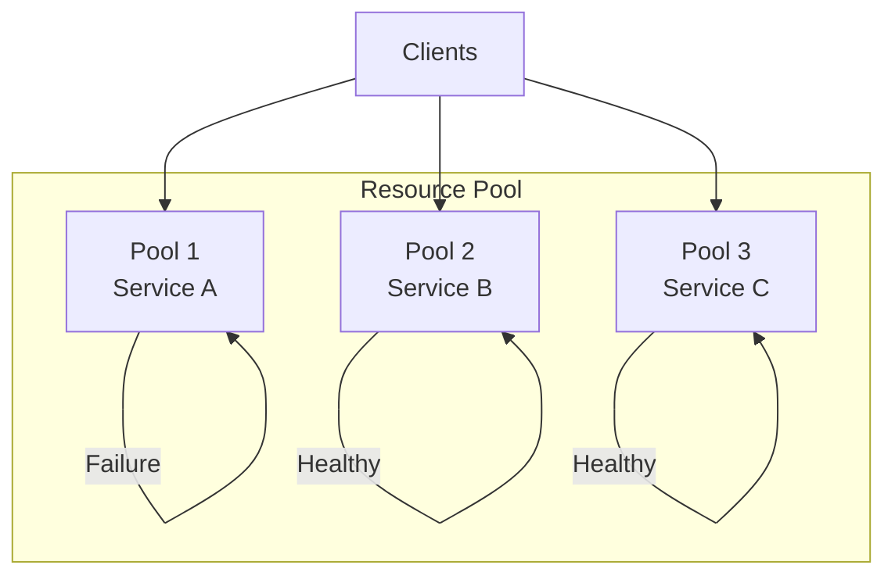

# Bulkhead Pattern

## Abstract

The Bulkhead pattern isolates resources to prevent cascading failures by partitioning the system into separate pools, ensuring that a failure in one pool doesn't exhaust resources for other pools.

## Problem Statement

In shared resource environments, a failure or overload in one component can exhaust shared resources (threads, connections, memory) and cause cascading failures across the entire system. The problem is how to isolate components so that failures are contained and the system can continue operating with partial capacity.

## Context

This pattern arises when:
- Multiple components share limited resources
- One component's failure shouldn't affect others
- Resource exhaustion can cascade through the system
- Different components have different criticality levels
- Partial system operation is acceptable

## Forces

- **Isolation vs. Efficiency:** Isolated pools reduce resource utilization efficiency
- **Granularity vs. Overhead:** Fine-grained isolation adds management overhead
- **Static vs. Dynamic:** Static partitions are simple but inflexible
- **Protection vs. Starvation:** Over-protection may starve healthy components

## Solution

### Architecture Diagram



### Components

- **Resource Pools:** Isolated pools of threads, connections, or memory
- **Pool Manager:** Allocates and monitors pool resources
- **Failure Detector:** Identifies pool exhaustion or failures
- **Load Balancer:** Distributes load across pools

### Formal Properties

**Invariants:**
- Each pool has fixed maximum capacity
- Pools are independent (no shared resources)
- Pool exhaustion doesn't affect other pools

**Guarantees:**
- Failure in one pool is contained
- Other pools continue operating normally
- Pool capacity is enforced strictly

**Bounds:**
- Pool size: bounded by total available resources
- Number of pools: bounded by management overhead
- Queue depth: bounded by memory constraints

## Implementation

```typescript
interface BulkheadConfig {
  maxConcurrentCalls: number;
  maxQueueSize: number;
  timeoutMs: number;
}

class Bulkhead {
  private semaphore: Semaphore;
  private queue: Array<{
    operation: () => Promise<unknown>;
    resolve: (value: unknown) => void;
    reject: (error: Error) => void;
  }> = [];
  private processing = false;

  constructor(private config: BulkheadConfig) {
    this.semaphore = new Semaphore(config.maxConcurrentCalls);
  }

  async execute<T>(operation: () => Promise<T>): Promise<T> {
    if (!this.semaphore.tryAcquire()) {
      if (this.queue.length >= this.config.maxQueueSize) {
        throw new Error('Bulkhead queue full');
      }
      return new Promise((resolve, reject) => {
        this.queue.push({ operation, resolve, reject });
        this.processQueue();
      });
    }

    try {
      return await Promise.race([
        operation(),
        this.timeout(this.config.timeoutMs)
      ]);
    } finally {
      this.semaphore.release();
      this.processQueue();
    }
  }

  private async processQueue(): Promise<void> {
    if (this.processing || this.queue.length === 0) return;
    
    this.processing = true;
    while (this.queue.length > 0 && this.semaphore.tryAcquire()) {
      const { operation, resolve, reject } = this.queue.shift()!;
      this.executeOperation(operation, resolve, reject);
    }
    this.processing = false;
  }

  private async executeOperation<T>(
    operation: () => Promise<T>,
    resolve: (value: T) => void,
    reject: (error: Error) => void
  ): Promise<void> {
    try {
      const result = await operation();
      resolve(result);
    } catch (error) {
      reject(error as Error);
    } finally {
      this.semaphore.release();
      this.processQueue();
    }
  }

  private timeout(ms: number): Promise<never> {
    return new Promise((_, reject) => {
      setTimeout(() => reject(new Error('Bulkhead timeout')), ms);
    });
  }
}
```

## Failure Modes

| Failure | Detection | Recovery |
|---------|-----------|----------|
| Pool exhaustion | Queue full, requests rejected | Scale up pool, add bulkheads |
| Deadlock | Requests stuck in queue | Timeout, circuit breaker |
| Resource leak | Pool capacity not released | Resource tracking, cleanup |
| Unbalanced pools | Some pools overloaded, others idle | Dynamic rebalancing |

## When NOT to Use

- **Single component:** If only one component exists, isolation provides no benefit
- **Abundant resources:** If resources are not constrained, overhead is unnecessary
- **Homogeneous load:** If all components have identical resource needs, single pool suffices
- **Simple systems:** If system is simple, bulkhead complexity is unjustified

## Cross-References

### Related Patterns
- **Circuit Breaker** (Part II) — Often used together
- **Timeout** (Part II) — Bounds individual operation time
- **Thread Pool** — Classic bulkhead implementation
- **Connection Pool** — Database connection isolation

### External Implementations
- **Netflix Hystrix** — Thread pool isolation
- **Resilience4j** — Bulkhead implementation

## References

- **Release It!** (Nygard, 2007) — Bulkhead pattern origin
- **Resilience4j** — Modern bulkhead implementation
- **Kubernetes** — Resource quotas and limits
