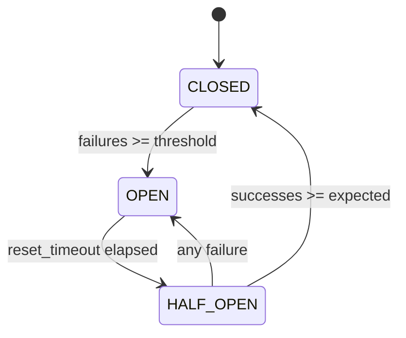

# Circuit Breaker Pattern

## Abstract

The Circuit Breaker pattern prevents cascading failures by failing fast when a component is unhealthy. Like an electrical circuit breaker, it monitors failures and opens the circuit when a threshold is exceeded, rejecting requests immediately rather than waiting for timeouts. After a cooldown period, it tests recovery with limited requests.

## Problem Statement

In distributed systems, component failures can cascade through the system as requests pile up waiting for timeouts. The problem is how to detect component failures quickly, stop sending requests to unhealthy components, and automatically recover when the component becomes healthy again, all without human intervention.

## Context

This pattern arises when:
- Components communicate over unreliable networks
- Component failures can cascade through the system
- Quick failure detection is critical
- Automatic recovery is desired
- Resource exhaustion from waiting for timeouts is a concern

## Forces

- **Speed vs. Accuracy:** Fast failure detection may trigger on transient issues
- **Recovery vs. Stability:** Quick recovery may overwhelm recovering components
- **State vs. Simplicity:** Stateful circuit breakers are more complex but more effective
- **Isolation vs. Coordination:** Per-component breakers isolate failures but don't coordinate

## Solution

### Architecture Diagram



### Components

- **Circuit Breaker:** State machine tracking failures and controlling request flow
- **Failure Counter:** Tracks consecutive or recent failures
- **Recovery Timer:** Manages cooldown period before recovery attempt
- **Test Dispatcher:** Sends limited test requests during recovery

### Formal Properties

**Invariants:**
- State is always one of: CLOSED, OPEN, HALF_OPEN
- failure_count = 0 when state = CLOSED
- failure_count ≥ threshold when state = OPEN

**Guarantees:**
- Requests are rejected within O(1) when circuit is OPEN
- Recovery is attempted after reset_timeout
- State transitions are atomic

**Bounds:**
- Memory: O(1) per circuit breaker
- Recovery time: bounded by reset_timeout × backoff_multiplier
- Half-open calls: bounded by half_open_max_calls

## Implementation

```typescript
type CircuitState = 'CLOSED' | 'OPEN' | 'HALF_OPEN';

interface CircuitBreakerConfig {
  failureThreshold: number;
  resetTimeoutMs: number;
  halfOpenMaxCalls: number;
  halfOpenTimeoutMs: number;
}

class CircuitBreaker {
  private state: CircuitState = 'CLOSED';
  private failureCount = 0;
  private successCount = 0;
  private lastFailureTime = 0;
  private halfOpenCalls = 0;
  private halfOpenStartTime = 0;

  constructor(private config: CircuitBreakerConfig) {}

  async execute<T>(fn: () => Promise<T>): Promise<T> {
    if (this.state === 'OPEN') {
      if (Date.now() - this.lastFailureTime >= this.config.resetTimeoutMs) {
        this.state = 'HALF_OPEN';
        this.halfOpenCalls = 0;
        this.halfOpenStartTime = Date.now();
      } else {
        throw new Error('Circuit breaker is OPEN');
      }
    }

    if (this.state === 'HALF_OPEN' && this.halfOpenCalls >= this.config.halfOpenMaxCalls) {
      throw new Error('Circuit breaker HALF_OPEN max calls reached');
    }

    this.halfOpenCalls++;

    try {
      const result = await fn();
      this.onSuccess();
      return result;
    } catch (error) {
      this.onFailure();
      throw error;
    }
  }

  private onSuccess(): void {
    if (this.state === 'HALF_OPEN') {
      this.successCount++;
      if (this.successCount >= this.config.halfOpenMaxCalls) {
        this.state = 'CLOSED';
        this.failureCount = 0;
        this.successCount = 0;
      }
    } else if (this.state === 'CLOSED') {
      this.failureCount = 0;
    }
  }

  private onFailure(): void {
    this.failureCount++;
    this.lastFailureTime = Date.now();

    if (this.state === 'HALF_OPEN') {
      this.state = 'OPEN';
      this.lastFailureTime = Date.now();
    } else if (this.state === 'CLOSED' && this.failureCount >= this.config.failureThreshold) {
      this.state = 'OPEN';
    }
  }

  getState(): CircuitState {
    return this.state;
  }
}
```

## Failure Modes

| Failure | Detection | Recovery |
|---------|-----------|----------|
| False positive (circuit opens on transient error) | Success rate remains high | Lower threshold, add error classification |
| Circuit stays OPEN | No recovery attempts succeed | Check component health, manual reset |
| HALF_OPEN storm | Many instances test simultaneously | Add jitter to recovery timing |
| State inconsistency | Distributed instances disagree | Use shared state with leader election |

## When NOT to Use

- **Idempotent operations:** If operations are idempotent and cheap, simple retry may suffice
- **Single-component systems:** If there's only one component, circuit breaker adds complexity
- **Predictable failures:** If failures are predictable, proactive health checks may be better
- **Stateful operations:** If operations have side effects, circuit breaker may leave inconsistent state

## Cross-References

### Related Patterns
- **Retry with Backoff** (Part II) — Often composed with circuit breaker
- **Timeout** (Part II) — Circuit breaker complements timeout
- **Fallback Chain** (Part II) — Circuit breaker triggers fallback
- **Bulkhead** (Part II) — Isolation pattern that complements circuit breaker

### External Implementations
- **agent-mesh** — `src/utils/circuitBreaker.ts` with Firestore persistence

## References

- **Release It!** (Nygard, 2007) — Circuit Breaker pattern origin
- **Netflix Hystrix** — Open-source circuit breaker implementation
- **Martin Fowler's blog** — CircuitBreaker article (martinfowler.com)
