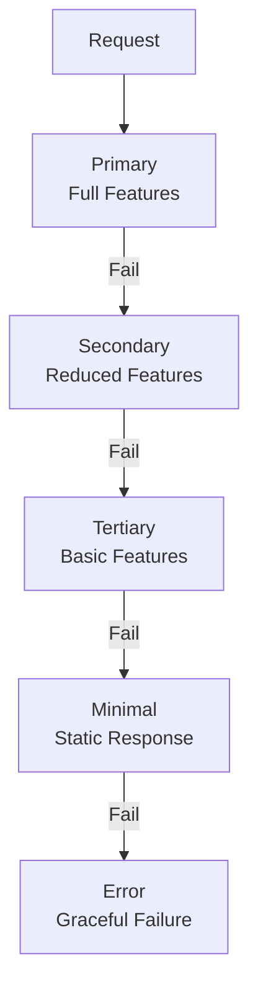

# Fallback Chain Pattern

## Abstract

The Fallback Chain pattern provides graceful degradation through an ordered list of alternatives, attempting each in sequence until one succeeds, ensuring service continuity even when primary components fail.

## Problem Statement

When primary components fail, systems must continue operating with reduced functionality rather than failing completely. The problem is how to define and manage a sequence of fallback options that provide progressively degraded but still useful service, while maintaining consistency and monitoring degradation levels.

## Context

This pattern arises when:
- Complete service failure is unacceptable
- Degraded functionality is preferable to no functionality
- Multiple implementation options exist with different capabilities
- Failure of one component shouldn't cascade
- Service level objectives must be maintained

## Forces

- **Quality vs. Availability:** Lower quality options may be more available
- **Complexity vs. Resilience:** More fallbacks increase resilience but also complexity
- **Consistency vs. Degradation:** Degraded service may provide inconsistent results
- **Detection Speed vs. False Positives:** Fast failure detection may trigger unnecessary fallbacks

## Solution

### Architecture Diagram



### Components

- **Fallback Chain:** Ordered list of fallback handlers
- **Health Monitor:** Tracks component availability
- **Degradation Tracker:** Monitors current service level
- **Recovery Handler:** Attempts to restore primary service

### Formal Properties

**Invariants:**
- Fallback order is fixed and deterministic
- Each fallback is strictly less capable than the previous
- At least one fallback always returns (even if error)

**Guarantees:**
- Request always receives a response
- Service degradation is logged and monitored
- Recovery to primary is attempted periodically

**Bounds:**
- Chain length: bounded by complexity tolerance
- Fallback latency: bounded by SLA requirements
- Degradation duration: bounded by recovery time

## Implementation

```typescript
interface FallbackHandler<T> {
  name: string;
  priority: number;
  execute(request: unknown): Promise<T>;
  isHealthy(): Promise<boolean>;
}

class FallbackChain<T> {
  private handlers: FallbackHandler<T>[] = [];

  addHandler(handler: FallbackHandler<T>): void {
    this.handlers.push(handler);
    this.handlers.sort((a, b) => a.priority - b.priority);
  }

  async execute(request: unknown): Promise<T> {
    let lastError: Error | undefined;

    for (const handler of this.handlers) {
      try {
        if (!(await handler.isHealthy())) {
          continue;
        }
        return await handler.execute(request);
      } catch (error) {
        lastError = error as Error;
        console.warn(`Fallback ${handler.name} failed:`, lastError.message);
      }
    }

    throw lastError || new Error('All fallbacks failed');
  }
}

// Usage
const chain = new FallbackChain<Response>();
chain.addHandler({ name: 'primary', priority: 1, execute: callPrimary, isHealthy: () => checkHealth('primary') });
chain.addHandler({ name: 'secondary', priority: 2, execute: callSecondary, isHealthy: () => checkHealth('secondary') });
chain.addHandler({ name: 'cached', priority: 3, execute: returnCached, isHealthy: () => hasCache() });
```

## Failure Modes

| Failure | Detection | Recovery |
|---------|-----------|----------|
| All fallbacks fail | Final fallback returns error | Return error response, alert |
| Stuck in degraded state | Primary never recovers | Manual intervention, auto-scaling |
| Fallback inconsistency | Different fallbacks return different results | Data reconciliation, version tracking |
| Cascading fallback failures | One fallback failure triggers next | Add circuit breakers between fallbacks |

## When NOT to Use

- **Stateless services:** If service is stateless, simple retry may suffice
- **Single implementation:** If no alternatives exist, use circuit breaker
- **Consistency critical:** If degraded results cause inconsistency, fail fast
- **Simple services:** If service is simple, fallback complexity is unjustified

## Cross-References

### Related Patterns
- **Circuit Breaker** (Part II) — Prevents calls to unhealthy components
- **Retry with Backoff** (Part II) — Retry before falling back
- **Cache-Aside** (Part VI) — Common fallback strategy
- **Graceful Degradation** (Part VI) — Quality reduction pattern

### External Implementations
- **llm-router** — `src/fallback/fallback-chain.ts` for LLM model fallback

## References

- **Release It!** (Nygard, 2007) — Fallback patterns
- **Netflix Hystrix** — Fallback implementation
- **AWS Well-Architected** — Graceful degradation strategies
