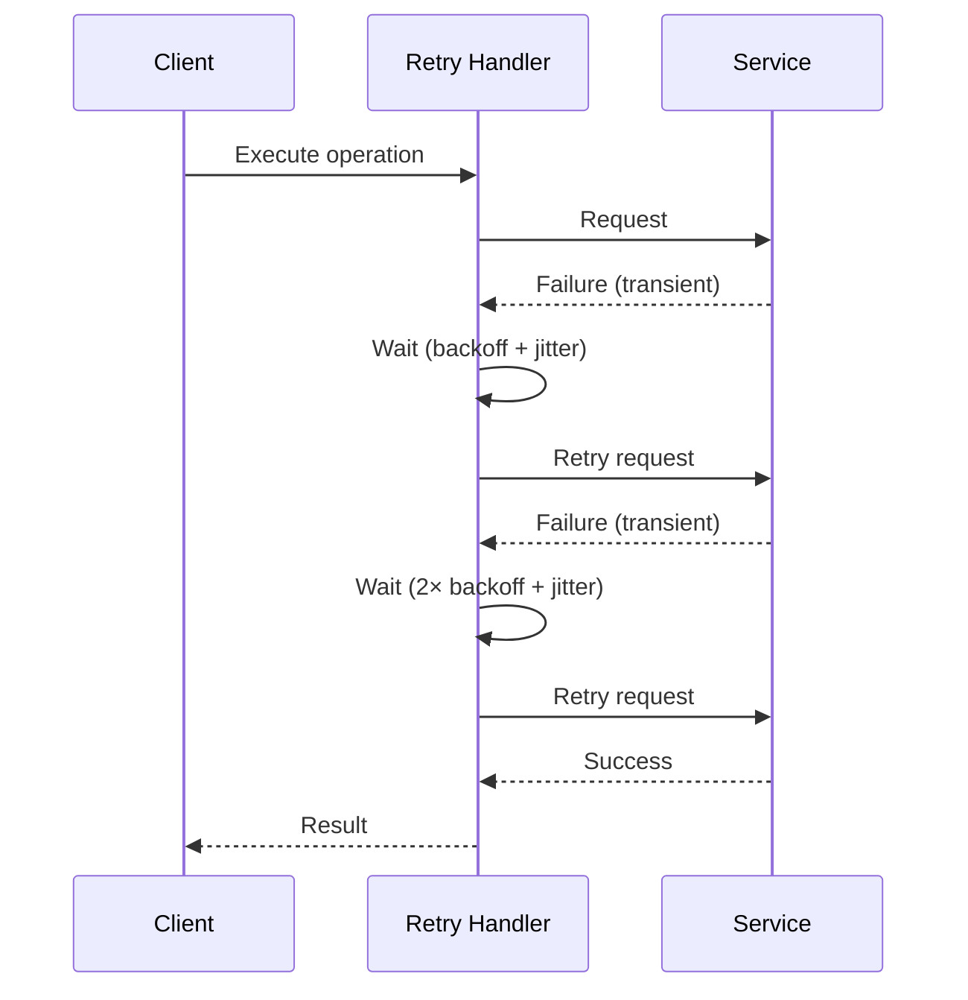

# Retry with Backoff Pattern

## Abstract

The Retry with Backoff pattern handles transient failures by retrying operations with exponentially increasing delays and jitter, preventing thundering herd problems while giving failing components time to recover.

## Problem Statement

In distributed systems, transient failures are common due to network issues, temporary overload, or brief service disruptions. The problem is how to retry failed operations effectively without overwhelming the failing component or causing excessive latency, while distinguishing between transient and permanent failures.

## Context

This pattern arises when:
- Failures are often transient and self-resolving
- Immediate retry may overwhelm recovering components
- Multiple clients may retry simultaneously (thundering herd)
- Operations should be idempotent for safe retry
- Bounded retry duration is required

## Forces

- **Retry Speed vs. Component Recovery:** Fast retries may prevent recovery
- **Jitter vs. Predictability:** Jitter prevents thundering herd but adds variance
- **Retry Count vs. Latency:** More retries increase worst-case latency
- **Idempotency vs. Flexibility:** Idempotent operations are safer but restrictive

## Solution

### Architecture Diagram



### Components

- **Retry Handler:** Manages retry logic with backoff and jitter
- **Backoff Strategy:** Calculates delay between retries
- **Jitter Function:** Adds randomness to prevent synchronization
- **Failure Classifier:** Distinguishes transient from permanent failures

### Formal Properties

**Invariants:**
- Backoff delay increases monotonically
- Total retry time is bounded
- Jitter is uniformly distributed within bounds

**Guarantees:**
- Operations are retried for transient failures
- Permanent failures fail fast without retry
- Maximum retry time is bounded

**Bounds:**
- Maximum retries: bounded by max_retries parameter
- Maximum delay: bounded by max_delay parameter
- Total retry time: bounded by sum of all backoff delays

## Implementation

```typescript
interface RetryConfig {
  maxRetries: number;
  initialDelayMs: number;
  maxDelayMs: number;
  backoffMultiplier: number;
  jitterFactor: number; // 0.0 to 1.0
}

class RetryWithBackoff {
  constructor(private config: RetryConfig) {}

  async execute<T>(
    operation: () => Promise<T>,
    isTransient: (error: Error) => boolean
  ): Promise<T> {
    let lastError: Error | undefined;
    let delay = this.config.initialDelayMs;

    for (let attempt = 0; attempt <= this.config.maxRetries; attempt++) {
      try {
        return await operation();
      } catch (error) {
        lastError = error as Error;
        
        if (!isTransient(lastError) || attempt === this.config.maxRetries) {
          throw lastError;
        }

        const jitter = this.calculateJitter(delay);
        await this.sleep(delay + jitter);
        delay = Math.min(delay * this.config.backoffMultiplier, this.config.maxDelayMs);
      }
    }

    throw lastError;
  }

  private calculateJitter(delay: number): number {
    const maxJitter = delay * this.config.jitterFactor;
    return Math.random() * maxJitter;
  }

  private sleep(ms: number): Promise<void> {
    return new Promise(resolve => setTimeout(resolve, ms));
  }
}

// Usage
const retry = new RetryWithBackoff({
  maxRetries: 5,
  initialDelayMs: 100,
  maxDelayMs: 10000,
  backoffMultiplier: 2,
  jitterFactor: 0.1
});

const isTransient = (error: Error) => 
  error.code === 'ETIMEDOUT' || error.code === 'ECONNREFUSED';

await retry.execute(() => callService(), isTransient);
```

## Failure Modes

| Failure | Detection | Recovery |
|---------|-----------|----------|
| Retry storm | Exponential traffic increase | Add circuit breaker, reduce max retries |
| Non-idempotent operation retry | Duplicate side effects | Use idempotency keys, deduplication |
| Infinite retry loop | Retry never succeeds | Add maximum retry time, fail fast |
| Jitter insufficient | Synchronized retries persist | Increase jitter factor |

## When NOT to Use

- **Non-idempotent operations:** If retry causes duplicate side effects, use idempotency patterns
- **Permanent failures:** If failures are permanent, retry wastes time
- **Real-time requirements:** Retry latency may violate timing constraints
- **Resource-intensive operations:** Retry may exhaust resources

## Cross-References

### Related Patterns
- **Circuit Breaker** (Part II) — Prevents retry to unhealthy components
- **Timeout** (Part II) — Bounds individual attempt duration
- **Idempotency Cache** (Part III) — Enables safe retry
- **Fallback Chain** (Part II) — Alternative when retry fails

### External Implementations
- **agent-mesh** — Retry logic in service calls

## References

- **Release It!** (Nygard, 2007) — Retry patterns
- **AWS Architecture Blog** — Exponential backoff and jitter
- **gRPC** — Built-in retry with configurable backoff
