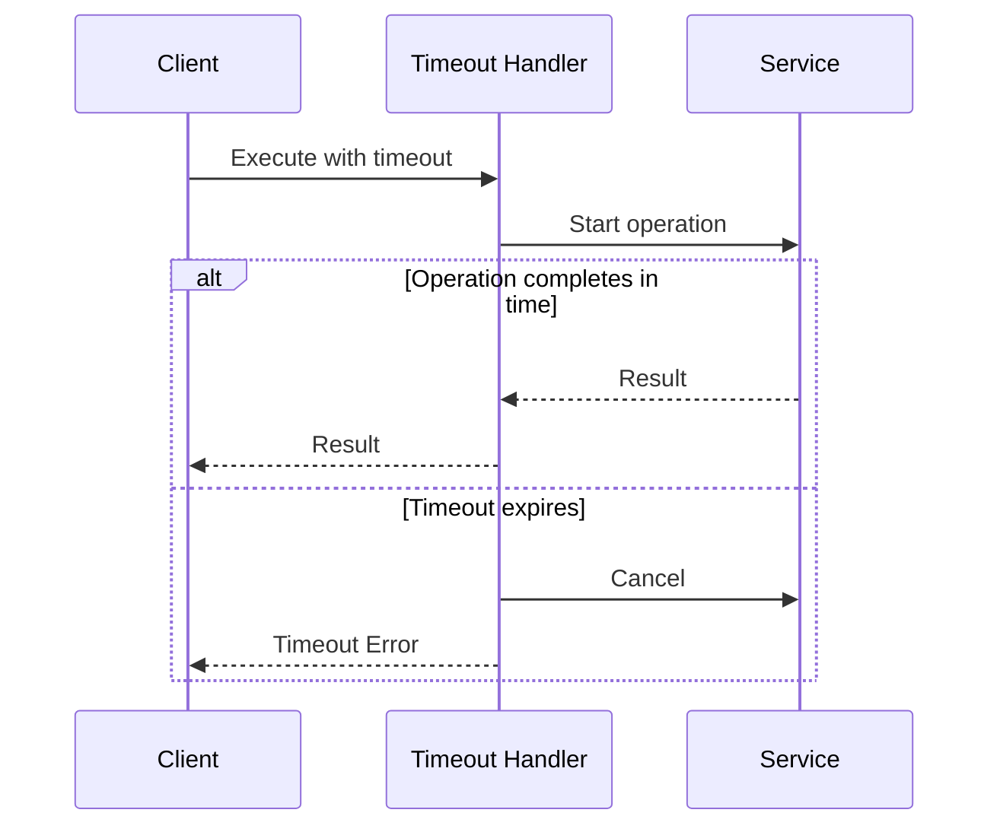

# Timeout Pattern

## Abstract

The Timeout pattern bounds waiting time for operations by enforcing a maximum duration, after which the operation is cancelled and an error is returned, preventing resource exhaustion from unbounded waiting.

## Problem Statement

When calling external services or performing long-running operations, there's a risk that the operation may hang indefinitely due to network issues, service overload, or bugs. The problem is how to bound waiting time, release resources promptly, and handle timeout scenarios gracefully while distinguishing between slow and failed operations.

## Context

This pattern arises when:
- Operations call external services over unreliable networks
- Resource exhaustion from hanging operations is a concern
- Users need predictable response times
- Operations should be cancellable
- Slow operations need to be distinguished from failed ones

## Forces

- **Timeout Duration vs. Success Rate:** Shorter timeouts may abort valid operations
- **Cancellation vs. Cleanup:** Cancelled operations may leave partial state
- **Synchronous vs. Asynchronous:** Async timeouts are more complex but more flexible
- **Global vs. Per-Operation:** Global timeouts are simple but inflexible

## Solution

### Architecture Diagram



### Components

- **Timeout Handler:** Enforces time bounds on operations
- **Cancellation Token:** Signals operation cancellation
- **Timer:** Tracks elapsed time and triggers timeout
- **Cleanup Handler:** Releases resources on timeout

### Formal Properties

**Invariants:**
- Operation is cancelled when timeout expires
- Resources are released within bounded time
- Timeout is enforced regardless of operation state

**Guarantees:**
- Operation completes or times out within specified duration
- Timeout error is returned consistently
- Cancellation is propagated to underlying operations

**Bounds:**
- Timeout duration: configurable per operation type
- Cleanup time: bounded by resource release time
- Timer accuracy: bounded by system clock precision

## Implementation

```typescript
interface TimeoutConfig {
  defaultTimeoutMs: number;
  maxTimeoutMs: number;
}

class TimeoutError extends Error {
  constructor(operation: string, timeoutMs: number) {
    super(`Operation '${operation}' timed out after ${timeoutMs}ms`);
    this.name = 'TimeoutError';
  }
}

class TimeoutHandler {
  constructor(private config: TimeoutConfig) {}

  async execute<T>(
    operation: () => Promise<T>,
    timeoutMs?: number,
    operationName = 'unnamed'
  ): Promise<T> {
    const timeout = Math.min(
      timeoutMs || this.config.defaultTimeoutMs,
      this.config.maxTimeoutMs
    );

    const controller = new AbortController();
    const timeoutId = setTimeout(() => controller.abort(), timeout);

    try {
      const result = await Promise.race([
        operation(),
        this.createTimeoutPromise(timeout, operationName, controller.signal)
      ]);
      return result;
    } finally {
      clearTimeout(timeoutId);
    }
  }

  private createTimeoutPromise<T>(
    timeoutMs: number,
    operationName: string,
    signal: AbortSignal
  ): Promise<T> {
    return new Promise((_, reject) => {
      const timer = setTimeout(() => {
        reject(new TimeoutError(operationName, timeoutMs));
      }, timeoutMs);

      signal.addEventListener('abort', () => {
        clearTimeout(timer);
      }, { once: true });
    });
  }
}

// Usage
const timeout = new TimeoutHandler({
  defaultTimeoutMs: 5000,
  maxTimeoutMs: 30000
});

try {
  const result = await timeout.execute(
    () => callExternalService(),
    10000,
    'external-service-call'
  );
} catch (error) {
  if (error instanceof TimeoutError) {
    // Handle timeout
  }
}
```

## Failure Modes

| Failure | Detection | Recovery |
|---------|-----------|----------|
| Timeout too short | Valid operations aborted | Increase timeout, monitor latency |
| Timeout too long | Resources held too long | Decrease timeout, add circuit breaker |
| Cancellation not propagated | Operation continues after timeout | Implement proper cancellation |
| Resource leak | Resources not released | Add cleanup handlers, monitoring |

## When NOT to Use

- **Fire-and-forget:** If operation result is not needed, timeout is unnecessary
- **Batch operations:** If operation is batch, use per-item timeouts
- **Streaming:** If operation streams results, use idle timeout
- **Background jobs:** If operation is async, use deadline instead

## Cross-References

### Related Patterns
- **Circuit Breaker** (Part II) — Works with timeout for failure detection
- **Retry with Backoff** (Part II) — Retry after timeout
- **Cancellation Token** — Propagates cancellation
- **Deadline** — End-to-end timeout for distributed operations

### External Implementations
- **gRPC** — Built-in deadline support
- **axios** — Request timeout configuration
- **Node.js** — AbortController for fetch timeouts

## References

- **Release It!** (Nygard, 2007) — Timeout patterns
- **gRPC Documentation** — Deadline propagation
- **AWS Best Practices** — Timeout configuration for Lambda
