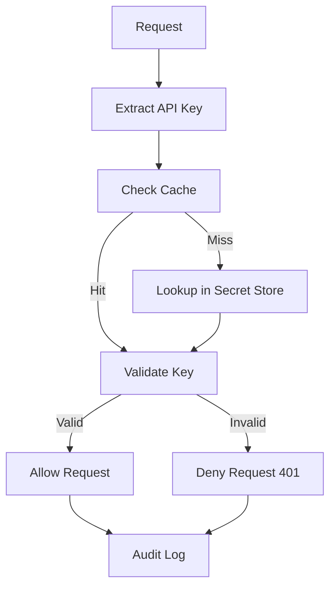

# API Key Validator Pattern

## Abstract

The API Key Validator pattern authenticates requests by validating API keys against a secure store. By checking keys on every request with caching to reduce lookup latency, this pattern ensures only authorized clients can access agent services while maintaining high performance.

## Problem Statement

Agent services need to authenticate clients to prevent unauthorized access. The problem is how to validate API keys efficiently on every request, handle key rotation and revocation, and cache validation results without compromising security.

## Context

This pattern arises when:
- Services need to authenticate API clients
- Key-based authentication is required
- High request volume requires caching
- Key rotation and revocation are needed
- Audit logging of access is required

## Forces

- **Security vs. Performance:** Strict validation is secure but slow; caching improves performance
- **Centralized vs. Distributed:** Centralized validation is consistent; distributed is faster
- **Short-lived vs. Long-lived:** Short-lived keys are more secure; long-lived are more convenient
- **Automatic vs. Manual:** Automatic rotation is secure; manual is simpler

## Solution

### Architecture Diagram



### Components

- **Key Extractor:** Extracts API key from request headers
- **Cache Manager:** Caches validation results with TTL
- **Secret Store:** Secure storage for API keys
- **Validator:** Validates key against store
- **Audit Logger:** Logs all validation attempts

### Formal Properties

**Invariants:**
- Only valid, non-revoked keys allow access
- Cached results are invalidated on revocation
- All validation attempts are logged

**Guarantees:**
- No unauthorized access with valid keys
- Cache invalidation within TTL bounds
- Complete audit trail

**Bounds:**
- Cache TTL: typically 5-60 seconds
- Key lookup latency: bounded by store performance
- Concurrent validations: bounded by cache capacity

## Implementation

```typescript
interface APIKeyConfig {
  key: string;
  clientId: string;
  scopes: string[];
  expiresAt?: string;
  revoked: boolean;
}

class APIKeyValidator {
  private cache: Map<string, { result: ValidateResult; expires: number }> = new Map();

  constructor(
    private secretStore: SecretStore,
    private cacheTTL: number = 30_000
  ) {}

  async validate(request: AuthenticatedRequest): Promise<ValidateResult> {
    const key = this.extractKey(request);
    if (!key) {
      return { allowed: false, reason: 'Missing API key' };
    }

    // Check cache
    const cached = this.cache.get(key);
    if (cached && Date.now() < cached.expires) {
      return cached.result;
    }

    // Lookup in secret store
    const config = await this.secretStore.getAPIKey(key);
    if (!config) {
      return { allowed: false, reason: 'Invalid API key' };
    }

    if (config.revoked) {
      return { allowed: false, reason: 'Revoked API key' };
    }

    if (config.expiresAt && new Date(config.expiresAt) < new Date()) {
      return { allowed: false, reason: 'Expired API key' };
    }

    const result = {
      allowed: true,
      clientId: config.clientId,
      scopes: config.scopes,
    };

    // Cache valid result
    this.cache.set(key, {
      result,
      expires: Date.now() + this.cacheTTL,
    });

    return result;
  }

  async revoke(key: string): Promise<void> {
    await this.secretStore.revokeAPIKey(key);
    this.cache.delete(key);
  }

  private extractKey(request: AuthenticatedRequest): string | null {
    const header = request.headers['authorization'] || '';
    if (header.startsWith('Bearer ')) {
      return header.slice(7);
    }
    return request.query?.api_key || null;
  }
}
```

## Failure Modes

| Failure | Detection | Recovery |
|---------|-----------|----------|
| Cache unavailable | Map error | Fallback to direct lookup |
| Store unavailable | Connection error | Fail closed (deny all) |
| Key not found | Null response | Deny with "invalid key" |
| Concurrent revocation | Race condition | Use version numbers for cache invalidation |

## When NOT to Use

- **OAuth-based systems:** If OAuth is used, API key validation is redundant
- **Network-level auth:** If services are behind VPN with network-level auth
- **Low security requirements:** If open access is acceptable
- **Per-request signing:** If request signing (HMAC) is used instead

## Cross-References

### Related Patterns
- **Tool Permission Gateway** (Part V) — Permission checks after authentication
- **Audit Trail** (Part V) — Logs authentication events
- **Multi-Key Rotation** (Part V) — Manages key lifecycle

### External Implementations
- **agent-mesh** — `src/auth/api-key-validator.ts` with HashiCorp Vault

## References

- **OWASP Authentication** — API authentication best practices
- **RFC 9126** — OAuth 2.0 Pushed Authorization Requests
- **Vault API Keys** — HashiCorp Vault documentation