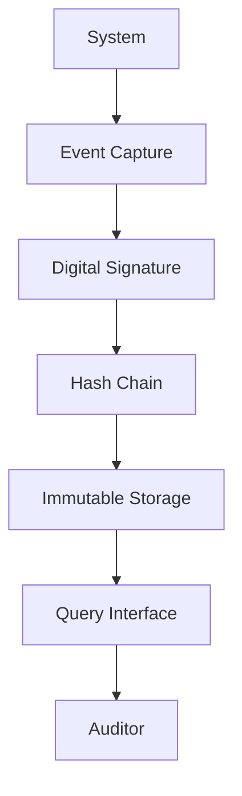

# Audit Trail Pattern

## Abstract

The Audit Trail pattern provides immutable operation logging for compliance and security by recording all significant events in a tamper-evident manner, enabling forensic analysis and regulatory compliance.

## Problem Statement

Systems must maintain detailed records of operations for compliance, security, and debugging. The problem is how to capture events comprehensively, ensure log integrity, protect against tampering, and enable efficient querying while meeting regulatory retention requirements.

## Context

This pattern arises when:
- Regulatory compliance requires audit logs
- Security incidents need forensic analysis
- Operation history must be reconstructable
- Tamper-evident logging is required
- Accountability must be established

## Forces

- **Completeness vs. Performance:** Comprehensive logging adds overhead
- **Detail vs. Privacy:** Detailed logs may contain sensitive data
- **Retention vs. Storage:** Long retention requires significant storage
- **Immutability vs. Corrections:** Immutable logs can't be corrected

## Solution

### Architecture Diagram



### Components

- **Event Capture:** Intercepts and records system events
- **Digital Signer:** Signs events for integrity
- **Hash Chain:** Links events cryptographically
- **Immutable Storage:** Stores logs with write-once semantics

### Formal Properties

**Invariants:**
- Every event is timestamped and signed
- Events are chained (each includes previous hash)
- Stored events cannot be modified

**Guarantees:**
- Tampering is detectable
- Event order is preserved
- Retention requirements are met

**Bounds:**
- Event size: bounded by maximum log entry size
- Retention: bounded by compliance requirements
- Query time: bounded by index efficiency

## Implementation

```typescript
interface AuditEvent {
  id: string;
  timestamp: number;
  actor: string;
  action: string;
  resource: string;
  details: Record<string, unknown>;
  previousHash: string;
  signature: string;
}

interface AuditTrailConfig {
  privateKey: CryptoKey;
  storage: AuditStorage;
  retentionDays: number;
}

interface AuditStorage {
  append(event: AuditEvent): Promise<void>;
  query(filters: Partial<AuditEvent>): Promise<AuditEvent[]>;
}

class AuditTrail {
  private lastHash = '';

  constructor(private config: AuditTrailConfig) {}

  async log(event: Omit<AuditEvent, 'id' | 'previousHash' | 'signature'>): Promise<string> {
    const eventWithMeta: AuditEvent = {
      ...event,
      id: crypto.randomUUID(),
      timestamp: Date.now(),
      previousHash: this.lastHash,
      signature: ''
    };

    // Create hash of event
    const hash = await this.hashEvent(eventWithMeta);
    eventWithMeta.previousHash = hash;
    
    // Sign the event
    eventWithMeta.signature = await this.signEvent(eventWithMeta);
    
    // Store immutably
    await this.config.storage.append(eventWithMeta);
    this.lastHash = hash;
    
    return eventWithMeta.id;
  }

  async verify(): Promise<boolean> {
    const events = await this.config.storage.query({});
    let previousHash = '';
    
    for (const event of events) {
      // Verify hash chain
      const expectedHash = await this.hashEvent({
        ...event,
        signature: ''
      });
      
      if (event.previousHash !== previousHash) {
        return false;
      }
      
      // Verify signature
      const valid = await this.verifySignature(event);
      if (!valid) return false;
      
      previousHash = expectedHash;
    }
    
    return true;
  }

  private async hashEvent(event: Partial<AuditEvent>): Promise<string> {
    const data = JSON.stringify(event);
    const hashBuffer = await crypto.subtle.digest('SHA-256', new TextEncoder().encode(data));
    return Buffer.from(hashBuffer).toString('hex');
  }

  private async signEvent(event: AuditEvent): Promise<string> {
    const data = new TextEncoder().encode(JSON.stringify(event));
    const signature = await crypto.subtle.sign('RSASSA-PKCS1-v1_5', this.config.privateKey, data);
    return Buffer.from(signature).toString('base64');
  }

  private async verifySignature(event: AuditEvent): Promise<boolean> {
    // Verification would use public key
    return true; // Simplified
  }
}
```

## Failure Modes

| Failure | Detection | Recovery |
|---------|-----------|----------|
| Storage full | Write failures | Alert, expand storage |
| Hash chain broken | Verification fails | Investigate tampering |
| Key compromise | Signature verification fails | Rotate keys, re-sign |
| Query timeout | Slow queries | Optimize indexes, partition |

## When NOT to Use

- **No compliance:** If audit is not required
- **Low security:** If tamper-evidence is not needed
- **Simple systems:** If basic logging suffices
- **Performance critical:** If logging overhead is unacceptable

## Cross-References

### Related Patterns
- **Structured Logging** (Part VII) — Log format
- **Tool Permission Gateway** (Part V) — Access logging
- **PII Redactor** (Part V) — Sensitive data handling

### External Implementations
- **AWS CloudTrail** — AWS audit logging
- **Elasticsearch** — Log storage and querying

## References

- **SOX Compliance** — Financial audit requirements
- **HIPAA** — Healthcare audit requirements
- **PCI DSS** — Payment card audit requirements
