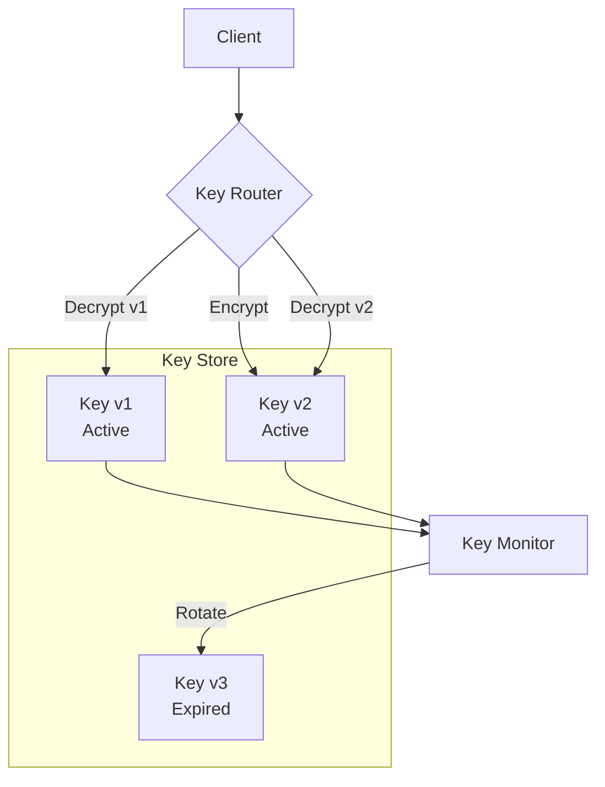

# Multi-Key Rotation Pattern

## Abstract

The Multi-Key Rotation pattern manages cryptographic key lifecycles by maintaining multiple key versions, rotating keys on a schedule, and ensuring smooth migration without service disruption.

## Problem Statement

Cryptographic keys must be rotated regularly for security compliance, but rotating keys in a live system risks service disruption if not handled properly. The problem is how to maintain multiple key versions, transition traffic smoothly, and ensure old keys are retired securely.

## Context

This pattern arises when:
- Cryptographic keys need regular rotation
- Compliance requires key lifecycle management
- Service continuity during rotation is critical
- Multiple key versions must coexist
- Key compromise must be handled quickly

## Forces

- **Security vs. Availability:** Frequent rotation increases security but risks availability
- **Overlap vs. Complexity:** Key overlap simplifies migration but adds complexity
- **Automation vs. Control:** Automated rotation reduces human error but needs safeguards
- **Performance vs. Security:** Key derivation adds latency

## Solution

### Architecture Diagram



### Components

- **Key Manager:** Creates, activates, and retires keys
- **Key Router:** Routes operations to appropriate key version
- **Rotation Scheduler:** Triggers key rotation on schedule
- **Key Monitor:** Tracks key health and usage

### Formal Properties

**Invariants:**
- At least one key is always active
- Expired keys are never used for encryption
- Key versions are monotonically increasing

**Guarantees:**
- Encryption always uses newest active key
- Decryption supports all active keys
- Key rotation completes without downtime

**Bounds:**
- Active keys: typically 2 (current + previous)
- Rotation interval: configurable (e.g., 90 days)
- Key lifetime: bounded by security policy

## Implementation

```typescript
interface KeyVersion {
  id: string;
  version: number;
  status: 'active' | 'expired' | 'revoked';
  createdAt: number;
  expiresAt?: number;
  material: string; // Encrypted key material
}

interface KeyRotationConfig {
  rotationIntervalMs: number;
  maxActiveVersions: number;
  gracePeriodMs: number;
}

class MultiKeyRotation {
  private keys: KeyVersion[] = [];
  private currentVersion = 0;

  constructor(private config: KeyRotationConfig) {}

  async encrypt(data: string): Promise<{ version: number; ciphertext: string }> {
    const activeKey = this.getActiveKey();
    if (!activeKey) throw new Error('No active key');
    
    const ciphertext = await this.encryptWithKey(activeKey, data);
    return { version: activeKey.version, ciphertext };
  }

  async decrypt(version: number, ciphertext: string): Promise<string> {
    const key = this.keys.find(k => k.version === version);
    if (!key) throw new Error(`Key version ${version} not found`);
    
    if (key.status === 'revoked') {
      throw new Error(`Key version ${version} has been revoked`);
    }
    
    return await this.decryptWithKey(key, ciphertext);
  }

  async rotate(): Promise<void> {
    // Mark current key as expired
    const currentKey = this.getActiveKey();
    if (currentKey) {
      currentKey.status = 'expired';
      currentKey.expiresAt = Date.now();
    }

    // Create new active key
    const newKey = await this.createKey();
    this.keys.push(newKey);
    this.currentVersion = newKey.version;

    // Clean up old keys
    this.cleanupExpiredKeys();
  }

  private getActiveKey(): KeyVersion | undefined {
    return this.keys.find(k => k.status === 'active' && k.version === this.currentVersion);
  }

  private async createKey(): Promise<KeyVersion> {
    return {
      id: crypto.randomUUID(),
      version: this.currentVersion + 1,
      status: 'active',
      createdAt: Date.now(),
      material: await this.generateKeyMaterial()
    };
  }

  private cleanupExpiredKeys(): void {
    const cutoff = Date.now() - this.config.gracePeriodMs;
    this.keys = this.keys.filter(k => 
      k.status === 'active' || 
      (k.status === 'expired' && (k.expiresAt || 0) > cutoff)
    );
  }

  private async generateKeyMaterial(): Promise<string> {
    const key = await crypto.subtle.generateKey(
      { name: 'AES-GCM', length: 256 },
      true,
      ['encrypt', 'decrypt']
    );
    const exported = await crypto.subtle.exportKey('raw', key);
    return Buffer.from(exported).toString('base64');
  }

  private async encryptWithKey(keyVersion: KeyVersion, data: string): Promise<string> {
    // Implementation depends on key management system
    return data; // Placeholder
  }

  private async decryptWithKey(keyVersion: KeyVersion, ciphertext: string): Promise<string> {
    // Implementation depends on key management system
    return ciphertext; // Placeholder
  }
}
```

## Failure Modes

| Failure | Detection | Recovery |
|---------|-----------|----------|
| Key rotation failure | New key not created | Retry, alert, manual intervention |
| Decryption failure | Old key missing | Extend grace period, check key store |
| Key compromise | Unauthorized access detected | Revoke key, force rotation |
| Clock skew | Key expired prematurely | Sync clocks, adjust grace period |

## When NOT to Use

- **Single key:** If only one key is needed
- **No compliance:** If key rotation is not required
- **Static systems:** If system doesn't handle sensitive data
- **Short-lived systems:** If system lifetime is shorter than rotation interval

## Cross-References

### Related Patterns
- **Audit Trail** (Part V) — Key usage logging
- **Tool Permission Gateway** (Part V) — Access control
- **Circuit Breaker** (Part II) — Handle key service failures

### External Implementations
- **AWS KMS** — Key management with rotation
- **HashiCorp Vault** — Key rotation and management

## References

- **NIST SP 800-57** — Key management guidelines
- **PCI DSS** — Key rotation requirements
- **AWS KMS** — Key rotation best practices
