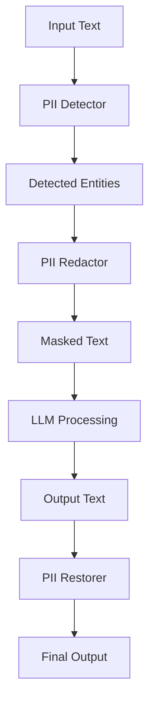

# PII Redactor Pattern

## Abstract

The PII Redactor pattern automatically detects and masks sensitive personal information in inputs and outputs, ensuring data privacy compliance and preventing accidental data leakage through LLM processing.

## Problem Statement

LLM systems may process sensitive personal information (PII) that must be protected for privacy compliance. The problem is how to detect PII in text, mask or redact it appropriately, and maintain data utility while ensuring privacy protection and regulatory compliance.

## Context

This pattern arises when:
- Personal data is processed by LLMs
- Privacy regulations (GDPR, HIPAA, CCPA) apply
- Data leakage must be prevented
- Audit trails are required for compliance
- Data minimization is required

## Forces

- **Privacy vs. Utility:** More redaction reduces data utility
- **Detection vs. False Positives:** Aggressive detection may over-redact
- **Compliance vs. Performance:** Thorough detection adds latency
- **Reversibility vs. Security:** Reversible redaction adds complexity

## Solution

### Architecture Diagram



### Components

- **PII Detector:** Identifies PII using patterns and NER
- **Entity Redactor:** Replaces PII with placeholders
- **PII Restorer:** Restores original values after processing
- **Audit Logger:** Records PII handling for compliance

### Formal Properties

**Invariants:**
- All PII types are detected and redacted
- Redaction is consistent within a session
- Original PII is never logged or stored

**Guarantees:**
- PII is masked before LLM processing
- Redacted output is semantically valid
- PII handling is auditable

**Bounds:**
- Detection time: bounded by text length
- PII types: configurable per regulations
- Redaction accuracy: monitored and tuned

## Implementation

```typescript
import { findPhoneNumbersInText } from 'libphonenumber-js';

interface PIIType {
  name: string;
  pattern: RegExp;
  replacement: string;
  priority: number;
}

interface RedactionResult {
  originalText: string;
  redactedText: string;
  entities: RedactedEntity[];
}

interface RedactedEntity {
  type: string;
  original: string;
  placeholder: string;
  position: { start: number; end: number };
}

class PIIRedactor {
  private readonly PII_TYPES: PIIType[] = [
    { name: 'email', pattern: /\b[\w.-]+@[\w.-]+\.\w+\b/g, replacement: '[EMAIL]', priority: 1 },
    { name: 'ssn', pattern: /\b\d{3}-\d{2}-\d{4}\b/g, replacement: '[SSN]', priority: 1 },
    { name: 'credit_card', pattern: /\b\d{4}[- ]?\d{4}[- ]?\d{4}[- ]?\d{4}\b/g, replacement: '[CREDIT_CARD]', priority: 1 },
  ];

  redact(text: string): RedactionResult {
    const entities: RedactedEntity[] = [];
    let redactedText = text;
    let placeholderCount = 0;

    // Phone numbers: use libphonenumber-js for reliable detection
    const phoneNumbers = findPhoneNumbersInText(text, 'US');
    for (const { startsAt, endsAt } of phoneNumbers) {
      const original = text.slice(startsAt, endsAt);
      const placeholder = `[PHONE]_${placeholderCount++}`;
      entities.push({
        type: 'phone',
        original,
        placeholder,
        position: { start: startsAt, end: endsAt },
      });
      redactedText = redactedText.replace(original, placeholder);
    }

    // Regex-based PII types
    for (const piiType of this.PII_TYPES.sort((a, b) => a.priority - b.priority)) {
      redactedText = redactedText.replace(piiType.pattern, (match) => {
        const position = { start: redactedText.indexOf(match), end: redactedText.indexOf(match) + match.length };
        const placeholder = `${piiType.replacement}_${placeholderCount++}`;
        
        entities.push({
          type: piiType.name,
          original: match,
          placeholder,
          position
        });
        
        return placeholder;
      });
    }

    return {
      originalText: text,
      redactedText,
      entities
    };
  }

  restore(redactedText: string, entities: RedactedEntity[]): string {
    let restoredText = redactedText;
    for (const entity of entities) {
      restoredText = restoredText.replace(entity.placeholder, entity.original);
    }
    return restoredText;
  }
}
```

## Failure Modes

| Failure | Detection | Recovery |
|---------|-----------|----------|
| PII not detected | Audit shows missed PII | Add detection patterns, use NER |
| Over-redaction | Too many false positives | Tune patterns, add allowlist |
| Restoration failure | Placeholder mismatch | Validate mapping, use unique IDs |
| PII in logs | PII found in logs | Add log scanning, fix redaction |

## When NOT to Use

- **No PII processed:** If no personal data is handled
- **Encrypted data:** If data is already encrypted
- **Public data only:** If only public information is processed
- **Internal tools:** If privacy is not a concern

## Cross-References

### Related Patterns
- **Prompt-Injection Sanitizer** (Part V) — Input security
- **Audit Trail** (Part V) — Compliance logging
- **Session Bypass** (Part III) — Data isolation

### External Implementations
- **Microsoft Presidio** — PII detection and redaction
- **AWS Comprehend** — PII detection service

## References

- **GDPR** — EU data protection regulation
- **HIPAA** — US health data protection
- **CCPA** — California privacy law
- **Microsoft Presidio** — Open-source PII protection
