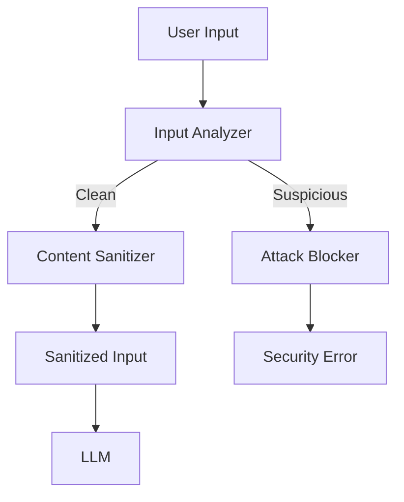

# Prompt-Injection Sanitizer Pattern

## Abstract

The Prompt-Injection Sanitizer pattern detects and neutralizes prompt injection attacks by analyzing inputs for malicious patterns, sanitizing dangerous content, and preventing jailbreak attempts before they reach the LLM.

## Problem Statement

LLMs are vulnerable to prompt injection attacks where malicious inputs manipulate the model into producing unintended outputs, bypassing safety constraints, or leaking sensitive information. The problem is how to detect these attacks, sanitize inputs effectively, and maintain security without overly restricting legitimate use.

## Context

This pattern arises when:
- User inputs are passed to LLMs
- Attackers may attempt jailbreaking
- Sensitive information must be protected
- Safety constraints must be enforced
- Input validation is required for compliance

## Forces

- **Security vs. Usability:** Strict sanitization may block legitimate inputs
- **Detection vs. Evasion:** Attackers adapt to detection methods
- **Performance vs. Thoroughness:** Deep analysis adds latency
- **Patterns vs. Semantics:** Pattern matching misses semantic attacks

## Solution

### Architecture Diagram



### Components

- **Input Analyzer:** Detects injection patterns and anomalies
- **Content Sanitizer:** Removes or escapes dangerous content
- **Attack Blocker:** Rejects confirmed attacks
- **Security Logger:** Records security events

### Formal Properties

**Invariants:**
- All user inputs are analyzed before LLM processing
- Known attack patterns are always blocked
- Sanitization is idempotent

**Guarantees:**
- Malicious inputs are blocked or sanitized
- Legitimate inputs pass with minimal modification
- Security events are logged for analysis

**Bounds:**
- Analysis time: bounded by input length
- False positive rate: monitored and tuned
- Attack detection: covers known attack vectors

## Implementation

```typescript
interface InjectionPattern {
  name: string;
  pattern: RegExp;
  severity: 'low' | 'medium' | 'high' | 'critical';
  action: 'sanitize' | 'block';
}

interface SanitizerConfig {
  patterns: InjectionPattern[];
  maxInputLength: number;
  allowlist?: string[];
  blocklist?: string[];
}

interface AnalysisResult {
  safe: boolean;
  sanitizedInput: string;
  threats: ThreatDetection[];
}

interface ThreatDetection {
  pattern: string;
  severity: string;
  action: string;
}

class PromptInjectionSanitizer {
  private readonly DEFAULT_PATTERNS: InjectionPattern[] = [
    {
      name: 'system-prompt-override',
      pattern: /ignore\s+(previous|all)\s+(instructions|rules)/i,
      severity: 'critical',
      action: 'block'
    },
    {
      name: 'jailbreak-attempt',
      pattern: /you are now\s+\w+\s+without restrictions/i,
      severity: 'critical',
      action: 'block'
    },
    {
      name: 'role-play-bypass',
      pattern: /pretend to be\s+\w+\s+that can/i,
      severity: 'high',
      action: 'sanitize'
    },
    {
      name: 'encoding-attack',
      pattern: /[\u0000-\u001F\u007F-\u009F]/,
      severity: 'medium',
      action: 'sanitize'
    }
  ];

  constructor(private config: SanitizerConfig) {}

  async sanitize(input: string): Promise<AnalysisResult> {
    const threats: ThreatDetection[] = [];
    let sanitizedInput = input;

    // Check input length
    if (input.length > this.config.maxInputLength) {
      sanitizedInput = sanitizedInput.substring(0, this.config.maxInputLength);
    }

    // Check against patterns
    const allPatterns = [...this.DEFAULT_PATTERNS, ...this.config.patterns];
    for (const pattern of allPatterns) {
      const matches = sanitizedInput.match(pattern.pattern);
      if (matches) {
        threats.push({
          pattern: pattern.name,
          severity: pattern.severity,
          action: pattern.action
        });

        if (pattern.action === 'block') {
          return {
            safe: false,
            sanitizedInput: input,
            threats
          };
        } else if (pattern.action === 'sanitize') {
          sanitizedInput = sanitizedInput.replace(pattern.pattern, '[REDACTED]');
        }
      }
    }

    // Check blocklist
    if (this.config.blocklist) {
      for (const blocked of this.config.blocklist) {
        if (sanitizedInput.toLowerCase().includes(blocked.toLowerCase())) {
          threats.push({
            pattern: 'blocklist-match',
            severity: 'high',
            action: 'sanitize'
          });
          sanitizedInput = sanitizedInput.replace(
            new RegExp(this.escapeRegex(blocked), 'gi'),
            '[REDACTED]'
          );
        }
      }
    }

    return {
      safe: threats.filter(t => t.severity === 'critical').length === 0,
      sanitizedInput,
      threats
    };
  }

  private escapeRegex(string: string): string {
    return string.replace(/[.*+?^${}()|[\]\\]/g, '\\$&');
  }
}
```

## Failure Modes

| Failure | Detection | Recovery |
|---------|-----------|----------|
| False positive | Legitimate input blocked | Review and adjust patterns |
| False negative | Attack not detected | Update patterns, add semantic analysis |
| Pattern bypass | Attacker finds workaround | Continuous pattern updates |
| Performance impact | Sanitization too slow | Optimize patterns, cache results |

## When NOT to Use

- **Trusted inputs:** If inputs are from trusted sources only
- **No security requirements:** If security is not a concern
- **Creative applications:** If creative freedom is paramount
- **Internal tools:** If only used internally with trusted users

## Cross-References

### Related Patterns
- **PII Redactor** (Part V) — Sensitive data protection
- **Tool Permission Gateway** (Part V) — Access control
- **Audit Trail** (Part V) — Security logging
- **Structured Output Validator** (Part IV) — Output validation

### External Implementations
- **prompt-injection-bench** — Benchmark for injection detection
- **LLM Guard** — Open-source security library

## References

- **Prompt Injection Attacks** — Security research on LLM vulnerabilities
- **OWASP Top 10 for LLM** — LLM security guidelines
- **Anthropic Safety** — Constitutional AI and safety
