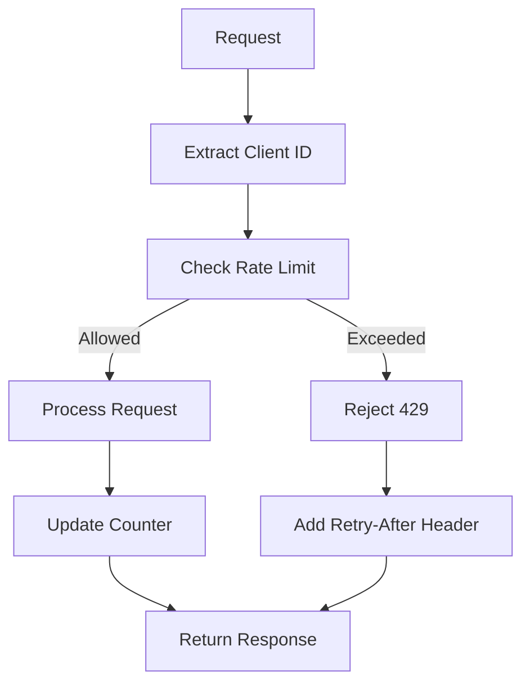

# Rate Limiter Pattern

## Abstract

The Rate Limiter pattern controls the rate of requests to prevent resource exhaustion and ensure fair usage. By implementing token bucket or sliding window algorithms with per-client tracking, this pattern protects agent services from abuse while allowing legitimate traffic to flow smoothly.

## Problem Statement

Agent services have finite resources and need protection from request floods, whether accidental or malicious. The problem is how to limit request rates per client while allowing bursts, handling distributed deployments, and providing clear feedback when limits are exceeded.

## Context

This pattern arises when:
- Services need protection from request floods
- Fair usage among clients is required
- API costs need to be controlled
- Resource exhaustion is a concern
- Graceful degradation under load is needed

## Forces

- **Strictness vs. Flexibility:** Strict limits protect resources but may block legitimate traffic
- **Per-client vs. Global:** Per-client limits are fair; global limits are simpler
- **Burst vs. Sustained:** Allowing bursts improves UX but complicates implementation
- **Local vs. Distributed:** Local limiting is fast; distributed is consistent

## Solution

### Architecture Diagram



### Components

- **Client Identifier:** Extracts client ID from request (API key, IP, user ID)
- **Rate Counter:** Tracks request count per client
- **Limit Evaluator:** Determines if request is within limits
- **Response Handler:** Adds rate limit headers to responses

### Formal Properties

**Invariants:**
- Requests exceeding limit receive 429 response
- Counter is incremented atomically
- Rate limit headers are always present

**Guarantees:**
- No request is processed beyond limit
- Headers accurately reflect remaining quota
- Distributed deployments have consistent limits

**Bounds:**
- Limit check latency: < 1ms
- Maximum clients tracked: bounded by memory/Redis
- Burst allowance: configurable tokens

## Implementation

```typescript
interface RateLimitConfig {
  maxRequests: number;
  windowMs: number;
  burstAllowance?: number;
}

interface RateLimitResult {
  allowed: boolean;
  remaining: number;
  resetAt: number;
  retryAfter?: number;
}

class TokenBucketRateLimiter {
  private buckets: Map<string, { tokens: number; lastRefill: number }> = new Map();

  constructor(
    private config: RateLimitConfig,
    private store: DistributedStore
  ) {}

  async checkLimit(clientId: string): Promise<RateLimitResult> {
    const bucket = await this.store.getOrCreate(clientId, {
      tokens: this.config.maxRequests,
      lastRefill: Date.now(),
    });

    const now = Date.now();
    const elapsed = now - bucket.lastRefill;
    const tokensToAdd = (elapsed / this.config.windowMs) * this.config.maxRequests;

    bucket.tokens = Math.min(
      this.config.maxRequests,
      bucket.tokens + tokensToAdd
    );
    bucket.lastRefill = now;

    if (bucket.tokens >= 1) {
      bucket.tokens -= 1;
      await this.store.set(clientId, bucket);
      return {
        allowed: true,
        remaining: Math.floor(bucket.tokens),
        resetAt: now + this.config.windowMs,
      };
    }

    const retryAfter = Math.ceil((1 - bucket.tokens) * (this.config.windowMs / this.config.maxRequests));

    return {
      allowed: false,
      remaining: 0,
      resetAt: now + retryAfter,
      retryAfter,
    };
  }
}
```

## Failure Modes

| Failure | Detection | Recovery |
|---------|-----------|----------|
| Store unavailable | Redis connection error | Fail open (allow) or closed (deny) |
| Counter overflow | Number overflow | Reset counter |
| Clock skew | Inconsistent time | Use logical timestamps |

## When NOT to Use

- **Trusted clients:** If all clients are trusted, rate limiting adds overhead
- **Batch workloads:** If requests are independent batch jobs
- **Very low traffic:** If traffic is consistently low
- **Streaming:** If response is streaming (rate limiting is per-request)

## Cross-References

### Related Patterns
- **Token Budget Enforcer** (Part VI) — Budget-based limiting for costs
- **Circuit Breaker** (Part II) — Service-level protection
- **Bulkhead** (Part II) — Resource isolation

### External Implementations
- **llm-router** — `src/middleware/rate-limiter.ts` with Redis

## References

- **Token Bucket Algorithm** — Network rate limiting
- **IETF RFC 6585** — Additional HTTP Status Codes
- **Redis Rate Limiting** — Distributed rate limiting patterns