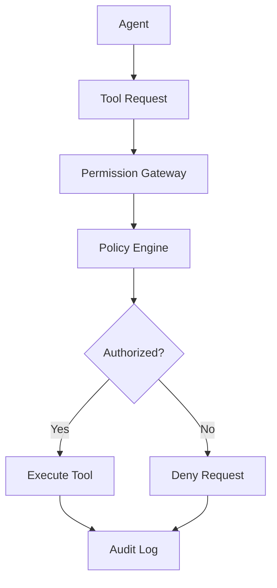

# Tool Permission Gateway Pattern

## Abstract

The Tool Permission Gateway pattern controls access to tools and capabilities by enforcing permission policies, validating authorization before tool execution, and maintaining audit trails of tool usage.

## Problem Statement

In agentic systems, LLMs may request to use tools (APIs, databases, external services) that require access control. The problem is how to enforce fine-grained permissions, prevent unauthorized tool usage, and maintain security while allowing legitimate agent operations.

## Context

This pattern arises when:
- Agents have access to sensitive tools
- Different users/roles have different permissions
- Tool usage must be auditable
- Principle of least privilege is required
- Compliance requires access control

## Forces

- **Security vs. Flexibility:** Strict permissions may block legitimate operations
- **Granularity vs. Complexity:** Fine-grained control adds management overhead
- **Performance vs. Thoroughness:** Permission checks add latency
- **Centralized vs. Distributed:** Centralized control vs. local enforcement

## Solution

### Architecture Diagram



### Components

- **Permission Gateway:** Intercepts and validates tool requests
- **Policy Engine:** Evaluates permissions against policies
- **Role Manager:** Manages user roles and capabilities
- **Audit Logger:** Records all tool access attempts

### Formal Properties

**Invariants:**
- Every tool request is validated before execution
- Permissions are evaluated based on authenticated identity
- Denied requests never reach the tool

**Guarantees:**
- Unauthorized tool access is blocked
- All access attempts are logged
- Permission evaluation is consistent

**Bounds:**
- Permission check time: bounded by policy complexity
- Policy evaluation: deterministic and fast
- Audit retention: bounded by compliance requirements

## Implementation

```typescript
interface Permission {
  tool: string;
  actions: string[]; // 'read', 'write', 'execute'
  resources?: string[];
}

interface Role {
  id: string;
  permissions: Permission[];
}

interface ToolRequest {
  tool: string;
  action: string;
  resource?: string;
  userId: string;
  roles: string[];
}

interface PermissionGatewayConfig {
  roles: Map<string, Role>;
  defaultDeny: boolean;
  auditEnabled: boolean;
}

class ToolPermissionGateway {
  constructor(private config: PermissionGatewayConfig) {}

  async authorize(request: ToolRequest): Promise<{ authorized: boolean; reason?: string }> {
    const auditEntry = {
      timestamp: Date.now(),
      userId: request.userId,
      tool: request.tool,
      action: request.action,
      resource: request.resource,
      authorized: false
    };

    try {
      // Check if any role has the required permission
      for (const roleId of request.roles) {
        const role = this.config.roles.get(roleId);
        if (!role) continue;

        const hasPermission = role.permissions.some(p => 
          p.tool === request.tool && 
          p.actions.includes(request.action) &&
          (!p.resources || !request.resource || p.resources.includes(request.resource))
        );

        if (hasPermission) {
          auditEntry.authorized = true;
          return { authorized: true };
        }
      }

      // Default deny
      if (this.config.defaultDeny) {
        auditEntry.reason = 'No matching permission found';
        return { authorized: false, reason: auditEntry.reason };
      }

      return { authorized: true };
    } finally {
      if (this.config.auditEnabled) {
        await this.logAudit(auditEntry);
      }
    }
  }

  async executeWithAuthorization<T>(
    request: ToolRequest,
    toolExecutor: () => Promise<T>
  ): Promise<T> {
    const { authorized, reason } = await this.authorize(request);
    
    if (!authorized) {
      throw new Error(`Permission denied: ${reason}`);
    }

    return await toolExecutor();
  }

  private async logAudit(entry: Record<string, unknown>): Promise<void> {
    // Log to audit system
    console.log('AUDIT:', JSON.stringify(entry));
  }
}
```

## Failure Modes

| Failure | Detection | Recovery |
|---------|-----------|----------|
| Permission check failure | Policy engine error | Default deny, alert |
| Stale permissions | User role changed | Refresh permissions, cache invalidation |
| Audit failure | Audit log full | Buffer entries, alert |
| Policy misconfiguration | Legitimate access denied | Review policies, add exceptions |

## When NOT to Use

- **Trusted environment:** If all users are trusted
- **No sensitive tools:** If tools don't require access control
- **Simple systems:** If only one user role exists
- **Performance critical:** If permission check latency is unacceptable

## Cross-References

### Related Patterns
- **Audit Trail** (Part V) — Access logging
- **PII Redactor** (Part V) — Data protection
- **Prompt-Injection Sanitizer** (Part V) — Input security

### External Implementations
- **OPA (Open Policy Agent)** — Policy enforcement
- **AWS IAM** — Role-based access control

## References

- **RBAC** — Role-based access control standards
- **ABAC** — Attribute-based access control
- **Zero Trust** — Security architecture principles
