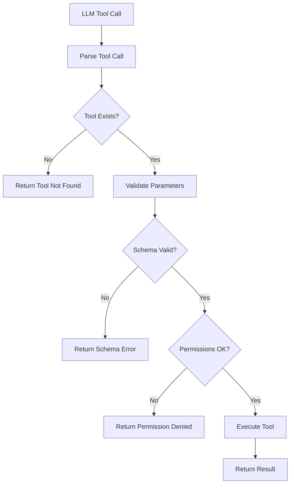

# Tool Use Validation Pattern

## Abstract

The Tool Use Validation pattern validates LLM-generated tool calls before execution. By checking tool existence, parameter schemas, and permission requirements, this pattern prevents invalid tool invocations that could cause errors, security breaches, or unintended side effects.

## Problem Statement

LLMs can generate tool calls with incorrect parameters, non-existent tools, or unauthorized operations. The problem is how to validate tool calls before execution to ensure they are well-formed, authorized, and safe, while providing clear error messages for correction.

## Context

This pattern arises when:
- LLMs generate tool calls dynamically
- Tools have strict parameter schemas
- Permission checking is required
- Invalid tool calls could cause harm
- Clear error feedback is needed for LLM correction

## Forces

- **Strictness vs. Flexibility:** Strict validation prevents errors but may reject valid calls
- **Pre-validation vs. Post-validation:** Pre-validation prevents execution; post-validation catches runtime issues
- **Schema Complexity:** Complex schemas are expressive but harder to validate
- **Performance vs. Thoroughness:** Thorough validation is safer but slower

## Solution

### Architecture Diagram



### Components

- **Tool Registry:** Catalog of available tools with schemas
- **Schema Validator:** Validates parameters against tool schemas
- **Permission Checker:** Verifies caller has required permissions
- **Error Formatter:** Generates clear error messages for LLM

### Formal Properties

**Invariants:**
- All tool calls are validated before execution
- Invalid calls are rejected with clear error messages
- Validated calls match registered tool schemas

**Guarantees:**
- No execution of unregistered tools
- Parameter types match schema definitions
- Permissions are checked atomically

**Bounds:**
- Validation latency: < 10ms
- Maximum tools: bounded by registry size
- Schema depth: bounded for performance

## Implementation

```typescript
interface ToolSchema {
  name: string;
  description: string;
  parameters: {
    type: 'object';
    properties: Record<string, ParameterSchema>;
    required?: string[];
  };
  requiredPermissions?: string[];
}

interface ValidationResult {
  valid: boolean;
  errors: string[];
  warnings?: string[];
}

class ToolUseValidator {
  constructor(
    private registry: ToolRegistry,
    private permissionChecker: PermissionChecker,
    private schemaValidator: SchemaValidator
  ) {}

  async validate(toolCall: ToolCall, context: ExecutionContext): Promise<ValidationResult> {
    const errors: string[] = [];

    // Check tool exists
    const tool = this.registry.getTool(toolCall.name);
    if (!tool) {
      return {
        valid: false,
        errors: [`Tool '${toolCall.name}' does not exist`],
      };
    }

    // Validate parameters against schema
    const paramValidation = this.schemaValidator.validate(
      toolCall.arguments,
      tool.parameters
    );
    if (!paramValidation.valid) {
      errors.push(...paramValidation.errors.map(e => `Parameter error: ${e}`));
    }

    // Check permissions
    if (tool.requiredPermissions) {
      const hasPermission = await this.permissionChecker.check(
        context.userId,
        tool.requiredPermissions
      );
      if (!hasPermission) {
        errors.push(`Missing required permissions: ${tool.requiredPermissions.join(', ')}`);
      }
    }

    return {
      valid: errors.length === 0,
      errors,
    };
  }

  formatError(toolCall: ToolCall, result: ValidationResult): string {
    if (result.valid) return '';

    const lines = [`Error calling tool '${toolCall.name}':`];
    for (const error of result.errors) {
      lines.push(`  - ${error}`);
    }
    lines.push('Please correct and retry.');
    return lines.join('\n');
  }
}
```

## Failure Modes

| Failure | Detection | Recovery |
|---------|-----------|----------|
| Schema mismatch | Validation failure | Return error to LLM for correction |
| Permission denied | Auth check failure | Return error, LLM selects alternative |
| Registry unavailable | Connection error | Fail closed (deny all) |
| Tool execution timeout | Tool timeout | Return timeout error |

## When NOT to Use

- **Trusted LLMs:** If LLMs are trusted to generate correct calls
- **Simple tools:** If tools have no parameters or are stateless
- **Single tool:** If system uses only one tool
- **Sandboxed execution:** If tools run in fully sandboxed environment

## Cross-References

### Related Patterns
- **Tool Permission Gateway** (Part V) — Permission enforcement
- **Structured Output Validator** (Part IV) — Validates LLM outputs
- **Prompt Injection Sanitizer** (Part V) — Prevents malicious inputs

### External Implementations
- **MCP Contract Kit** — Schema validation for MCP servers

## References

- **JSON Schema** — Parameter validation standard
- **MCP Protocol** — Model Context Protocol tool definitions
- **LangChain Tool Validation** — Tool validation patterns