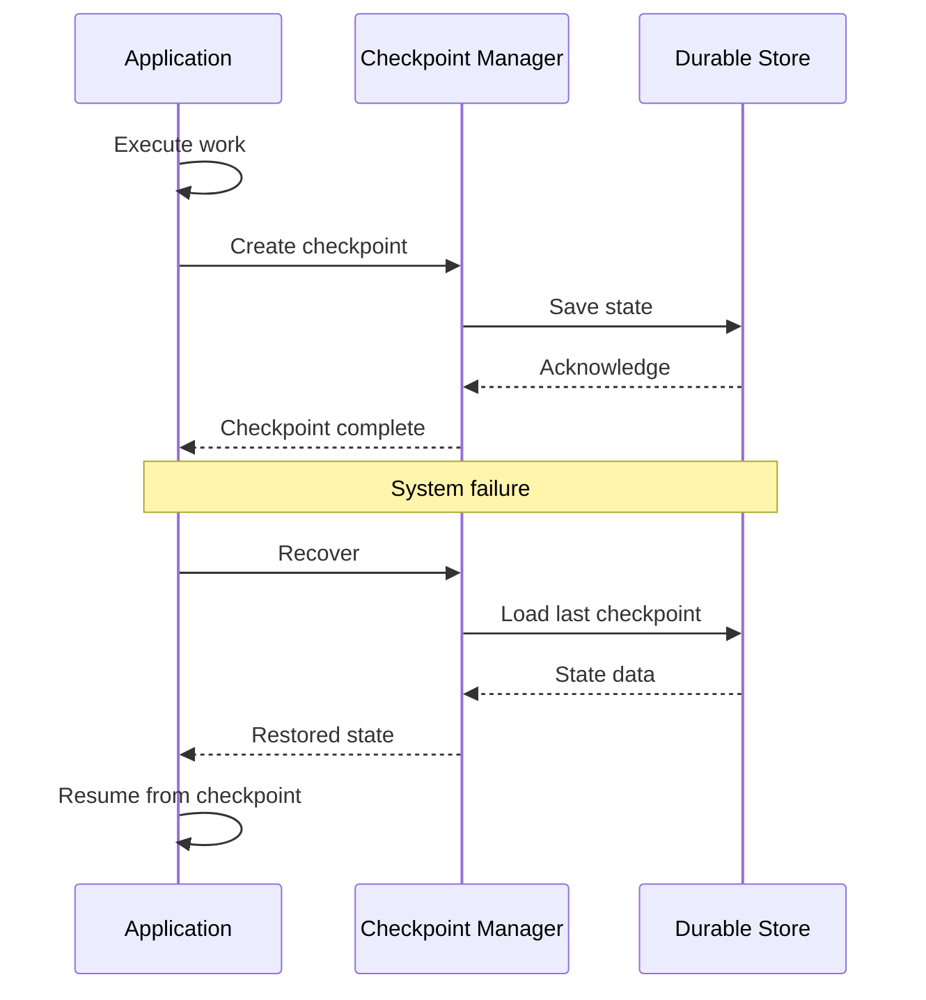

# Checkpoint Pattern

## Abstract

The Checkpoint pattern enables recovery by periodically persisting system state to durable storage, allowing the system to resume from the last checkpoint after a failure rather than starting from scratch.

## Problem Statement

Long-running operations or conversations can be lost due to system failures, crashes, or restarts. The problem is how to capture system state at strategic points, store it durably, and restore it quickly after a failure while balancing checkpoint frequency against storage and performance overhead.

## Context

This pattern arises when:
- Operations are long-running and expensive to redo
- State loss would be costly or unacceptable
- Recovery time objectives require fast restoration
- State changes are incremental
- Durable storage is available

## Forces

- **Frequency vs. Overhead:** More frequent checkpoints increase overhead
- **Granularity vs. Size:** Fine-grained checkpoints are smaller but more numerous
- **Consistency vs. Performance:** Strong consistency slows checkpointing
- **Recovery Time vs. Storage:** Faster recovery requires more storage

## Solution

### Architecture Diagram



### Components

- **Checkpoint Manager:** Coordinates checkpoint creation and recovery
- **State Serializer:** Converts state to storable format
- **Durable Store:** Persists checkpoint data
- **Recovery Handler:** Restores state from checkpoint

### Formal Properties

**Invariants:**
- Checkpoints are stored in chronological order
- Each checkpoint has a unique sequence number
- Checkpoint data is complete and consistent

**Guarantees:**
- System can recover from last checkpoint
- Recovery time is bounded
- Checkpoint creation doesn't block application

**Bounds:**
- Checkpoint interval: bounded by RPO requirements
- Recovery time: bounded by RTO requirements
- Storage size: bounded by retention policy

## Implementation

```typescript
interface Checkpoint<T> {
  id: string;
  sequence: number;
  timestamp: number;
  state: T;
  metadata: Record<string, unknown>;
}

interface CheckpointConfig {
  intervalMs: number;
  maxCheckpoints: number;
  storageProvider: StorageProvider;
}

class CheckpointManager<T> {
  private checkpoints: Checkpoint<T>[] = [];
  private lastCheckpointTime = 0;
  private sequence = 0;

  constructor(
    private config: CheckpointConfig,
    private stateProvider: StateProvider<T>
  ) {}

  async createCheckpoint(metadata?: Record<string, unknown>): Promise<string> {
    const now = Date.now();
    if (now - this.lastCheckpointTime < this.config.intervalMs) {
      return this.checkpoints[this.checkpoints.length - 1]?.id || '';
    }

    const state = await this.stateProvider.getState();
    const checkpoint: Checkpoint<T> = {
      id: crypto.randomUUID(),
      sequence: ++this.sequence,
      timestamp: now,
      state,
      metadata: metadata || {}
    };

    await this.config.storageProvider.save(checkpoint);
    this.checkpoints.push(checkpoint);
    this.lastCheckpointTime = now;
    this.prune();

    return checkpoint.id;
  }

  async recover(): Promise<T | null> {
    const checkpoint = await this.config.storageProvider.loadLatest();
    if (!checkpoint) return null;

    await this.stateProvider.restoreState(checkpoint.state);
    this.checkpoints = [checkpoint];
    this.sequence = checkpoint.sequence;
    this.lastCheckpointTime = checkpoint.timestamp;

    return checkpoint.state;
  }

  private prune(): void {
    while (this.checkpoints.length > this.config.maxCheckpoints) {
      const removed = this.checkpoints.shift()!;
      this.config.storageProvider.delete(removed.id);
    }
  }
}
```

## Failure Modes

| Failure | Detection | Recovery |
|---------|-----------|----------|
| Checkpoint corruption | Checksum mismatch | Use previous checkpoint |
| Storage full | Write failures | Prune old checkpoints, alert |
| Recovery failure | State restore error | Manual intervention |
| Stale checkpoint | Large gap since last checkpoint | Increase frequency |

## When NOT to Use

- **Stateless operations:** If no state to preserve
- **Short operations:** If operation completes before checkpoint interval
- **Cheap recovery:** If restarting is faster than recovering
- **No durable storage:** If no persistent storage available

## Cross-References

### Related Patterns
- **Replay Buffer** (Part III) — In-memory state preservation
- **Saga** (Part III) — Distributed transaction recovery
- **Session Bypass** (Part III) — Session state management
- **Idempotency Cache** (Part III) — Request deduplication

### External Implementations
- **TensorFlow** — Training checkpointing
- **Spark** — RDD checkpointing
- **Kubernetes** — StatefulSet volume snapshots

## References

- **Checkpoint/Restart** — HPC fault tolerance patterns
- **Database Checkpoints** — Transaction log management
- **AWS S3** — Durable object storage for checkpoints
