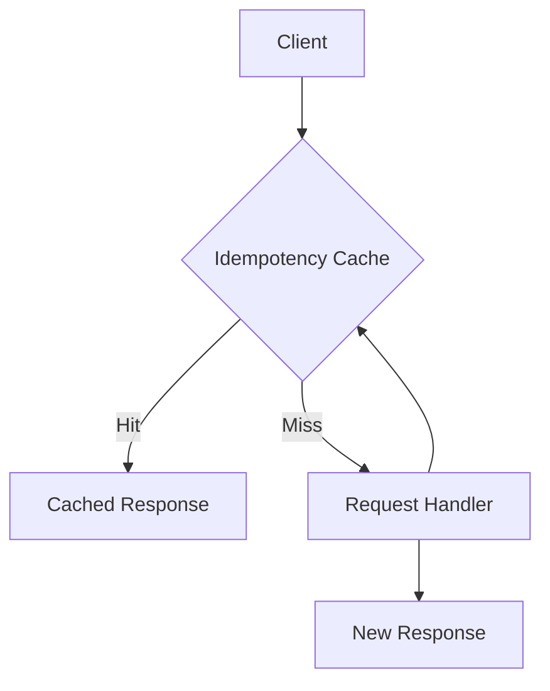

# Idempotency Cache Pattern

## Abstract

The Idempotency Cache pattern deduplicates repeated requests by caching responses for identical requests, ensuring exactly-once semantics even when clients retry due to network issues or timeouts.

## Problem Statement

In distributed systems, clients may retry requests due to network failures, timeouts, or ambiguous responses. The problem is how to detect duplicate requests and return the cached response instead of re-executing the operation, preventing duplicate side effects while maintaining correctness.

## Context

This pattern arises when:
- Clients retry after network failures
- Operations have side effects that shouldn't be duplicated
- Response time for retries should be minimal
- Request identity can be determined
- Cache storage is available

## Forces

- **Cache Size vs. Hit Rate:** Larger caches increase hit rate but use more memory
- **TTL vs. Staleness:** Longer TTL increases hits but may return stale data
- **Key Generation vs. Overhead:** Complex keys are more accurate but slower
- **Consistency vs. Performance:** Strong consistency reduces performance

## Solution

### Architecture Diagram



### Components

- **Idempotency Key Generator:** Creates unique request identifiers
- **Cache Store:** Stores request-response mappings
- **Cache Manager:** Handles TTL and eviction
- **Request Deduplicator:** Detects and handles duplicate requests

### Formal Properties

**Invariants:**
- Same idempotency key returns same response
- Cache entries expire after TTL
- Key generation is deterministic for same request

**Guarantees:**
- Duplicate requests return cached response
- Cache miss executes operation exactly once
- Cache entries are cleaned up after TTL

**Bounds:**
- Cache size: bounded by memory/storage
- TTL: bounded by idempotency window
- Key collision probability: bounded by key entropy

## Implementation

```typescript
interface CacheEntry<T> {
  response: T;
  createdAt: number;
  ttlMs: number;
}

interface IdempotencyConfig {
  defaultTTLMs: number;
  maxCacheSize: number;
  keyHeader: string;
}

class IdempotencyCache<T> {
  private cache = new Map<string, CacheEntry<T>>();
  private readonly config: IdempotencyConfig;

  constructor(config: IdempotencyConfig) {
    this.config = config;
  }

  async execute(
    key: string,
    operation: () => Promise<T>,
    ttlMs?: number
  ): Promise<T> {
    // Check cache
    const cached = this.get(key);
    if (cached) {
      return cached;
    }

    // Execute and cache
    const response = await operation();
    this.set(key, response, ttlMs);
    return response;
  }

  private get(key: string): T | null {
    const entry = this.cache.get(key);
    if (!entry) return null;

    // Check TTL
    if (Date.now() - entry.createdAt > entry.ttlMs) {
      this.cache.delete(key);
      return null;
    }
    return entry.response;
  }

  private set(key: string, response: T, ttlMs?: number): void {
    // Evict if at capacity
    if (this.cache.size >= this.config.maxCacheSize) {
      const oldestKey = this.cache.keys().next().value;
      if (oldestKey) this.cache.delete(oldestKey);
    }

    this.cache.set(key, {
      response,
      createdAt: Date.now(),
      ttlMs: ttlMs || this.config.defaultTTLMs
    });
  }
}

// Middleware usage
const cache = new IdempotencyCache<Response>({
  defaultTTLMs: 5 * 60 * 1000, // 5 minutes
  maxCacheSize: 10000,
  keyHeader: 'Idempotency-Key'
});

app.post('/api/endpoint', async (req, res) => {
  const key = req.headers['idempotency-key'] as string;
  const response = await cache.execute(key, async () => {
    return await processRequest(req.body);
  });
  res.json(response);
});
```

## Failure Modes

| Failure | Detection | Recovery |
|---------|-----------|----------|
| Cache miss after retry | Different key generated | Use consistent key generation |
| Cache full | Eviction of valid entries | Increase cache size, reduce TTL |
| Stale cache | TTL too long | Reduce TTL, add cache invalidation |
| Key collision | Different requests same key | Increase key entropy |

## When NOT to Use

- **Stateless operations:** If operations are read-only, caching is sufficient
- **Unique responses required:** If each response must be unique
- **Large responses:** If response size makes caching expensive
- **Low retry rate:** If retries are rare, overhead is unjustified

## Cross-References

### Related Patterns
- **Retry with Backoff** (Part II) — Retries benefit from idempotency
- **Session Bypass** (Part III) — Session-based deduplication
- **Cache-Aside** (Part VI) — General caching pattern
- **Replay Buffer** (Part III) — Stores request history

### External Implementations
- **Stripe API** — Idempotency key header pattern
- **AWS API Gateway** — Request deduplication

## References

- **Idempotent REST API** — REST API design patterns
- **Stripe Documentation** — Idempotent requests
- **HTTP Idempotency** — RFC draft on idempotency keys
