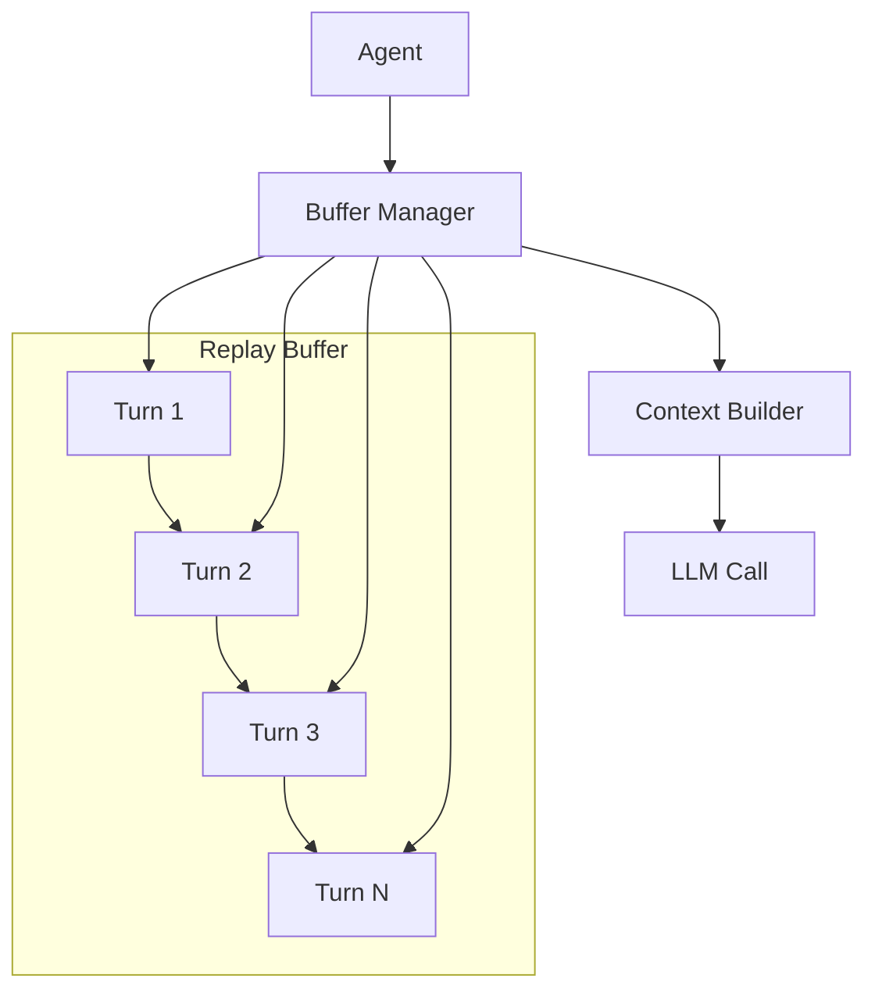

# Replay Buffer Pattern

## Abstract

The Replay Buffer pattern preserves conversation history by storing and managing turn-by-turn interaction records, enabling context-aware responses and conversation resumption after interruptions.

## Problem Statement

LLM-based agents require conversation context to provide coherent multi-turn responses. The problem is how to efficiently store, retrieve, and manage conversation history while respecting context window limits, ensuring relevant context is available for each turn, and handling conversation resumption after interruptions.

## Context

This pattern arises when:
- Conversations span multiple turns
- Context window limits require selective history
- Conversations may be interrupted and resumed
- Different turns have different relevance
- History must be persisted for compliance

## Forces

- **Completeness vs. Cost:** Full history is comprehensive but expensive
- **Recency vs. Relevance:** Recent turns may not be most relevant
- **Size vs. Performance:** Larger buffers slow retrieval
- **Persistence vs. Privacy:** Stored history raises privacy concerns

## Solution

### Architecture Diagram



### Components

- **Turn Recorder:** Captures each request-response pair
- **Buffer Manager:** Stores and retrieves turns
- **Context Builder:** Selects relevant turns for context
- **Pruner:** Removes old or irrelevant turns

### Formal Properties

**Invariants:**
- Turns are stored in chronological order
- Each turn has a unique sequence number
- Buffer size is bounded

**Guarantees:**
- All turns within window are retrievable
- Context fits within LLM token limit
- Conversation can be resumed from any turn

**Bounds:**
- Buffer size: bounded by max_turns or max_tokens
- Turn retrieval: O(1) by sequence number
- Context window: bounded by LLM limit

## Implementation

```typescript
interface Turn {
  sequence: number;
  role: 'user' | 'assistant';
  content: string;
  timestamp: number;
  tokens?: number;
}

interface ReplayBufferConfig {
  maxTurns: number;
  maxTokens: number;
  persistenceEnabled: boolean;
}

class ReplayBuffer {
  private turns: Turn[] = [];
  private sequence = 0;

  constructor(private config: ReplayBufferConfig) {}

  addTurn(role: 'user' | 'assistant', content: string): Turn {
    const turn: Turn = {
      sequence: ++this.sequence,
      role,
      content,
      timestamp: Date.now(),
      tokens: this.estimateTokens(content)
    };
    this.turns.push(turn);
    this.prune();
    return turn;
  }

  getContext(maxTokens?: number): string {
    const limit = maxTokens || this.config.maxTokens;
    const context: Turn[] = [];
    let totalTokens = 0;

    // Add turns from most recent, respecting token limit
    for (let i = this.turns.length - 1; i >= 0; i--) {
      const turn = this.turns[i]!;
      if (totalTokens + (turn.tokens || 0) > limit) break;
      context.unshift(turn);
      totalTokens += turn.tokens || 0;
    }

    return context.map(t => `${t.role}: ${t.content}`).join('\n');
  }

  private prune(): void {
    // Remove oldest turns if over limits
    while (this.turns.length > this.config.maxTurns) {
      this.turns.shift();
    }

    // Remove oldest turns if over token limit
    let totalTokens = this.turns.reduce((sum, t) => sum + (t.tokens || 0), 0);
    while (totalTokens > this.config.maxTokens && this.turns.length > 0) {
      const removed = this.turns.shift()!;
      totalTokens -= removed.tokens || 0;
    }
  }

  private estimateTokens(text: string): number {
    // Rough estimate: ~4 characters per token
    return Math.ceil(text.length / 4);
  }

  clear(): void {
    this.turns = [];
    this.sequence = 0;
  }
}
```

## Failure Modes

| Failure | Detection | Recovery |
|---------|-----------|----------|
| Buffer overflow | Too many turns stored | Prune aggressively, alert |
| Context too large | Exceeds LLM limit | Reduce turns, summarize |
| Lost context | Turns missing | Reload from persistence |
| Stale context | Old irrelevant turns | Implement relevance scoring |

## When NOT to Use

- **Stateless interactions:** If each request is independent
- **Single-turn conversations:** If no multi-turn context needed
- **Privacy-critical:** If storing conversation is prohibited
- **Real-time constraints:** If buffer operations add too much latency

## Cross-References

### Related Patterns
- **Session Bypass** (Part III) — Session continuity
- **Checkpoint** (Part III) — Persistent storage
- **Token Budget Enforcer** (Part VI) — Token management
- **Graceful Degradation** (Part VI) — Handle context limits

### External Implementations
- **LangChain** — Conversation memory implementations
- **LlamaIndex** — Chat history management

## References

- **Conversational Memory** — Dialogue system patterns
- **LangChain Memory** — Conversation buffer implementations
- **Context Window Management** — LLM context optimization
