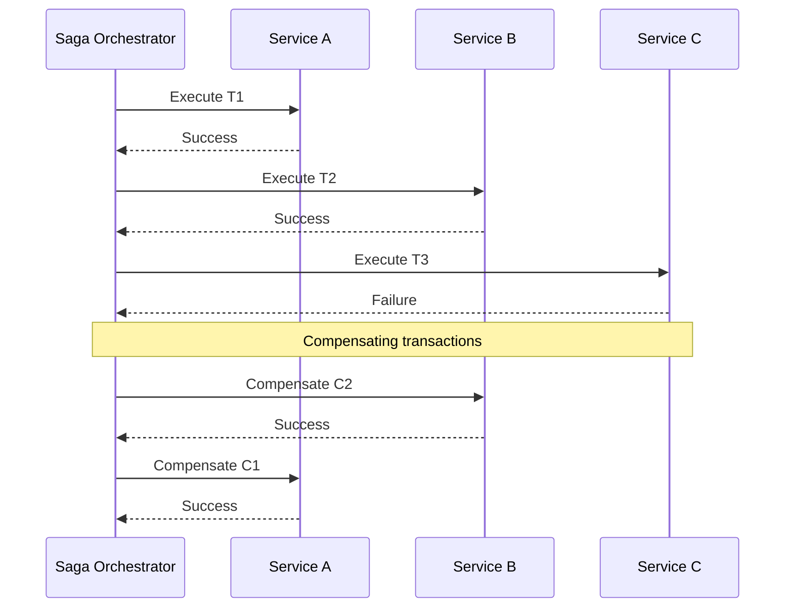

# Saga Pattern

## Abstract

The Saga pattern coordinates distributed transactions through a sequence of local transactions with compensating actions, ensuring data consistency across services without distributed locks.

## Problem Statement

In distributed systems, operations often span multiple services, each with its own database. The problem is how to maintain data consistency across services without using distributed transactions (which are slow and don't scale), while handling partial failures and providing rollback capabilities.

## Context

This pattern arises when:
- Operations span multiple services or databases
- ACID transactions are not available across services
- Partial failures must be handled gracefully
- Compensating actions can undo partial work
- Eventual consistency is acceptable

## Forces

- **Consistency vs. Performance:** Stronger consistency reduces performance
- **Compensation vs. Rollback:** Compensating actions may not fully undo changes
- **Orchestration vs. Choreography:** Centralized control vs. decentralized coordination
- **Idempotency vs. Complexity:** Idempotent operations simplify recovery

## Solution

### Architecture Diagram



### Components

- **Saga Orchestrator:** Coordinates the sequence of transactions
- **Transaction Handlers:** Execute local transactions
- **Compensation Handlers:** Undo completed transactions
- **State Machine:** Tracks saga progress and recovery

### Formal Properties

**Invariants:**
- Each transaction has a corresponding compensation
- Compensations execute in reverse order
- Saga state is persisted after each step

**Guarantees:**
- Either all transactions complete or all are compensated
- Compensations are idempotent
- Saga can recover from any failure point

**Bounds:**
- Saga duration: bounded by sum of transaction timeouts
- Compensation time: bounded by recovery SLA
- State size: bounded by transaction count

## Implementation

```typescript
interface SagaStep<T> {
  name: string;
  execute: (context: T) => Promise<void>;
  compensate: (context: T) => Promise<void>;
}

interface SagaState {
  id: string;
  status: 'running' | 'completed' | 'compensating' | 'failed';
  completedSteps: string[];
  context: Record<string, unknown>;
}

class Saga<T> {
  private steps: SagaStep<T>[] = [];
  private state: SagaState;

  constructor(sagaId: string) {
    this.state = {
      id: sagaId,
      status: 'running',
      completedSteps: [],
      context: {}
    };
  }

  addStep(step: SagaStep<T>): Saga<T> {
    this.steps.push(step);
    return this;
  }

  async execute(initialContext: T): Promise<T> {
    this.state.context = initialContext as Record<string, unknown>;

    for (let i = 0; i < this.steps.length; i++) {
      const step = this.steps[i]!;
      try {
        await step.execute(this.state.context as T);
        this.state.completedSteps.push(step.name);
        await this.persistState();
      } catch (error) {
        await this.compensate(i - 1, error as Error);
        throw error;
      }
    }

    this.state.status = 'completed';
    await this.persistState();
    return this.state.context as T;
  }

  private async compensate(lastSuccessfulStep: number, error: Error): Promise<void> {
    this.state.status = 'compensating';
    await this.persistState();

    for (let i = lastSuccessfulStep; i >= 0; i--) {
      const step = this.steps[i]!;
      try {
        await step.compensate(this.state.context as T);
      } catch (compensationError) {
        // Log and continue with remaining compensations
        console.error(`Compensation failed for ${step.name}:`, compensationError);
      }
    }

    this.state.status = 'failed';
    await this.persistState();
  }

  private async persistState(): Promise<void> {
    // Persist to database for recovery
  }

  async recover(): Promise<void> {
    const savedState = await this.loadState();
    if (!savedState) return;

    this.state = savedState;
    if (this.state.status === 'compensating') {
      // Resume compensation from last saved point
    }
  }
}
```

## Failure Modes

| Failure | Detection | Recovery |
|---------|-----------|----------|
| Compensation failure | Compensation throws error | Log, alert, manual intervention |
| Partial compensation | Some compensations fail | Idempotent retry, manual review |
| Lost saga state | State not persisted | Reload from event log |
| Stuck saga | No progress for timeout | Timeout and compensate |

## When NOT to Use

- **Single service:** If operation is within one service, use ACID transaction
- **No compensation:** If changes can't be undone, use different pattern
- **Strong consistency required:** If eventual consistency is unacceptable
- **Short operations:** If operation is quick, simpler patterns suffice

## Cross-References

### Related Patterns
- **Checkpoint** (Part III) — State persistence for recovery
- **Idempotency Cache** (Part III) — Ensures idempotent operations
- **Circuit Breaker** (Part II) — Prevents cascading failures
- **Retry with Backoff** (Part II) — Retry failed steps

### External Implementations
- **Temporal.io** — Durable execution with sagas
- **AWS Step Functions** — State machine orchestration
- **Camunda** — BPMN workflow engine

## References

- **Sagas** (Garcia-Molina & Salem, 1987) — Original saga paper
- **Microservices Patterns** (Richardson) — Saga pattern chapter
- **Temporal.io** — Modern saga implementation
