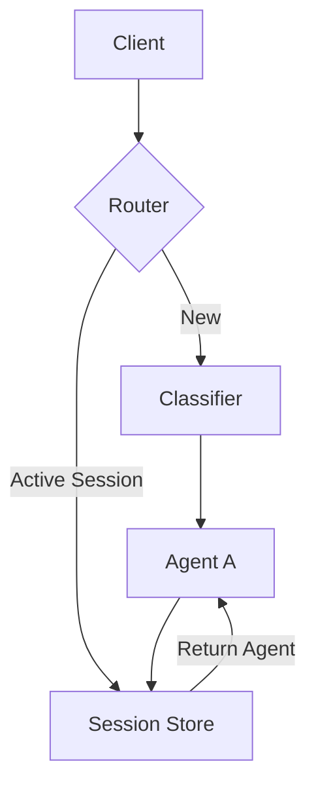

# Session Bypass Pattern

## Abstract

The Session Bypass pattern maintains conversational continuity by skipping routing for active sessions, ensuring that users continue interacting with the same agent throughout a multi-turn conversation.

## Problem Statement

In multi-agent systems with intent-based routing, each request is independently classified and routed. However, multi-turn conversations require context continuity — a user's follow-up message should continue the same conversation thread rather than being re-routed, which could break context and confuse the user.

## Context

This pattern arises when:
- Conversations span multiple turns
- Context from previous turns is needed
- Re-routing mid-conversation would break flow
- Session state must be preserved
- Users expect conversation continuity

## Forces

- **Continuity vs. Flexibility:** Session persistence limits dynamic re-routing
- **State vs. Scalability:** Session state adds memory overhead
- **Consistency vs. Freshness:** Cached routing may become stale
- **Isolation vs. Sharing:** Sessions must be isolated but share resources

## Solution

### Architecture Diagram



### Components

- **Session Store:** Maintains active session mappings
- **Session Manager:** Creates, updates, and expires sessions
- **Router:** Checks session before classification
- **Session ID Generator:** Creates unique session identifiers

### Formal Properties

**Invariants:**
- Each session maps to exactly one agent
- Session has a TTL after last activity
- Session ID is unique and non-guessable

**Guarantees:**
- Active sessions bypass classification
- Session state is consistent within TTL
- Expired sessions are cleaned up

**Bounds:**
- Session TTL: bounded by conversation timeout
- Session storage: bounded by memory/database capacity
- Session lookup: O(1) by session ID

## Implementation

```typescript
interface Session {
  id: string;
  agentId: string;
  context: Record<string, unknown>;
  lastActiveAt: number;
  ttlMs: number;
}

class SessionBypass {
  private sessions = new Map<string, Session>();
  private readonly DEFAULT_TTL = 30 * 60 * 1000; // 30 minutes

  async processRequest(
    request: Request,
    classifier: Classifier,
    agents: Map<string, Agent>
  ): Promise<Response> {
    // Check for existing session
    const sessionId = request.sessionId;
    if (sessionId) {
      const session = this.getSession(sessionId);
      if (session) {
        this.updateSessionActivity(session);
        const agent = agents.get(session.agentId);
        return await agent!.process(request, session.context);
      }
    }

    // New conversation - classify and route
    const intent = await classifier.classify(request.content);
    const agentId = this.selectAgent(intent);
    const agent = agents.get(agentId);
    
    // Create session
    const session = this.createSession(agentId);
    const response = await agent!.process(request, session.context);
    
    // Return session ID for future requests
    response.sessionId = session.id;
    return response;
  }

  private createSession(agentId: string): Session {
    const session: Session = {
      id: crypto.randomUUID(),
      agentId,
      context: {},
      lastActiveAt: Date.now(),
      ttlMs: this.DEFAULT_TTL
    };
    this.sessions.set(session.id, session);
    return session;
  }

  private getSession(id: string): Session | null {
    const session = this.sessions.get(id);
    if (!session) return null;
    
    // Check if expired
    if (Date.now() - session.lastActiveAt > session.ttlMs) {
      this.sessions.delete(id);
      return null;
    }
    return session;
  }

  private updateSessionActivity(session: Session): void {
    session.lastActiveAt = Date.now();
  }
}
```

## Failure Modes

| Failure | Detection | Recovery |
|---------|-----------|----------|
| Session not found | Session ID invalid or expired | Re-classify and create new session |
| Session store full | Memory/database capacity exceeded | Evict old sessions, scale storage |
| Stale session | Agent no longer available | Re-route to available agent |
| Session leakage | User sees wrong session data | Add authentication, isolation |

## When NOT to Use

- **Stateless interactions:** If each request is independent, sessions add overhead
- **Single-turn conversations:** If conversations don't span multiple turns
- **High churn:** If sessions change frequently, bypass provides little benefit
- **Stateless agents:** If agents don't maintain context, sessions are unnecessary

## Cross-References

### Related Patterns
- **Router** (Part I) — Session bypass skips routing
- **Replay Buffer** (Part III) — Stores conversation history
- **Idempotency Cache** (Part III) — Handles duplicate requests
- **Checkpoint** (Part III) — Persists session state

### External Implementations
- **agent-mesh** — `src/session/session.middleware.ts` for session management

## References

- **Conversational AI Patterns** — Session management in dialogue systems
- **HTTP Session Management** — Web session patterns
- **Redis** — Session storage implementation
