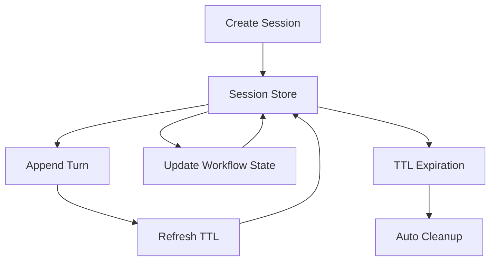

# Session Management Pattern

## Abstract

The Session Management pattern provides persistent storage and lifecycle management for multi-turn conversations. By storing session state, turn history, and workflow context in a durable store with TTL-based expiration, this pattern enables agents to maintain context across multiple interactions while ensuring automatic cleanup of expired sessions.

## Problem Statement

Multi-turn conversations require maintaining state across multiple exchanges. The problem is how to persist session data reliably, manage session lifecycle (create, update, expire), support concurrent access, and ensure automatic cleanup without manual intervention.

## Context

This pattern arises when:
- Conversations span multiple turns
- Session state must persist across requests
- Automatic cleanup of expired sessions is needed
- Concurrent access to sessions must be handled
- Session data needs to be queryable

## Forces

- **Durability vs. Performance:** Durable storage is reliable but slower than in-memory
- **TTL vs. Manual Cleanup:** TTL is automatic but less flexible than manual control
- **Consistency vs. Availability:** Strong consistency is reliable but may impact availability
- **Session Size vs. Cost:** Larger sessions provide more context but increase storage costs

## Solution

### Architecture Diagram



### Components

- **Session Store:** Durable storage for session data (Firestore, Redis, DynamoDB)
- **Session Manager:** Manages session lifecycle operations
- **TTL Manager:** Handles session expiration and cleanup
- **Turn Appender:** Adds new turns to session history

### Formal Properties

**Invariants:**
- Each session has a unique identifier
- Session TTL is refreshed on each access
- Expired sessions are automatically deleted

**Guarantees:**
- Session data is durable and survives restarts
- Concurrent updates are handled atomically
- Sessions expire after configured inactivity period

**Bounds:**
- Session lifetime: bounded by TTL (typically 30 minutes)
- Turn history: bounded by storage limits
- Session size: bounded by storage limits

## Implementation

```typescript
interface Session {
  id: string;
  userId: string;
  agentId: string;
  status: 'active' | 'completed' | 'abandoned' | 'error';
  createdAt: string;
  updatedAt: string;
  ttl: string;
  turnHistory: TurnEntry[];
  workflowState: Record<string, unknown>;
}

interface TurnEntry {
  role: 'user' | 'agent';
  content: string;
  timestamp: string;
  intentSummary?: string;
}

class SessionManager {
  constructor(private store: SessionStore, private defaultTTLMinutes: number = 30) {}

  async createSession(userId: string, agentId: string): Promise<Session> {
    const now = new Date();
    const session: Session = {
      id: generateUUID(),
      userId,
      agentId,
      status: 'active',
      createdAt: now.toISOString(),
      updatedAt: now.toISOString(),
      ttl: new Date(now.getTime() + this.defaultTTLMinutes * 60 * 1000).toISOString(),
      turnHistory: [],
      workflowState: {},
    };

    await this.store.create(session);
    return session;
  }

  async getActiveSession(userId: string): Promise<Session | null> {
    const session = await this.store.findByUser(userId);

    if (!session || session.status !== 'active') {
      return null;
    }

    if (new Date(session.ttl) < new Date()) {
      await this.closeSession(session.id, 'abandoned');
      return null;
    }

    return session;
  }

  async appendTurn(sessionId: string, entry: TurnEntry): Promise<void> {
    await this.store.transaction(sessionId, async (session) => {
      session.turnHistory.push(entry);
      session.updatedAt = new Date().toISOString();
      session.ttl = new Date(
        Date.now() + this.defaultTTLMinutes * 60 * 1000
      ).toISOString();
      return session;
    });
  }
}
```

## Failure Modes

| Failure | Detection | Recovery |
|---------|-----------|----------|
| Store unavailable | Connection timeout | Fail open (create new session without history) |
| Concurrent update conflict | Transaction conflict | Retry with exponential backoff |
| TTL not refreshed | Session expires prematurely | Manual TTL extension |
| Turn history too large | Storage limit exceeded | Truncate old turns, keep recent |

## When NOT to Use

- **Single-turn interactions:** If interactions are single-turn, session management adds overhead
- **Stateless systems:** If no state needs to be preserved, skip session management
- **In-memory only:** If persistence is not required, use in-memory store
- **Very short-lived sessions:** If sessions are seconds-lived, TTL overhead may dominate

## Cross-References

### Related Patterns
- **Session Bypass** (Part III) — Uses session to skip classification
- **Workflow State** (Part III) — Stores agent-managed state in session
- **Idempotency Cache** (Part III) — Can use session for idempotency keys

### External Implementations
- **agent-mesh** — `src/session/session.service.ts` with Firestore backend

## References

- **agent-mesh ARCHITECTURE.md** — Session management implementation
- **Firestore TTL** — Automatic document expiration
- **Session Management Patterns** — Fowler's P of EAA