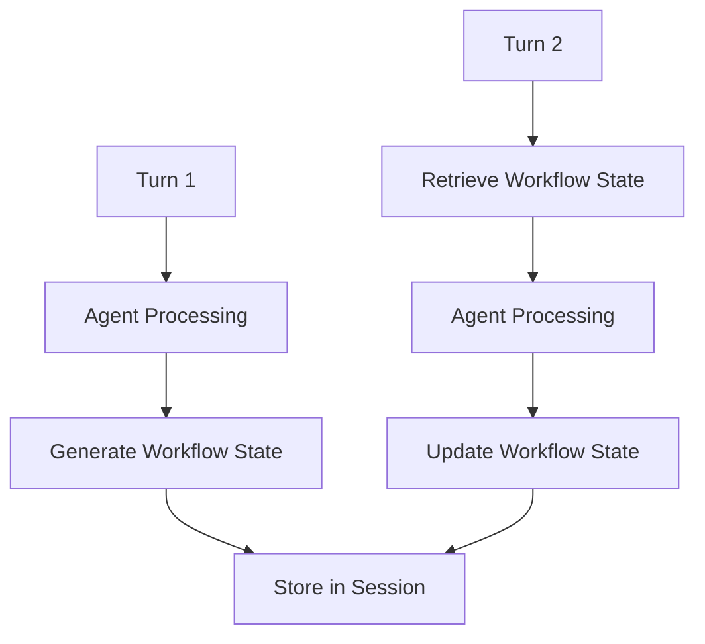

# Workflow State Pattern

## Abstract

The Workflow State pattern persists agent-managed state across multi-turn interactions. By storing state in a structured format that survives across turns, agents can maintain context, track progress through multi-step processes, and resume interrupted workflows without losing information.

## Problem Statement

Multi-turn interactions require maintaining context across multiple exchanges. The problem is how to persist agent-specific state in a way that survives across turns, enables workflow resumption, and isolates state between different conversations while remaining accessible to the assigned agent.

## Context

This pattern arises when:
- Interactions span multiple turns
- Agents need to track progress through multi-step processes
- Workflows can be interrupted and resumed
- State must be isolated between conversations
- Agents need to remember user-provided information

## Forces

- **State Size:** Larger state provides more context but increases storage and transfer costs
- **Serialization:** Complex state structures require serialization/deserialization
- **Consistency:** State must be consistent across reads and writes
- **Isolation:** State must be isolated between different sessions

## Solution

### Architecture Diagram



### Components

- **State Manager:** Manages state lifecycle (create, read, update, delete)
- **State Serializer:** Converts state to/from storable format
- **State Validator:** Validates state structure and content
- **State Versioning:** Manages state schema evolution

### Formal Properties

**Invariants:**
- State is associated with exactly one session
- State updates are atomic
- State schema is validated on read/write

**Guarantees:**
- State persists across turns within a session
- State is accessible only to the session's agent
- State is deleted when session ends

**Bounds:**
- State size: bounded by storage limits
- State lifetime: bounded by session TTL
- State access latency: bounded by datastore performance

## Implementation

```typescript
interface WorkflowState {
  step: string;
  data: Record<string, unknown>;
  metadata: {
    lastUpdated: string;
    version: number;
  };
}

class WorkflowStateManager {
  constructor(private storage: StateStorage) {}

  async createState(sessionId: string, initialState: Partial<WorkflowState>): Promise<WorkflowState> {
    const state: WorkflowState = {
      step: 'init',
      data: {},
      metadata: {
        lastUpdated: new Date().toISOString(),
        version: 1
      },
      ...initialState
    };

    await this.storage.setState(sessionId, state);
    return state;
  }

  async getState(sessionId: string): Promise<WorkflowState | null> {
    return this.storage.getState(sessionId);
  }

  async updateState(
    sessionId: string,
    updater: (state: WorkflowState) => WorkflowState
  ): Promise<WorkflowState> {
    const state = await this.getState(sessionId);
    if (!state) {
      throw new Error(`No workflow state found for session ${sessionId}`);
    }

    const newState = updater(state);
    newState.metadata = {
      lastUpdated: new Date().toISOString(),
      version: state.metadata.version + 1
    };

    await this.storage.setState(sessionId, newState);
    return newState;
  }

  async deleteState(sessionId: string): Promise<void> {
    await this.storage.deleteState(sessionId);
  }
}
```

## Failure Modes

| Failure | Detection | Recovery |
|---------|-----------|----------|
| State corruption | Schema validation failure | Reset to initial state, log error |
| State size exceeded | Storage limit error | Prune old data, compress state |
| Concurrent updates | Version conflict | Retry with latest state |
| State loss | Storage unavailable | Fail gracefully, ask user to restart |

## When NOT to Use

- **Single-turn interactions:** If interactions are single-turn, state management adds overhead
- **Stateless agents:** If agents don't need to remember context, state is unnecessary
- **Ephemeral data:** If data doesn't need to persist, use in-memory state
- **Large binary data:** If state includes large files, store references instead

## Cross-References

### Related Patterns
- **Session Bypass** (Part III) — Workflow state is stored in session
- **Session Management** (Part III) — Underlying session infrastructure
- **Pipeline** (Part I) — Pipeline stages can update workflow state

### External Implementations
- **agent-mesh** — `src/session/session.service.ts` with Firestore backend

## References

- **agent-mesh ARCHITECTURE.md** — Workflow state implementation
- **State Pattern** — Gang of Four Design Patterns
- **Firestore State Management** — Google Cloud documentation