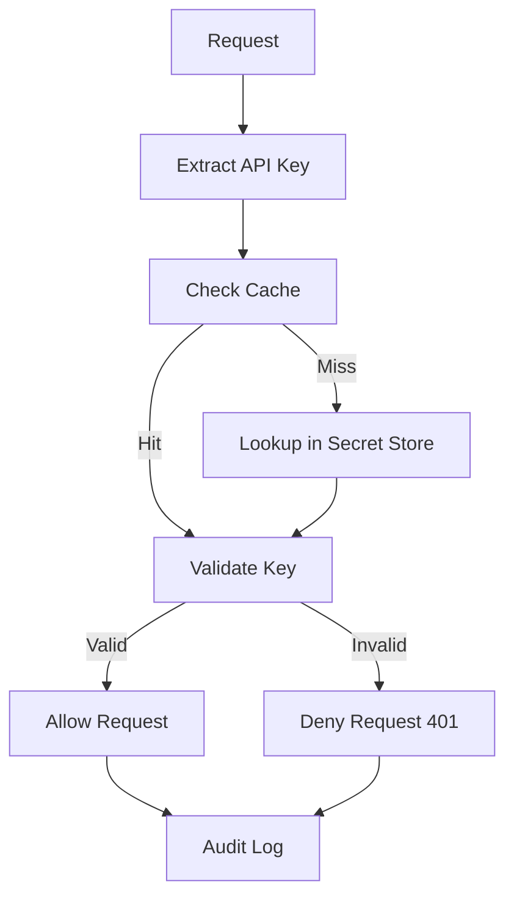

# API Key Validator Pattern

## Abstract

The API Key Validator pattern authenticates requests by validating API keys against a secure store. By checking keys on every request with caching to reduce lookup latency, this pattern ensures only authorized clients can access agent services while maintaining high performance.

## Problem Statement

Agent services need to authenticate clients to prevent unauthorized access. The problem is how to validate API keys efficiently on every request, handle key rotation and revocation, and cache validation results without compromising security.

## Context

This pattern arises when:
- Services need to authenticate API clients
- Key-based authentication is required
- High request volume requires caching
- Key rotation and revocation are needed
- Audit logging of access is required

## Forces

- **Security vs. Performance:** Strict validation is secure but slow; caching improves performance
- **Centralized vs. Distributed:** Centralized validation is consistent; distributed is faster
- **Short-lived vs. Long-lived:** Short-lived keys are more secure; long-lived are more convenient
- **Automatic vs. Manual:** Automatic rotation is secure; manual is simpler

## Solution

### Architecture Diagram



### Components

- **Key Extractor:** Extracts API key from request headers
- **Cache Manager:** Caches validation results with TTL
- **Secret Store:** Secure storage for API keys
- **Validator:** Validates key against store
- **Audit Logger:** Logs all validation attempts

### Formal Properties

**Invariants:**
- Every request is validated before processing
- Invalid keys are always rejected
- Validation results are cached for bounded time

**Guarantees:**
- Only requests with valid keys are processed
- Revoked keys are rejected within cache TTL
- All validation attempts are logged

**Bounds:**
- Cache TTL: bounded (typically 5 minutes)
- Validation latency: bounded by cache + lookup time
- Key length: bounded by security requirements

## Implementation

```typescript
interface ValidationResult {
  valid: boolean;
  keyId?: string;
  permissions?: string[];
  error?: string;
}

class APIKeyValidator {
  private cache = new Map<string, { result: ValidationResult; expires: number }>();
  private cacheTTL: number;

  constructor(
    private secretStore: SecretStore,
    cacheTTL: number = 5 * 60 * 1000 // 5 minutes
  ) {
    this.cacheTTL = cacheTTL;
  }

  async validate(apiKey: string): Promise<ValidationResult> {
    // Check cache first
    const cached = this.cache.get(apiKey);
    if (cached && Date.now() < cached.expires) {
      return cached.result;
    }

    // Validate against secret store
    const result = await this.secretStore.validateKey(apiKey);
    
    // Cache result
    this.cache.set(apiKey, {
      result,
      expires: Date.now() + this.cacheTTL
    });

    // Log validation attempt
    logger.info({
      keyId: result.keyId,
      valid: result.valid,
      ip: getClientIP()
    }, 'API key validation');

    return result;
  }

  // Clear cache for key rotation/revocation
  invalidate(apiKey: string): void {
    this.cache.delete(apiKey);
  }

  // Clear entire cache (for emergency revocation)
  clearCache(): void {
    this.cache.clear();
  }
}

// Middleware usage
const validator = new APIKeyValidator(secretManager);

app.use(async (req, res, next) => {
  const apiKey = req.headers['x-api-key'];
  if (!apiKey) {
    return res.status(401).json({ error: 'API key required' });
  }

  const result = await validator.validate(apiKey);
  if (!result.valid) {
    return res.status(401).json({ error: 'Invalid API key' });
  }

  req.keyId = result.keyId;
  req.permissions = result.permissions;
  next();
});
```

## Failure Modes

| Failure | Detection | Recovery |
|---------|-----------|----------|
| Secret store unavailable | Connection timeout | Fail closed (reject all), use cached results |
| Cache poisoning | Invalid keys cached | Clear cache, reduce TTL |
| Key leakage | Key used from multiple IPs | Revoke key, audit access |
| Cache stampede | Many requests for same key | Use mutex for concurrent lookups |

## When NOT to Use

- **Internal services:** If all clients are trusted, use network-level auth
- **Browser clients:** API keys should not be exposed in browsers; use OAuth
- **One-time access:** For one-time access, use token-based auth instead
- **High-security:** For high-security applications, use mutual TLS instead

## Cross-References

### Related Patterns
- **Rate Limiter** (Part VI) — Rate limit per API key
- **Audit Logger** (Part VI) — Log all validation attempts
- **Secret Rotation** (Part V) — Rotate keys periodically

### External Implementations
- **agent-mesh** — `src/gateway/auth.middleware.ts` with 5-minute cache

## References

- **OWASP API Security** — API key best practices
- **Google Cloud API Keys** — API key management
- **AWS API Gateway** — API key authentication
