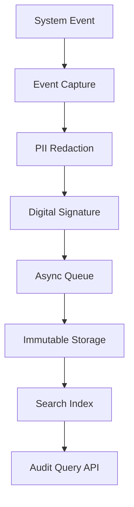

# Audit Logger Pattern

## Abstract

The Audit Logger pattern captures immutable records of all significant events in an agentic system. By logging authentication events, data access, configuration changes, and agent decisions with tamper-evident storage, this pattern enables compliance, forensic analysis, and accountability.

## Problem Statement

Enterprise agentic systems operate in regulated environments where accountability and traceability are required. The problem is how to capture comprehensive audit trails that are tamper-evident, searchable, and compliant with regulations like SOC 2, HIPAA, and GDPR, without impacting system performance.

## Context

This pattern arises when:
- Regulatory compliance requires audit trails
- Forensic analysis may be needed
- Accountability for agent decisions is required
- Data access must be tracked
- Configuration changes need to be auditable

## Forces

- **Completeness vs. Performance:** Comprehensive logging impacts performance
- **Detail vs. Privacy:** Detailed logs may contain sensitive data
- **Real-time vs. Batch:** Real-time logging is immediate; batch is more efficient
- **Retention vs. Cost:** Longer retention aids compliance but increases cost

## Solution

### Architecture Diagram



### Components

- **Event Capturer:** Intercepts and captures significant events
- **PII Redactor:** Removes sensitive data from logs
- **Event Signer:** Adds digital signatures for tamper evidence
- **Audit Store:** Immutable storage for audit records
- **Query API:** Searchable interface for audit data

### Formal Properties

**Invariants:**
- All audit events are timestamped with synchronized time
- Audit records are immutable after creation
- PII is never stored in audit logs

**Guarantees:**
- Audit events are captured before action completion
- Records are tamper-evident (digital signatures)
- Audit data is retained for configured period

**Bounds:**
- Log latency: bounded (typically < 100ms async)
- Retention period: bounded by policy
- Event size: bounded for storage efficiency

## Implementation

```typescript
interface AuditEvent {
  id: string;
  timestamp: string;
  eventType: string;
  actor: {
    type: 'user' | 'system' | 'agent';
    id: string;
    metadata?: Record<string, unknown>;
  };
  action: string;
  resource: string;
  outcome: 'success' | 'failure' | 'denied';
  details: Record<string, unknown>;
  signature?: string;
}

class AuditLogger {
  private signer: CryptoSigner;
  private queue: AsyncQueue<AuditEvent>;
  private piiPatterns: RegExp[];

  constructor(signer: CryptoSigner, queue: AsyncQueue<AuditEvent>) {
    this.signer = signer;
    this.queue = queue;
    this.piiPatterns = [
      /\b\d{3}-\d{2}-\d{4}\b/, // SSN
      /\b\d{16}\b/, // Credit card
      /\b[A-Za-z0-9._%+-]+@[A-Za-z0-9.-]+\.[A-Z|a-z]{2,}\b/, // Email
    ];
  }

  async log(event: Omit<AuditEvent, 'id' | 'timestamp' | 'signature'>): Promise<void> {
    const auditEvent: AuditEvent = {
      ...event,
      id: generateUUID(),
      timestamp: new Date().toISOString(),
    };

    // Redact PII from details
    auditEvent.details = this.redactPII(auditEvent.details);

    // Sign the event
    auditEvent.signature = await this.signer.sign(
      `${auditEvent.id}:${auditEvent.timestamp}:${JSON.stringify(auditEvent.details)}`
    );

    // Queue for async storage
    await this.queue.enqueue(auditEvent);
  }

  private redactPII(obj: Record<string, unknown>): Record<string, unknown> {
    const redacted = JSON.stringify(obj);
    const result = this.piiPatterns.reduce(
      (acc, pattern) => acc.replace(pattern, '[REDACTED]'),
      redacted
    );
    return JSON.parse(result);
  }
}

// Usage: Log authentication event
await auditLogger.log({
  eventType: 'authentication',
  actor: {
    type: 'user',
    id: userId,
    metadata: { ip: clientIP, userAgent: req.headers['user-agent'] },
  },
  action: 'login',
  resource: '/api/auth',
  outcome: success ? 'success' : 'failure',
  details: {
    method: authMethod,
    mfaUsed: mfaEnabled,
  },
});

// Usage: Log agent decision
await auditLogger.log({
  eventType: 'agent_decision',
  actor: {
    type: 'agent',
    id: agentId,
    metadata: { model: modelVersion },
  },
  action: 'classify',
  resource: `/sessions/${sessionId}`,
  outcome: 'success',
  details: {
    input: inputHash,
    output: intent,
    confidence: confidenceScore,
  },
});
```

## Failure Modes

| Failure | Detection | Recovery |
|---------|-----------|----------|
| Queue full | Queue depth threshold | Drop oldest non-critical events, alert |
| Signer unavailable | Signature generation failed | Buffer events, retry |
| Storage unavailable | Write failures | Buffer locally, retry with backoff |
| PII leak | Audit log contains PII | Rotate keys, purge affected logs |

## When NOT to Use

- **Development environments:** Full audit logging adds overhead in dev
- **Non-regulated systems:** If no compliance requirements, simpler logging may suffice
- **Performance-critical paths:** If every microsecond counts, use sampling
- **Low-security applications:** For low-security apps, standard logging may suffice

## Cross-References

### Related Patterns
- **API Key Validator** (Part V) — Log all authentication events
- **Prompt Injection Sanitizer** (Part V) — Log sanitization events
- **Human Handoff** (Part VI) — Log all handoff events

## References

- **NIST Audit Guidelines** — SP 800-92 audit log management
- **SOC 2 Compliance** — Audit trail requirements
- **GDPR Article 30** — Records of processing activities
- **HIPAA Audit Controls** — 45 CFR 164.312(b)
