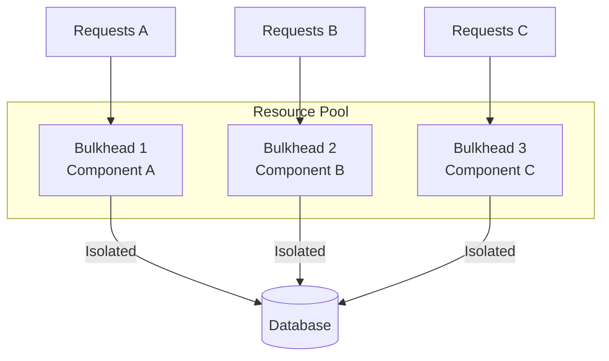

# Bulkhead Pattern

## Abstract

The Bulkhead pattern isolates resources to contain failures within a bounded context. Borrowed from ship design where bulkheads prevent flooding from spreading, this pattern partitions system resources so that a failure in one partition doesn't exhaust resources for other partitions.

## Problem Statement

In shared resource environments, a failure in one component can exhaust shared resources (threads, connections, memory) and cause cascading failures across the entire system. The problem is how to contain failures within a bounded context, preventing resource exhaustion from spreading to unaffected components.

## Context

This pattern arises when:
- Multiple components share limited resources
- Resource exhaustion in one component can affect others
- Different components have different criticality levels
- Isolation is needed to prevent cascading failures
- Graceful degradation by component is acceptable

## Forces

- **Isolation vs. Efficiency:** More isolation reduces resource utilization efficiency
- **Granularity:** Fine-grained isolation is more protective but more complex
- **Static vs. Dynamic:** Static partitioning is simpler; dynamic adapts to load
- **Fairness vs. Priority:** Equal resource allocation vs. priority-based allocation

## Solution

### Architecture Diagram



### Components

- **Bulkhead Manager:** Manages resource partitions and allocation
- **Resource Pool:** Partitioned resources (thread pools, connection pools)
- **Isolation Boundary:** Enforces resource limits per partition
- **Overflow Handler:** Handles requests when partition is full

### Formal Properties

**Invariants:**
- Each partition has bounded resources
- Partitions do not share resources
- Resource exhaustion in one partition doesn't affect others

**Guarantees:**
- Failure in one partition is contained
- Critical components always have minimum resources
- Non-critical components can be throttled or rejected

**Bounds:**
- Partition size: bounded by configuration
- Total resources: sum of partition sizes
- Overflow handling: bounded rejection rate

## Implementation

```typescript
class Bulkhead<T> {
  private maxConcurrent: number;
  private queue: Array<{ task: () => Promise<T>; resolve: Function; reject: Function }> = [];
  private running = 0;

  constructor(maxConcurrent: number) {
    this.maxConcurrent = maxConcurrent;
  }

  async execute(task: () => Promise<T>): Promise<T> {
    if (this.running >= this.maxConcurrent) {
      // Queue or reject based on policy
      return this.enqueue(task);
    }

    this.running++;
    try {
      return await task();
    } finally {
      this.running--;
      this.processQueue();
    }
  }

  private enqueue(task: () => Promise<T>): Promise<T> {
    return new Promise((resolve, reject) => {
      this.queue.push({ task, resolve, reject });
    });
  }

  private processQueue(): void {
    while (this.running < this.maxConcurrent && this.queue.length > 0) {
      const { task, resolve, reject } = this.queue.shift()!;
      this.execute(task).then(resolve).catch(reject);
    }
  }
}

// Usage: Isolate different agent types
const premiumBulkhead = new Bulkhead(50);  // Premium agents get 50 slots
const standardBulkhead = new Bulkhead(100); // Standard agents get 100 slots
const fallbackBulkhead = new Bulkhead(200); // Fallback agents get 200 slots
```

## Failure Modes

| Failure | Detection | Recovery |
|---------|-----------|----------|
| Partition starvation | Queue grows indefinitely | Increase partition size, add overflow handling |
| Resource underutilization | Partitions not fully used | Dynamic resource reallocation |
| Deadlock | Requests waiting forever | Timeout, circuit breaker |
| Priority inversion | Low priority blocks high priority | Priority-based scheduling |

## When NOT to Use

- **Single component systems:** If only one component exists, bulkhead adds overhead
- **Homogeneous load:** If all requests are similar, bulkhead provides no benefit
- **Abundant resources:** If resources are not constrained, isolation is unnecessary
- **Simple systems:** For simple systems, bulkhead complexity may not be justified

## Cross-References

### Related Patterns
- **Circuit Breaker** (Part II) — Often composed with bulkhead
- **Timeout** (Part II) — Each partition should have timeouts
- **Token Budget Enforcer** (Part VI) — Similar resource limiting concept

## References

- **Release It!** (Nygard, 2007) — Bulkhead pattern origin
- **Netflix Hystrix** — Bulkhead implementation in thread pools
- **Resilience4j** — Modern bulkhead implementation for Java
