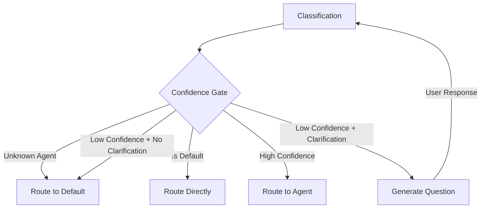

# Confidence Gate Pattern

## Abstract

The Confidence Gate pattern routes requests based on classification confidence scores and ambiguity detection. By evaluating classifier output against configurable thresholds, this pattern decides whether to route to a specialized agent, ask for clarification, or fall back to a default agent, ensuring requests are handled by the most appropriate agent.

## Problem Statement

Intent classifiers are not always certain about their predictions. Routing low-confidence predictions to specialized agents can result in poor user experience. The problem is how to handle uncertain classifications gracefully by either asking for clarification or falling back to a more general agent, while maintaining high routing accuracy.

## Context

This pattern arises when:
- Intent classification has variable confidence
- Specialized agents have narrow domains
- Ambiguous requests need clarification
- Fallback to general agents is acceptable
- User experience should not suffer from misrouting

## Forces

- **Accuracy vs. Latency:** Clarification improves accuracy but adds latency
- **Threshold Tuning:** High thresholds cause more fallbacks; low thresholds cause misrouting
- **Clarification Quality:** Good questions improve accuracy; poor questions frustrate users
- **Fallback Strategy:** Default agent always works but may be less efficient

## Solution

### Architecture Diagram



### Components

- **Confidence Evaluator:** Evaluates classification confidence against thresholds
- **Clarification Generator:** Generates clarification questions for ambiguous requests
- **Fallback Router:** Routes to default agent when confidence is low
- **Threshold Manager:** Manages per-agent confidence thresholds

### Formal Properties

**Invariants:**
- Every request is routed to exactly one agent
- Default agent always receives fallback traffic
- Clarification questions are localized to user's language

**Guarantees:**
- High-confidence requests route to intended agent
- Ambiguous requests trigger clarification
- Low-confidence requests fall back to default

**Bounds:**
- Clarification rounds: bounded to prevent infinite loops
- Threshold range: 0.0 to 1.0
- Default agent threshold: always 0.0

## Implementation

```typescript
interface ConfidenceDecision {
  action: 'route' | 'clarify' | 'fallback';
  agentId: string;
  clarificationQuestion?: string;
  confidence: number;
}

class ConfidenceGate {
  private agents: Map<string, AgentConfig>;
  private defaultAgentId: string;
  private clarificationGenerator: ClarificationGenerator;

  constructor(
    agents: Map<string, AgentConfig>,
    defaultAgentId: string,
    clarificationGenerator: ClarificationGenerator
  ) {
    this.agents = agents;
    this.defaultAgentId = defaultAgentId;
    this.clarificationGenerator = clarificationGenerator;
  }

  evaluate(classification: ClassificationResult, language: string): ConfidenceDecision {
    const { agentId, confidence, ambiguous } = classification;

    // Rule 1: Unknown agent → default
    if (!this.agents.has(agentId)) {
      return {
        action: 'fallback',
        agentId: this.defaultAgentId,
        confidence,
      };
    }

    // Rule 2: Default agent → always route directly
    if (agentId === this.defaultAgentId) {
      return {
        action: 'route',
        agentId: this.defaultAgentId,
        confidence,
      };
    }

    const agent = this.agents.get(agentId)!;

    // Rule 3: High confidence → route to agent
    if (confidence >= agent.confidenceThreshold && !ambiguous) {
      return {
        action: 'route',
        agentId: agent.id,
        confidence,
      };
    }

    // Rule 4: Clarification required → generate question
    if (agent.clarificationRequired) {
      const question = this.clarificationGenerator.generate(
        agent,
        classification,
        language
      );
      return {
        action: 'clarify',
        agentId: agent.id,
        clarificationQuestion: question,
        confidence,
      };
    }

    // Rule 5: Otherwise → fallback
    return {
      action: 'fallback',
      agentId: this.defaultAgentId,
      confidence,
    };
  }
}
```

## Failure Modes

| Failure | Detection | Recovery |
|---------|-----------|----------|
| Clarification generator unavailable | API timeout | Fall back to default agent |
| Infinite clarification loop | Max rounds exceeded | Force route to default agent |
| Wrong threshold | High fallback rate | Tune thresholds based on metrics |
| Language detection failure | Invalid language code | Use English as fallback |

## When NOT to Use

- **Single agent systems:** If only one agent exists, confidence gate is unnecessary
- **High accuracy classifiers:** If classifier accuracy is consistently high, gate adds latency
- **Real-time requirements:** If latency is critical, skip clarification
- **Simple domains:** For simple domains, rule-based routing may suffice

## Cross-References

### Related Patterns
- **Router** (Part I) — Confidence gate extends router decisions
- **Clarification** (Part IV) — Generates clarification questions
- **Fallback Chain** (Part II) — Fallback to default agent

### External Implementations
- **agent-mesh** — `src/confidence/confidence.gate.ts` with Gemini clarification

## References

- **agent-mesh ARCHITECTURE.md** — Confidence gate implementation
- **Intent Classification** — Confidence scoring in NLU systems
- **Dialogue Systems** — Clarification strategies in conversational AI
