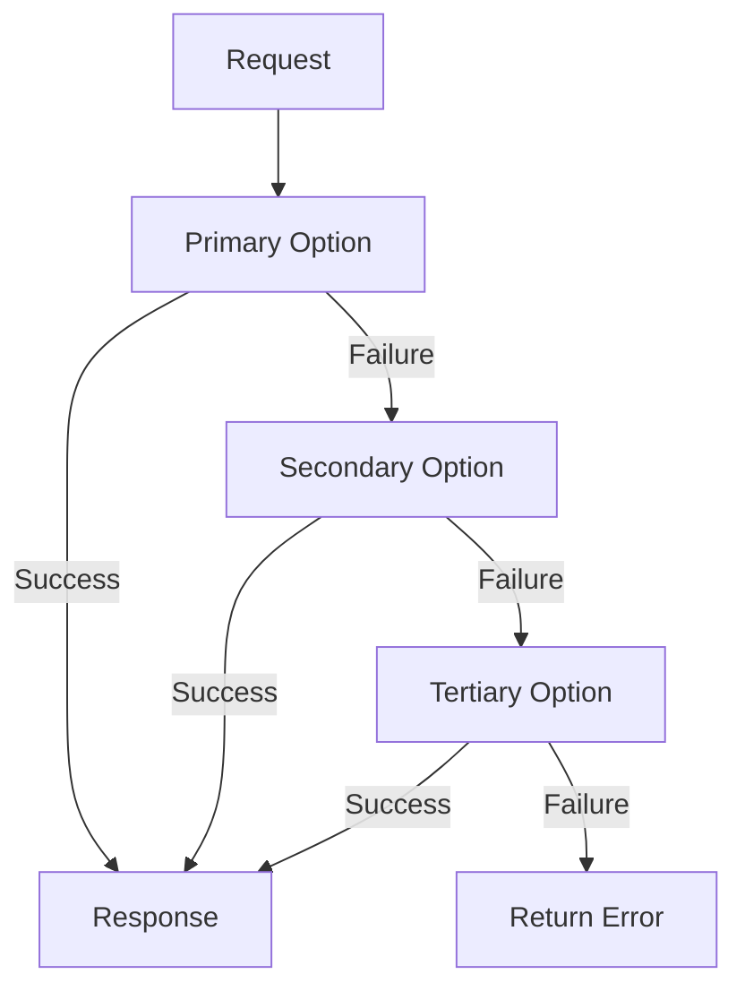

# Fallback Chain Pattern

## Abstract

The Fallback Chain pattern provides graceful degradation by defining an ordered list of alternatives. When the primary option fails, the system automatically tries the next option in the chain, continuing until success or exhausting all alternatives. This pattern ensures service availability even when preferred components are unavailable.

## Problem Statement

Components fail, but systems must continue operating. The problem is how to maintain service availability when preferred components fail by automatically degrading to less preferred but still functional alternatives, while making the degradation visible for monitoring and recovery.

## Context

This pattern arises when:
- Multiple implementations or providers are available
- Service availability is more important than optimal performance
- Graceful degradation is acceptable
- Failures should be transparent to end users
- Recovery should be automatic when primary recovers

## Forces

- **Quality vs. Availability:** Primary options are higher quality but less available
- **Chain Length:** Longer chains improve availability but increase complexity
- **Automatic vs. Manual:** Automatic failover is faster but may hide issues
- **State Synchronization:** Fallback options may have different state

## Solution

### Architecture Diagram



### Components

- **Chain Manager:** Orchestrates fallback chain execution
- **Options:** Ordered list of alternatives (primary to fallback)
- **Health Monitor:** Tracks option health for smart selection
- **Degradation Reporter:** Reports when fallback is active

### Formal Properties

**Invariants:**
- Options are tried in defined order
- Each option is tried at most once per request
- Chain execution stops at first success

**Guarantees:**
- Request succeeds if any option is available
- Degradation is detected and reported
- Primary option is preferred when available

**Bounds:**
- Chain length: bounded (typically 2-4 options)
- Total latency: sum of option latencies in worst case
- Memory: O(chain_length) per request

## Implementation

```typescript
interface FallbackOption<T> {
  name: string;
  execute: () => Promise<T>;
  healthCheck: () => Promise<boolean>;
}

class FallbackChain<T> {
  private options: FallbackOption<T>[] = [];

  addOption(option: FallbackOption<T>): void {
    this.options.push(option);
  }

  async execute(): Promise<{ result: T; usedOption: string }> {
    let lastError: Error | null = null;

    for (const option of this.options) {
      // Skip unhealthy options
      try {
        const healthy = await option.healthCheck();
        if (!healthy) continue;
      } catch (error) {
        continue;
      }

      try {
        const result = await option.execute();
        return { result, usedOption: option.name };
      } catch (error) {
        lastError = error as Error;
      }
    }

    throw new Error(`All fallback options failed. Last error: ${lastError?.message}`);
  }
}

// Usage: Model fallback chain
const modelChain = new FallbackChain<ModelResponse>();
modelChain.addOption({
  name: 'premium-model',
  execute: () => callPremiumModel(input),
  healthCheck: () => checkPremiumModelHealth()
});
modelChain.addOption({
  name: 'standard-model',
  execute: () => callStandardModel(input),
  healthCheck: () => checkStandardModelHealth()
});
modelChain.addOption({
  name: 'basic-model',
  execute: () => callBasicModel(input),
  healthCheck: () => checkBasicModelHealth()
});
```

## Failure Modes

| Failure | Detection | Recovery |
|---------|-----------|----------|
| All options fail | Chain exhaustion | Return error with all failure details |
| Stuck on fallback | Primary not retried | Periodic primary health checks |
| Cascade failure | All options become unhealthy | Alert operations, enable manual override |
| State inconsistency | Different options have different state | Synchronize state or use stateless options |

## When NOT to Use

- **No alternatives:** If no fallback options exist, use Circuit Breaker instead
- **Stateful operations:** If options have different state, failover may cause inconsistency
- **Performance critical:** Fallback chains add latency in failure scenarios
- **Complex recovery:** If recovery requires manual intervention, use manual failover

## Cross-References

### Related Patterns
- **Circuit Breaker** (Part II) — Skip unhealthy options in chain
- **Retry with Backoff** (Part II) — Retry same option before falling back
- **Graceful Degradation** (Part VI) — Reduce quality when using fallbacks

### External Implementations
- **llm-router** — `src/fallback/fallback-chain.ts` for model failover

## References

- **Release It!** (Nygard, 2007) — Fallback pattern
- **Designing Data-Intensive Applications** (Kleppmann, 2017) — Fault tolerance
- **Site Reliability Engineering** (Google, 2016) — Degradable systems
