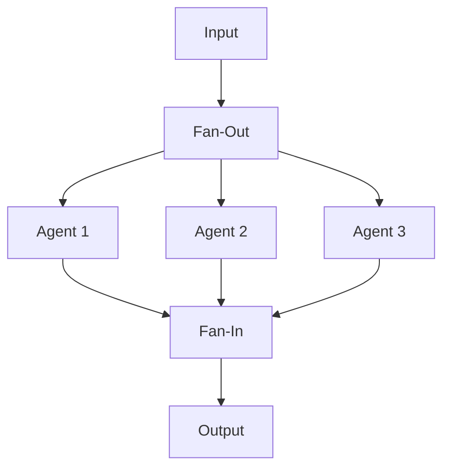

# Fan-Out/Fan-In Pattern

## Abstract

The Fan-Out/Fan-In pattern parallelizes execution by distributing work to multiple agents (fan-out) and aggregating results (fan-in). This pattern reduces latency for parallelizable tasks and enables processing of large workloads by distributing across multiple agents.

## Problem Statement

Some tasks can be decomposed into independent subtasks that can be executed in parallel. Sequential execution wastes resources and increases latency. The problem is how to efficiently distribute parallelizable work, manage concurrent execution, and aggregate results while handling partial failures.

## Context

This pattern arises when:
- Tasks can be decomposed into independent subtasks
- Parallel execution reduces overall latency
- Workload exceeds single agent capacity
- Results from multiple agents need aggregation
- Partial failures must be handled gracefully

## Forces

- **Parallelism vs. Coordination:** More parallelism improves speed but increases coordination overhead
- **Batch Size:** Larger batches reduce overhead but increase latency
- **Aggregation Strategy:** Simple concatenation vs. complex merging
- **Failure Handling:** Fail fast vs. partial success tolerance

## Solution

### Architecture Diagram



### Components

- **Fan-Out:** Decomposes input into subtasks and distributes to agents
- **Agent:** Parallel worker that processes assigned subtask
- **Fan-In:** Collects and aggregates results from agents
- **Coordinator:** Manages fan-out/fan-in lifecycle and error handling

### Formal Properties

**Invariants:**
- Each subtask is assigned to exactly one agent
- Fan-in waits for all agents or timeout
- Aggregation produces single coherent output

**Guarantees:**
- All agents receive work simultaneously
- Results are correlated with originating subtasks
- Partial failures are detected and reported

**Bounds:**
- Parallelism: bounded by agent count
- Fan-in timeout: bounded wait time
- Memory: bounded by result buffer size

## Implementation

```typescript
class FanOutFanIn<T, U> {
  private agents: Agent<T, U>[] = [];
  private timeout: number;

  constructor(timeout: number = 30000) {
    this.timeout = timeout;
  }

  addAgent(agent: Agent<T, U>): void {
    this.agents.push(agent);
  }

  async execute(inputs: T[]): Promise<{ results: U[]; errors: Error[] }> {
    const results: U[] = [];
    const errors: Error[] = [];

    const promises = inputs.map((input, index) => {
      const agent = this.agents[index % this.agents.length];
      return this.executeWithTimeout(agent, input, index)
        .then(result => { results[index] = result; })
        .catch(error => { errors.push(error); });
    });

    await Promise.allSettled(promises);
    return { results: results.filter(r => r !== undefined), errors };
  }

  private executeWithTimeout(agent: Agent<T, U>, input: T, index: number): Promise<U> {
    return Promise.race([
      agent.execute(input),
      timeout(this.timeout).then(() => {
        throw new Error(`Agent ${index} timeout after ${this.timeout}ms`);
      })
    ]);
  }
}
```

## Failure Modes

| Failure | Detection | Recovery |
|---------|-----------|----------|
| Agent timeout | Timeout exceeded | Return partial results, log error |
| Agent returns invalid result | Schema validation failure | Exclude from aggregation, log error |
| All agents fail | No results received | Return error with all failure details |
| Fan-in aggregation failure | Exception during aggregation | Return raw results with aggregation error |

## When NOT to Use

- **Sequential dependencies:** If subtasks depend on each other, use Pipeline
- **Small workloads:** For small workloads, parallelism overhead exceeds benefits
- **Stateful processing:** If agents share state, parallelism introduces race conditions
- **Complex aggregation:** If aggregation is complex, consider MapReduce

## Cross-References

### Related Patterns
- **Orchestrator-Worker** (Part I) — Sequential instead of parallel
- **Pipeline** (Part I) — Sequential processing
- **Batch Coalescing** (Part VI) — Opposite: combines requests instead of splitting

## References

- **MapReduce** (Dean & Ghemawat, 2004) — Distributed processing pattern
- **Parallel Programming Patterns** (Mattson et al., 2004) — Fork-join pattern
